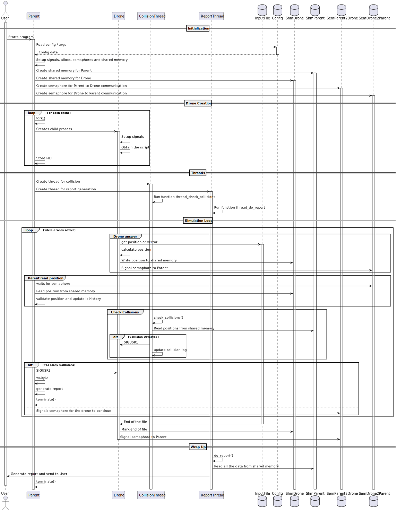

# SCOMP

This readme contains all the process and information related to the development of the uss related to SCOMP.

## Diagram with the components and processes for the solution.



## Drone Script

### Template for the Drone Script

The X, Y, and Z correspond to the coordinates in a 3D space, representing the initial position of the drone.
And the VX, VY, and VZ correspond to the vector of the drone in the X, Y, and Z directions respectively.
Each line corresponds to a time step of 1 second.

```
X,Y,Z
VX1,VY1,VZ1
VX2,VY2,VZ2
...
VXN,VYN,VZN
```

### Example of a Drone Script

```
1,2,3
1,1,1
1,1,2
```


## Process for each US

### US361 - Initialize Hybrid Simulation Environment with Shared Memory

**As** a Drone Tech,
<br>
**I want** to start the simulation with a multi-threaded parent process and multiple child drone processes communicating through a shared memory area,
<br>
**So that** the system efficiently coordinates simulation data across processes.

#### Acceptance Criteria

- **AC01:** The parent process spawns dedicated threads for its functionalities.
- **AC02:** Each drone is launched as an independent process.
- **AC03:** A shared memory segment is allocated and properly initialized for inter-process communication.
- **AC04:** Drone processes are configured to use semaphores for synchronization.
- **AC05:** This component must be implemented in C and must utilize threads, mutexes, condition variables, and signals.

### Process:

For this US, we set up the signal handling, shared memory, the child creation, the fork, the config file and struct initialization, as well as the semaphores shared memory and the threads in order to setup for the other USs.

### US362 - Implement Function-Specific Threads in the Parent Process

**As** a PO,
<br>
**I want** the simulation controller parent process to have at least two dedicated threads (one for collision detection and one for report generation),
<br>
**So that** each functionality operates concurrently and independently.

#### Acceptance Criteria

- **AC01:** The parent process creates a collision detection thread responsible for scanning the shared memory for drone position conflicts.
- **AC02:** A report generation thread is created to compile simulation results and respond to collision events.
- **AC03:** Any additional thread that you deem appropriate for any of the required functionalities.
- **AC04:** Threads are managed using mutexes and condition variables for internal synchronization.

### Process:

To implement this user story, the simulation process was designed to act as the central controller, coordinating drone
activity and tracking their movements over time. But before that, we set up the threads in the parent process to handle
collision detection and report generation. The parent process creates a dedicated thread for collision detection, which
monitors the shared memory for overlapping drone positions. Another thread is created for report generation, which compiles
all the simulation results and collision events.

Communication between the simulation process and each thread is established using mutexes. The simulation sets up
condition variables that will be used to notify the report generation thread when it is time to do the report generation,
or when a collision is detected by the collision detection thread. 

For synchronization, mutexes are used to ensure that only one thread accesses the shared memory at a time and that the processes
dont interfere with each other. 

### US363 - Notify Report Thread via Condition Variables Upon Collision

**As** a PO,
<br>
**I want** the simulation system collision detection thread to notify the report generation thread through condition variables when a collision occurs,
<br>
**So that** the report is updated in real time with accurate collision information.

#### Acceptance Criteria

- **AC01:** The collision detection thread monitors the shared memory for overlapping drone positions.
- **AC02:** Upon detecting a collision, the thread signals the report generation thread using condition variables.
- **AC03:** The report generation thread, waiting on the condition variable, immediately processes the collision event and logs it.
- **AC04:** Proper mutex locking is used to ensure thread-safe notification.

### Process:

To implement this user story, the simulation system was designed to monitor drone positions in real time and detect collisions based on proximity.
And to improve the already existing collision detection algorithm we added a thread to handle the collision detection separately from the main simulation loop.
The rest is explained in the sprint2.md has it is the same process as in the previous sprint.

### US364 - Enforce Step-by-Step Simulation Synchronization

**As** a PO,
<br>
**I want** the simulation engine to synchronize the simulation's step-by-step progression using semaphores,
<br>
**So that** all drone processes and parent threads advance in lockstep through each simulation time step.

#### Acceptance Criteria

**AC01:** The simulation must progress step by step.

### Process:

For this us, we had to make all the drone processes wait for the main process to send a signal to them, indicating that they can proceed with the next step.
This was done using a semaphore to indicate that they can continue with the next step.

How did we do that? By putting each drone into a state where they are waiting for the semaphore to post and let them continue, this happens after each process updates the shared memory with the new position.
In the main process we make all the necessary procedures like moving the drone to a new position and verifying if there were any collisions.
After that, we post the semaphore, indicating that they can proceed with the next step.

All of this is done in a loop, until all the drone processes update their status in the shared memory and the simulation is finished.


### US265 - Generate a simulation report

**As** a Drone Tech,
<br>
**I want** a comprehensive report that details the simulation outcomes, including drone execution statuses, collision events (with timestamps and positions), and overall validation results,
<br>
**So that** I can assess the safety and performance of the figure post-simulation.

#### Acceptance Criteria

- **AC01:** The report generation thread aggregates data from the shared memory once the simulation concludes.
- **AC02:** The report includes the total number of drones, individual execution statuses, and detailed collision events.
- **AC03:** The final validation result (pass/fail) is clearly indicated.
- **AC04:** The complete report is saved to a file for future reference.


### Process:

The report generation thread is responsible for compiling the simulation results and collision events.
And for that he reads the shared memory and aggregates the data from the drones.
The reports work on a separate thread, which is only active when it is time to generate the report. (End of the simulation or when there are too many collisions).

The sprint2.md has the complete process for the report generation, so we will not repeat it here.

## Auto-Evaluation

The auto-evaluation is between 0 and 100 %.

Diogo Veiros = 100%
<br>
Diogo Pereira = 100%
<br>
Tiago Sampaio = 100%
<br>
Tiago Alves = 100%


