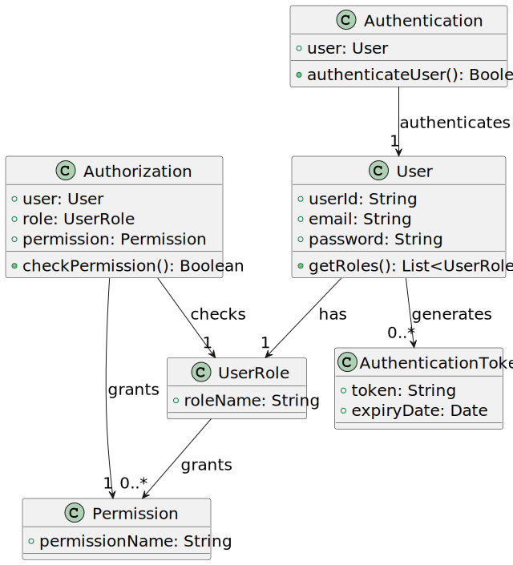

# US 210

## 1. Context

*This task aims to conclude the requirements for US210 in Sprint 2, which consists of developing the authentication and authorization functionality for the system. The team will focus on completing the implementation of login functionality, user role verification, and enabling/disabling user access. Additionally, the team will integrate this feature with the rest of the system to ensure seamless security for all users.*

### 1.1 List of issues

Analysis:

Design:

Implement:

Test:


## 2. Requirements

**As** a Project Manager,  
**I want** the system to support and apply authentication and authorization for all its users and functionalities.  

### Acceptance Criteria

- **AC01**: The system should allow users to log in with valid credentials (username and password).
- **AC02**: The system should verify the user’s role and allow or deny access to specific functionalities based on their role.
- **AC03**: The system should allow enabling or disabling user access.
- 

### Dependencies

This requirement dont have any dependencies.


## 3. Analysis

- **User Repository:** A repository (`UserRepository`) is already available for user data storage. We will leverage this for managing user information.
- **Roles:** The roles (`ADMIN`, `CRM_MANAGER`, etc.) define the access levels. We ensured that the system is scalable to add new roles in the future.
- **Security:** We considered basic authentication strategies and role-based access control (RBAC) to ensure the security of different functionalities.

## 4. Design

In this section, we describe the design approach adopted for implementing **US210 – Authentication 1 and authorization**. The class diagram defines the main components, showing a clear separation of concerns between the UI, application logic, domain model, and persistence layer.

### 4.1. Realization



### 4.3. Applied Patterns

### 4.4. Acceptance Tests

Include here the main tests used to validate the functionality. These tests focus on ensuring that authentication and role-based access are correctly handled.
**Test 1:** *Verifies that only active users can log in and access protected resources.*

**Refers to Acceptance Criteria:** US101.1


```java
@Test
public void ensureOnlyActiveUsersCanLogIn() {
    SystemUser user = new User("username", "password", Role.CRM_MANAGER);
    user.setActive(false);
    
    boolean loginSuccess = authService.authenticate(user.getUsername(), user.getPassword());
    assertFalse(loginSuccess);
}
````

## 5. Implementation

*In this section the team should present, if necessary, some evidencies that the implementation is according to the design. It should also describe and explain other important artifacts necessary to fully understand the implementation like, for instance, configuration files.*

*It is also a best practice to include a listing (with a brief summary) of the major commits regarding this requirement.*

## 6. Integration/Demonstration

*In this section the team should describe the efforts realized in order to integrate this functionality with the other parts/components of the system*

*It is also important to explain any scripts or instructions required to execute an demonstrate this functionality*

## 7. Observations

*This section should be used to include any content that does not fit any of the previous sections.*

*The team should present here, for instance, a critical prespective on the developed work including the analysis of alternative solutioons or related works*

*The team should include in this section statements/references regarding third party works that were used in the development this work.*