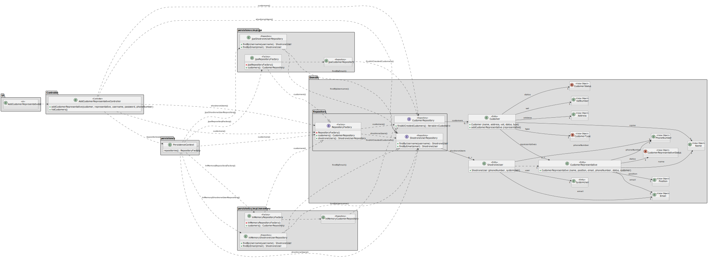

# US 221 

## 1. Context

This task as the objective of concluding the requirements of the us221 of sprint2, where it is asked to develop a new functionality to the system. The team will now focus on completing the implementation and testing of this functionality as well as integrating it with the rest of the system.

### 1.1 List of Issues

- **Analysis**: Done  
- **Design**: Done  
- **Implementation**: Done 
- **Testing**: Done  

---

## 2. Requirements

**As** a CRM Collaborator,  
**I want** to register a new representative for a customer,  
**So that** the customer can be represented by another person.

### Acceptance Criteria

- **AC01**: The customer representative must be a system user (restricted to the Customer App). Each representative must be a distinct user.
- **AC02**: The representative must be associated with a customer.
- **AC03**: The representative must have a name, email, phone number, position, and status.

### Dependencies

This requirement depends on [US220](../../SPRINT_2/US220/readme.md), as a customer must be registered in the system before a customer representative can be registered.

---

### Client Clarifications:

> **[Topic: Representantes de um cliente](https://moodle.isep.ipp.pt/mod/forum/discuss.php?d=35120)**  
> Os representantes não são partilhados entre clientes.

> **[Topic: Dúvidas sobre regras de negócio](https://moodle.isep.ipp.pt/mod/forum/discuss.php?d=35121)**  
> Não faz qualquer sentido atribuir um email da Shodrone a representantes dos clientes.  
> Um cliente não precisa de ter um domínio próprio e, caso o tenha, não quer dizer que seja igual ao nome, etc.  
> O cliente é a empresa, natural que todos os representantes vejam as propostas da empresa.

> **[Topic: Identificador de clientes e collaboradores](https://moodle.isep.ipp.pt/mod/forum/discuss.php?d=35235)**  
> Todos os utilizadores devem ter um ID.  
> O que deve ser esse ID é outra questão. (o id pode ser qualquer elemento que consiga identificar o user)

---

## 3. Analysis

### Customer Aggregate

It is important that we are able to register a new representative for a customer. As we have a one-to-many relationship between the customer and the representative, we can easily register a new representative for a customer.

This method will be used in the UI to register a new representative for a customer.

The `Customer` aggregate includes:

- **Name** – Customer name (for identification)
- **Address** – Customer address
- **VatNumber** – Tax identification number
- **CustomerStatus** – Current status of the customer (active, inactive, etc.)
- **CustomerType** – Type of customer (individual, company, etc.)
- **Representatives** – A list of associated representatives

Non-essential elements were omitted to maintain clarity and focus.

### Customer Representative Aggregate

The `CustomerRepresentative` aggregate includes:

- **Name** – Representative's name
- **Position** – Job title or role
- **Email** – Representative’s email address
- **PhoneNumber** – Contact number
- **CustomerRepresentativeStatus** – Current status (active, inactive, etc.)
- **Customer** – Associated customer

Other elements not relevant to this functionality are omitted for simplicity.


---

## 4. Design

In this section, we describe the design approach adopted for implementing **US221 – Add a Customer Representative**. The class diagram defines the main components involved in the addition of a new representative, showing a clear separation of concerns between the UI, application logic, domain model, and persistence layer.

### 4.1 Realization



---

## 5. Tests

The following tests validate the acceptance criteria defined for US221. They ensure that only valid customer representatives are created, that the data is correctly returned to the UI, and that DTOs are used properly.

---

### Test 1: Customer is a user of the system

**Refers to Acceptance Criteria:** AC01  
**Description:** Ensures that customer representatives are valid system users.

```java
@Test
void ensureCustomerRepresentativeIsAUser() {
    // setup: create and persist a customer representative
    // action: call controller.registerNewRepresentativeOfCustomer() and get the users list
    // assert: customer representative is in the list of users
}
```

---

### Test 2: The representative is associated with a customer

**Refers to Acceptance Criteria:** AC02  
**Description:** Validates that the representative is associated with a customer.

```java
@Test
void ensureRepresentativeRepresentsACustomer() {
    CustomerDTO dto = controller.registerNewRepresentativeOfCustomer();
    assertNotNull(dto.getCustomer());
}
```

---

### Test 3: Customer representative's information is correct

**Refers to Acceptance Criteria:** AC03  
**Description:** Verifies the correctness of name, email, phone number, position, and status.

```java
@Test
void ensureCustomerInformationIsCorrect() {
    CustomerDTO dto = controller.registerNewRepresentativeOfCustomer();
    assertNotNull(dto.getName());
    assertNotNull(dto.getEmail());
    assertNotNull(dto.getPhoneNumber());
    assertNotNull(dto.getPosition());
    assertNotNull(dto.getStatus());
}
```

## 6. Implementation

The implementation of US221 is based on the design and analysis presented in the previous sections. The code is organized into packages that reflect the domain model, application logic, and user interface.
We included the necessary classes and methods to support the registration of a new customer representative. And didn't diverge from the design.

The coding Commit messages related to this requirement are as follows:

- [Added the unit tests for the classes that make the us221 us222 us223 and us224](https://github.com/Departamento-de-Engenharia-Informatica/sem4pi-2024-2025-sem4pi_2024_2025_g44/commit/8c673b5543cfdc98a1faad132e06541cc48147cb)

- [Added the implementation of the classes that make the us221 us222 us223 and us224](https://github.com/Departamento-de-Engenharia-Informatica/sem4pi-2024-2025-sem4pi_2024_2025_g44/commit/c649bbf87b8d7c21c9dd30540338cba4c656bbf1)

## 7. Integration/Demonstration

To integrate the new functionality with the existing system, we followed these steps:

1. **Persistence Layer**: To connect the new functionality with the database, we used the existing repository pattern. The `CustomerRepository` were updated to include the necessary methods for the new functionality.
2. **Controller Layer**: The controller was updated to include methods for handling requests related to customer representatives. This includes methods for adding, updating, and retrieving representatives.
3. **UI Layer**: The user interface was updated to include forms and views for managing customer representatives. This includes input validation and error handling.
4. **Testing**: We ran the unit tests to ensure that the new functionality works as expected. The tests cover all acceptance criteria and other important scenarios.

To run the project, follow the instructions in the [README.md](../../../readme.md) file located in the root directory of the project. This file contains detailed instructions on how to set up the development environment, run the application, and execute the tests.


## 8. Observations

For the implementation of this project, we used the following sources:

- **EAPLI Framework**: A Java framework that provides a set of libraries and tools of our department(ISEP).
- **ECafetaria project**: A project developed by our department that serves as a reference and source for implementing similar functionalities and as a guide for best practices.
- **Jpa Hibernate**: A Java framework for object-relational mapping (ORM) that simplifies database interactions.
- **H2 Database**: A lightweight Java database that is easy to set up and use for development and testing purposes.
