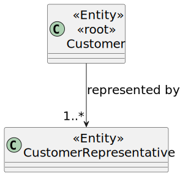

# US 222

## 1. Context

This task as the objective of concluding the requirements of the us222 of sprint2, where it is asked to develop a new functionality to the system. The team will now focus on completing the implementation and testing of this functionality as well as integrating it with the rest of the system.

### 1.1 List of issues

- **Analysis**: Done
- **Design**: Done
- **Implementation**: To do
- **Testing**: To do

---

## 2. Requirements

**As** a CRM Collaborator,
<br>
**I want** to list all customer representatives of a given customer,
<br>
**So that** decision-making by the CRM Collaborator is easier.

**Acceptance Criteria:**

**AC01:** It should not list disabled representatives.
<br>
**AC02:** It should list all representatives of a given customer.
<br>
**AC03:** The data must be retrieved using a dedicated DTO to decouple the internal domain model.

**Dependencies:**

*Regarding this requirement we understand that it relates to US220, as there needs to be a customer registered in the system before listing a customer representative of a given customer.*
<br>
*Regarding this requirement we understand that it relates to US221, as there needs to be a customer representative registered in the system before listing them.*

---

### Client Clarifications:

> **[Topic: US 222 List customer representatives](https://moodle.isep.ipp.pt/mod/forum/discuss.php?d=35499)**  
> P38: US 222 List customer representatives  
> A listagem é de representantes de um cliente específico.

> **[Topic: US 222 - List Customer Representatives](https://moodle.isep.ipp.pt/mod/forum/discuss.php?d=35594)**  
> É apropriado mostrar a informação completa dos Customer Representatives.  
> Os IDs internos não interessam.

## 3. Analysis

It is important that we are able to list all the representatives of a customer. As we have a one-to-many relationship between the customer and the representative, we can easily list all the representatives of a customer.

This method will be used in the UI to show the list of representatives of a customer.

Check the us221 for more information about the customer representative and the customer.



## 4. Design

*In this section we are going to present the design of the system. We will focus on the design of the new functionality, but we will also include other parts of the system that are important to understand the implementation.*

### 4.1. Realization

The class diagram as a similar structure to the one presented in US221, as the only difference are the names of the ui and controller and the used functions.

### 5. Tests

The following tests were designed to validate the acceptance criteria defined for US222. These tests focus on verifying
that only valid customer representatives are listed, that the expected data is correctly returned to the UI, and that proper
access control is enforced.

---

#### **Test 1: Disabled Representatives are not listed**
**Refers to Acceptance Criteria:** _AC01_  
**Description:** Ensures that customers representatives listed are not disabled.

```java
@Test
void ensureDisabledRepresentativesAreNotListed() {
    // setup: create and persist some customer representatives
    // action: call controller.listRepresentativesOfAGivenCustomer()
    // assert: All customer representative are active
}
```

---

#### **Test 2: The Representative is associated to a customer**
**Refers to Acceptance Criteria:** _AC02_  
**Description:** Validates that the created representative is associated to a customer.

```java
@Test
void ensureRepresentativeRepresentsACustomer() {
    // setup: create and persist a customer and one or more representatives for that customer
    // action: call controller.listRepresentativesOfAGivenCustomer() for the customer
    // assert: the result contains the representatives associated with the customer
}
```

---

#### **Test 3: DTOs are used to decouple domain and UI**
**Refers to Acceptance Criteria:** _AC03_  
**Description:** Verifies that no domain objects (`Customer`, `CustomerRepresentative`) are exposed directly by the controller, ensuring DTO usage.

```java
@Test
void ensureDomainEntitiesAreNotLeaked() {
    var result1 = controller.listAllCustomers();
    var result2 = controller.listRepresentativesOfAGivenCustomer();
    assertTrue(result1.stream().allMatch(dto -> dto instanceof CustomerDTO));
    assertTrue(result2.stream().allMatch(dto -> dto instanceof CustomerRepresentativeDTO));
}
```

## 6. Implementation

*In this section the team should present, if necessary, some evidencies that the implementation is according to the design. It should also describe and explain other important artifacts necessary to fully understand the implementation like, for instance, configuration files.*

*It is also a best practice to include a listing (with a brief summary) of the major commits regarding this requirement.*

## 7. Integration/Demonstration

*In this section the team should describe the efforts realized in order to integrate this functionality with the other parts/components of the system*

*It is also important to explain any scripts or instructions required to execute an demonstrate this functionality*

## 8. Observations

*This section should be used to include any content that does not fit any of the previous sections.*

*The team should present here, for instance, a critical prespective on the developed work including the analysis of alternative solutioons or related works*

*The team should include in this section statements/references regarding third party works that were used in the development this work.*