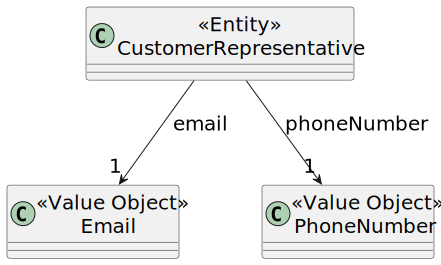

# US 223

## 1. Context

This task as the objective of concluding the requirements of the us223 of sprint2, where it is asked to develop a new functionality to the system. The team will now focus on completing the implementation and testing of this functionality as well as integrating it with the rest of the system.

### 1.1 List of issues

Analysis: Testing

Design: Testing

Implement: To do

Test: To do


## 2. Requirements

**As** a CRM Collaborator,
**I want** to edit the information (email and phone number) of a customer representative.
**So that** the given information is always up to date.

**Acceptance Criteria:**

**AC01:** The system should allow the user to edit the email and phone number of a customer representative. All other information cannot be changed.
**AC02:** The system should validate the input to ensure that it is valid.
**AC03:** The data must be retrieved using a dedicated DTO to decouple the internal domain model.

**Dependencies:**

*Regarding this requirement we understand that it relates to US221, as there needs to be a customer representative registered in the system before editing his information.*

## 3. Analysis

The system should allow the user to edit the information of a customer representative. This is important because the information of a customer representative may change over time, and it is important to keep this information up to date.

The system should allow the user to edit the email and phone number of a customer representative. The user should be able to edit this information through the user interface, and the system should validate the input to ensure that it is valid.



## 4. Design

*In this section we are going to present the design of the system. We will focus on the design of the new functionality, but we will also include other parts of the system that are important to understand the implementation.*

### 4.1. Realization

The class diagram as a similar structure to the one presented in US221, as the only difference are the names of the ui and controller and the used functions.

### 5. Tests

The following tests were designed to validate the acceptance criteria defined for US223. These tests focus on verifying
that the information edited is correct, that the expected data is correctly returned to the UI, and that proper
access control is enforced.

---

#### **Test 1: Editing the email and phone number of a customer representative**
**Refers to Acceptance Criteria:** _AC01_  
**Description:** Ensures that customers representatives information can be edited successfully.

```java
@Test
void ensureCustomerRepresentativeInformationCanBeEdited() {
    CustomerDTO dto = controller.registerNewRepresentativeOfCustomer();
    Email oldEmail = dto.getEmail();
    PhoneNumber oldPhoneNumber = dto.getPhoneNumber();
    controller.editInformationOfCustomerRepresentative(dto.getEmail(), dto.getPhoneNumber());
    assertNotEquals(oldEmail, dto.getEmail());
    assertNotEquals(oldPhoneNumber, dto.getPhoneNumber());
}
```

---

#### **Test 2: The newly edited data is valid**
**Refers to Acceptance Criteria:** _AC02_  
**Description:** Validates that the edited email and phone number are valid.

```java
@Test
void ensureRepresentativeRepresentsACustomer() {
    // setup: create and persist a representative.
    // action: call controller.editInformationOfCustomerRepresentative() with invalid data and valid data
    // assert: the first call throws an exception and the second one does not
}
```

---

#### **Test 3: DTOs are used to decouple domain and UI**
**Refers to Acceptance Criteria:** _AC03_  
**Description:** Verifies that no domain objects (`Customer`, `CustomerRepresentative`) are exposed directly by the controller, ensuring DTO usage.

```java
@Test
void ensureDomainEntitiesAreNotLeaked() {
    var result1 = controller.listAllCustomers();
    var result2 = controller.listRepresentativesOfAGivenCustomer();
    assertTrue(result1.stream().allMatch(dto -> dto instanceof CustomerDTO));
    assertTrue(result2.stream().allMatch(dto -> dto instanceof CustomerRepresentativeDTO));
}
```

## 6. Implementation

*In this section the team should present, if necessary, some evidencies that the implementation is according to the design. It should also describe and explain other important artifacts necessary to fully understand the implementation like, for instance, configuration files.*

*It is also a best practice to include a listing (with a brief summary) of the major commits regarding this requirement.*

## 7. Integration/Demonstration

*In this section the team should describe the efforts realized in order to integrate this functionality with the other parts/components of the system*

*It is also important to explain any scripts or instructions required to execute an demonstrate this functionality*

## 8. Observations

*This section should be used to include any content that does not fit any of the previous sections.*

*The team should present here, for instance, a critical prespective on the developed work including the analysis of alternative solutioons or related works*

*The team should include in this section statements/references regarding third party works that were used in the development this work.*