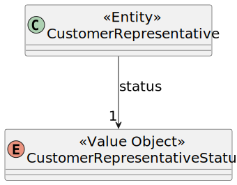

# US 224

## 1. Context

This task as the objective of concluding the requirements of the us224 of sprint2, where it is asked to develop a new functionality to the system. The team will now focus on completing the implementation and testing of this functionality as well as integrating it with the rest of the system.

### 1.1 List of issues

Analysis: Testing

Design: Testing

Implement: To do

Test: To do


## 2. Requirements

**As** a CRM Collaborator,
**I want** to disable a customer representative,
**So that** they are not contacted in the future.

**Acceptance Criteria:**

**AC01:** The system must validate the input to ensure that the customer representative is valid and exists in the system.
**AC02:** The system must ensure that the customer representative is not contacted in the future (the status of the customer representative must be changed to "disabled").
**AC03:** The data must be retrieved using a dedicated DTO to decouple the internal domain model.

**Dependencies:**

*Regarding this requirement we understand that it relates to US221, as there needs to be a customer representative registered in the system before disabling him.*

---

### Client Clarifications:

> **[Topic: US 224 Disable a customer representative](https://moodle.isep.ipp.pt/mod/forum/discuss.php?d=35716)**  
> Não faz sentido mostrar alguém já desativado se o objetivo é desativar.

---

## 3. Analysis

The system should allow the user to disable a customer representative. This is important because the customer representative might stop working for that enterprise, and it is important that the representatives registered that are integrated in the system are the ones that are still working for the enterprise. 

The system should allow the user to disable a customer representative through the user interface, and the system should validate the input to ensure that it is valid.



## 4. Design

*In this section we are going to present the design of the system. We will focus on the design of the new functionality, but we will also include other parts of the system that are important to understand the implementation.*

### 4.1. Realization

The class diagram as a similar structure to the one presented in US221, as the only difference are the names of the ui and controller and the used functions.

### 5. Tests

The following tests were designed to validate the acceptance criteria defined for US224. These tests focus on verifying
that the customer representative is disabled, that the expected data is correctly returned to the UI, and that proper
access control is enforced.

---

#### **Test 1: The Representative being disabled is a valid user**
**Refers to Acceptance Criteria:** _AC01_  
**Description:** Validates that the user being disabled is a valid customer representative.

```java
@Test
void ensureCustomerIsAUser() {
    // setup: create and persist a customer representative
    // action: call controller.disableCustomerRepresentative() for a valid user and invalid user
    // assert: check that the valid user is disabled and the invalid user throws an exception
}
```

---

#### **Test 2: The Customer Representative disabled is not contacted in the future**
**Refers to Acceptance Criteria:** _AC02_  
**Description:** Verifies that the status of the customer representative is changed to "disabled" and that they are not contacted in the future.

```java
@Test
void ensureCustomerInformationIsCorrect() {
    CustomerDTO dto = controller.registerNewRepresentativeOfCustomer();
    controller.disableCustomerRepresentative(dto);
    assertEquals(CustomerStatus.DISABLED, dto.getStatus());
}
```

#### **Test 3: DTOs are used to decouple domain and UI**
**Refers to Acceptance Criteria:** _AC03_  
**Description:** Verifies that no domain objects (`Customer`, `CustomerRepresentative`) are exposed directly by the controller, ensuring DTO usage.

```java
@Test
void ensureDomainEntitiesAreNotLeaked() {
    var result1 = controller.listAllCustomers();
    var result2 = controller.listRepresentativesOfAGivenCustomer();
    assertTrue(result1.stream().allMatch(dto -> dto instanceof CustomerDTO));
    assertTrue(result2.stream().allMatch(dto -> dto instanceof CustomerRepresentativeDTO));
}
```

## 6. Implementation

*In this section the team should present, if necessary, some evidencies that the implementation is according to the design. It should also describe and explain other important artifacts necessary to fully understand the implementation like, for instance, configuration files.*

*It is also a best practice to include a listing (with a brief summary) of the major commits regarding this requirement.*

## 7. Integration/Demonstration

*In this section the team should describe the efforts realized in order to integrate this functionality with the other parts/components of the system*

*It is also important to explain any scripts or instructions required to execute an demonstrate this functionality*

## 8. Observations

*This section should be used to include any content that does not fit any of the previous sections.*

*The team should present here, for instance, a critical prespective on the developed work including the analysis of alternative solutioons or related works*

*The team should include in this section statements/references regarding third party works that were used in the development this work.*