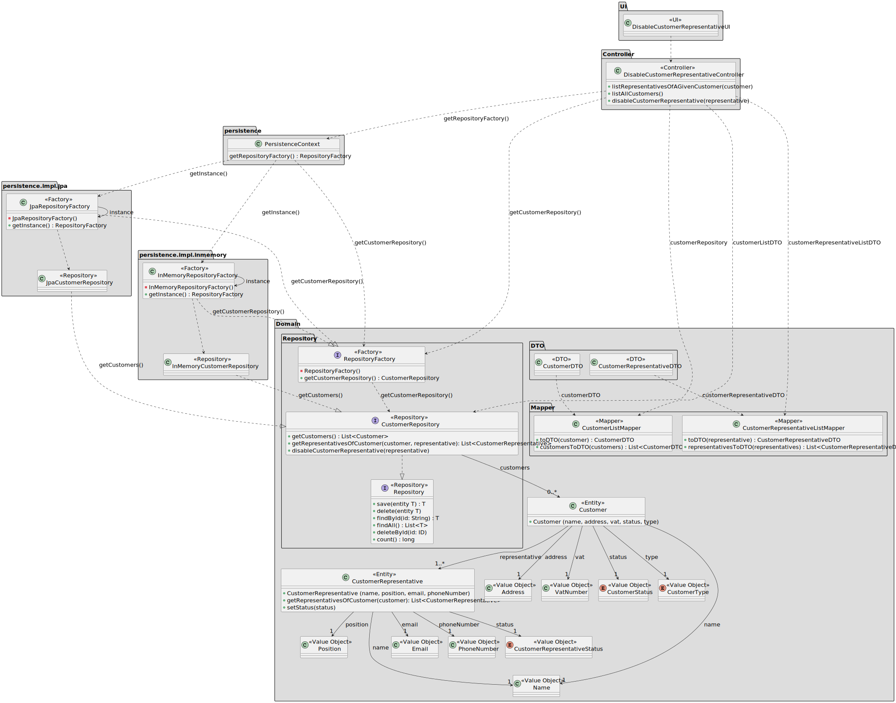

# US 224

## 1. Context

This task as the objective of concluding the requirements of the us224 of sprint2, where it is asked to develop a new functionality to the system. The team will now focus on completing the implementation and testing of this functionality as well as integrating it with the rest of the system.

### 1.1 List of issues

Analysis: Testing

Design: Testing

Implement: To do

Test: To do


## 2. Requirements

**As** a CRM Collaborator,
**I want** to disable a customer representative,
**So that** they are not contacted in the future.

**Acceptance Criteria:**

**AC01:** The system must validate the input to ensure that the customer representative is valid and exists in the system.
**AC02:** The system must ensure that the customer representative is not contacted in the future (the status of the customer representative must be changed to "disabled").
**AC03:** The data must be retrieved using a dedicated DTO to decouple the internal domain model.

**Dependencies:**

*Regarding this requirement we understand that it relates to US221, as there needs to be a customer representative registered in the system before disabling him.*

## 3. Analysis

The system should allow the user to disable a customer representative. This is important because the customer representative might stop working for that enterprise, and it is important that the representatives registered that are integrated in the system are the ones that are still working for the enterprise. 

The system should allow the user to disable a customer representative through the user interface, and the system should validate the input to ensure that it is valid.


## 4. Design

*In this section we are going to present the design of the system. We will focus on the design of the new functionality, but we will also include other parts of the system that are important to understand the implementation.*

### 4.1. Realization



### 4.3. Applied Patterns

This document outlines the design patterns used in the system. It provides a breakdown of each pattern's role, involved classes, and their purpose in maintaining a clean and maintainable architecture.

---

## **1. Data Transfer Object (DTO) Pattern**
**Classes Involved:**
- `CustomerDTO`
- `CustomerRepresentativeDTO`

**Purpose:**
DTOs are used to transfer data across layers, particularly between the Controller and the UI. They ensure that only necessary data is exposed, protecting the domain entities and maintaining a clear separation of concerns between the domain model and the UI.

---

## **2. Mapper Pattern**
**Classes Involved:**
- `CustomerListMapper`
- `CustomerRepresentativeListMapper`

**Purpose:**
The Mapper pattern is responsible for converting domain objects (`Customer`, `CustomerRepresentative`) into their corresponding DTOs (`CustomerDTO`, `CustomerRepresentativeDTO`) and vice versa. This helps centralize the transformation logic and ensures that business logic is kept separate from presentation logic.

---

## **3. Repository Pattern**

### **3.1. Repository Interface**
**Classes Involved:**
- `CustomerRepository`

**Purpose:**
The Repository pattern abstracts the data access logic and provides a clean interface for interacting with the domain entities. It allows the underlying data source to be changed without affecting the business logic.

---

### **3.2. Repository Implementations**

#### **JPA-based Implementation:**
**Classes Involved:**
- `JpaCustomerRepository`

**Purpose:**
The `JpaCustomerRepository` implements the `CustomerRepository` interface using JPA (Java Persistence API). It provides methods for interacting with the database and persisting `Customer` and `CustomerRepresentative` entities.

#### **In-Memory Implementation:**
**Classes Involved:**
- `InMemoryCustomerRepository`

**Purpose:**
The `InMemoryCustomerRepository` provides an in-memory solution for managing `Customer` and `CustomerRepresentative` entities. It is typically used for testing or when persistent storage is not required.

---

### **3.3. Repository Factory**
**Classes Involved:**
- `RepositoryFactory`
- `JpaRepositoryFactory`
- `InMemoryRepositoryFactory`

**Purpose:**
The Factory pattern is used to create repository instances. Depending on the configuration (e.g., JPA or in-memory), the appropriate repository is instantiated. `JpaRepositoryFactory` and `InMemoryRepositoryFactory` handle the creation of JPA and in-memory repositories, respectively.

---

## **4. Singleton Pattern**
**Classes Involved:**
- `Repositories`

**Purpose:**
The Singleton pattern ensures that only one instance of the `Repositories` class exists. This class is responsible for managing the repository instances and providing a global access point to the repositories.

---

## **5. Controller Pattern**
**Classes Involved:**
- `DisableCustomerRepresentativeController`

**Purpose:**
Controllers are responsible for handling user input and orchestrating the interactions between the UI and the domain.

---

## **6. Value Object Pattern**
**Classes Involved:**
- `Address`
- `VatNumber`
- `CustomerStatus`
- `CustomerType`
- `Position`
- `Name`
- `Email`
- `PhoneNumber`

**Purpose:**
Value objects represent immutable objects that encapsulate domain values. They ensure consistency and validity across the system.

---

## **7. UI Pattern**
**Classes Involved:**
- `DisableCustomerRepresentativeUI`

**Purpose:**
UI classes represent the user interface layer. They interact with the user, collect input, and delegate actions to controllers. These classes are responsible for rendering data to the user and handling user interactions.

---

## **8. Entity Pattern**
**Classes Involved:**
- `Customer`
- `CustomerRepresentative`

**Purpose:**
Entities represent core business objects with a unique identity. They are the central elements in the domain model and maintain business behavior and relationships.

---

## **9. Persistence Context**
**Classes Involved:**
- `PersistenceContext`

**Purpose:**
The `PersistenceContext` class provides access to the appropriate repository factory, either for JPA or in-memory repositories, based on the current configuration. It serves as a centralized point for repository creation and management.

---

## **10. Factory Pattern**
**Classes Involved:**
- `RepositoryFactory`
- `JpaRepositoryFactory`
- `InMemoryRepositoryFactory`

**Purpose:**
The Factory pattern abstracts the instantiation of repositories. It ensures that the correct repository implementation is used at runtime, making the system flexible and configurable.

---

These patterns contribute to the modular organization of the code and help maintain a clear separation of responsibilities across the various layers of the application.


### 5. Tests

The following tests were designed to validate the acceptance criteria defined for US224. These tests focus on verifying
that the customer representative is disabled, that the expected data is correctly returned to the UI, and that proper
access control is enforced.

---

#### **Test 1: The Representative being disabled is a valid user**
**Refers to Acceptance Criteria:** _AC01_  
**Description:** Validates that the user being disabled is a valid customer representative.

```java
@Test
void ensureCustomerIsAUser() {
    // setup: create and persist a customer representative
    // action: call controller.disableCustomerRepresentative() for a valid user and invalid user
    // assert: check that the valid user is disabled and the invalid user throws an exception
}
```

---

#### **Test 2: The Customer Representative disabled is not contacted in the future**
**Refers to Acceptance Criteria:** _AC02_  
**Description:** Verifies that the status of the customer representative is changed to "disabled" and that they are not contacted in the future.

```java
@Test
void ensureCustomerInformationIsCorrect() {
    CustomerDTO dto = controller.registerNewRepresentativeOfCustomer();
    controller.disableCustomerRepresentative(dto);
    assertEquals(CustomerStatus.DISABLED, dto.getStatus());
}
```

#### **Test 3: DTOs are used to decouple domain and UI**
**Refers to Acceptance Criteria:** _AC03_  
**Description:** Verifies that no domain objects (`Customer`, `CustomerRepresentative`) are exposed directly by the controller, ensuring DTO usage.

```java
@Test
void ensureDomainEntitiesAreNotLeaked() {
    var result1 = controller.listAllCustomers();
    var result2 = controller.listRepresentativesOfAGivenCustomer();
    assertTrue(result1.stream().allMatch(dto -> dto instanceof CustomerDTO));
    assertTrue(result2.stream().allMatch(dto -> dto instanceof CustomerRepresentativeDTO));
}
```

## 6. Implementation

*In this section the team should present, if necessary, some evidencies that the implementation is according to the design. It should also describe and explain other important artifacts necessary to fully understand the implementation like, for instance, configuration files.*

*It is also a best practice to include a listing (with a brief summary) of the major commits regarding this requirement.*

## 7. Integration/Demonstration

*In this section the team should describe the efforts realized in order to integrate this functionality with the other parts/components of the system*

*It is also important to explain any scripts or instructions required to execute an demonstrate this functionality*

## 8. Observations

*This section should be used to include any content that does not fit any of the previous sections.*

*The team should present here, for instance, a critical prespective on the developed work including the analysis of alternative solutioons or related works*

*The team should include in this section statements/references regarding third party works that were used in the development this work.*