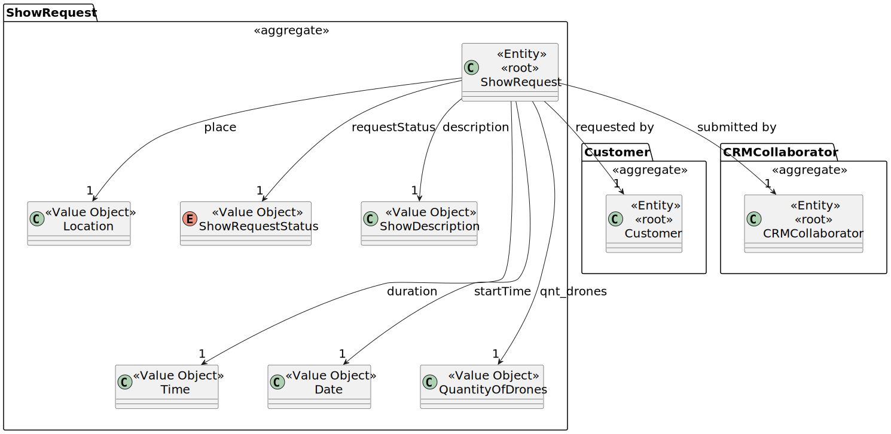
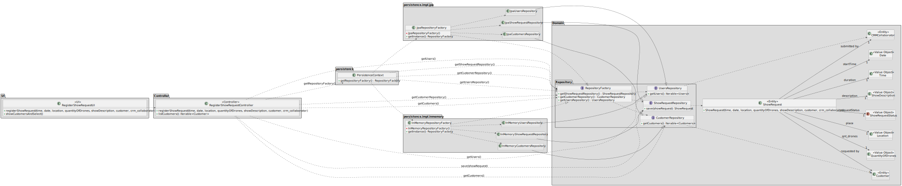

# US 230

## 1. Context
\
This task is being developed in sprint 2.\
The customer will contact the CRM Collaborator to submit a request for a show.\
The CRM Collaborator will create the show request into the system.

### 1.1 List of issues
\
Requirements: Done

Analysis: Done

Design: Done

Implement: Done

Test: Done


## 2. Requirements
\
US230 - As a CRM Collaborator, I want to register (create) a show request

\
**Acceptance Criteria:**

- AC01 - The CRM Collaborator must be a user in the system
- AC02 - The Show Request must have a Customer associated
- AC03 - The Show Request must have a Show Description, a Request Status and a Location 
- AC04 - The Show Request must also have a timestamp and the quantity of drones used
---
**Dependencies/References:**
 
- US211 - As Administrator, I want to be able to register users of the backoffice.\
The CRM Collaborator must be registered before a show request is created


- US220 - As a CRM Collaborator, I want to register a customer, and that the system automatically creates a customer representative for that customer.\
To create a Show Request, a customer is needed


- This US needs the customer is already in the system before starting to execute

---

**Client Clarifications:**

> **[Topic: Show Request Drones](https://moodle.isep.ipp.pt/mod/forum/discuss.php?d=35126)**\
> The number of drones used is the total amount specified

> **[Topic: Conceito de um Show Request](https://moodle.isep.ipp.pt/mod/forum/discuss.php?d=35286)**\
> The Show Request's show description can be a document with sequence of figures from the catalogue and/or new figures, as well as customer's exclusivity requirements

> **[Topic: Show Request Time](https://moodle.isep.ipp.pt/mod/forum/discuss.php?d=35349)**\
> The customer should provide to the CRM Collaborator, the date and time for the show

> **[Topic: Status do Show Request e Show Proposal](https://moodle.isep.ipp.pt/mod/forum/discuss.php?d=35337)**\
> The Show Request is created in a valid state, and not in an incomplete state waiting for information

> **[Topic: Identificão do show request](https://moodle.isep.ipp.pt/mod/forum/discuss.php?d=35376)**\
> The Show Request is identified by a Customer, a CRM Collaborator and a Timestamp

> **[Topic: Show Request - Place](https://moodle.isep.ipp.pt/mod/forum/discuss.php?d=35653)**\
> The Show Request place is defined by a location and an altitude, because it can affect the drone's performance

> **[Topic: Identificação do show request](https://moodle.isep.ipp.pt/mod/forum/discuss.php?d=35649)**\
> The Customer can place multiple Show Request at the same time.\
> Each Show Request must have a number or a code to identify it

> **[Topic: Show Request - Q&A](https://moodle.isep.ipp.pt/mod/forum/discuss.php?d=35671)**\
> The Show duration should be expressed in minutes

 
## 3. Analysis
\
The `Show Request` aggregate includes:

- Time - Time for the Show
- Date - Date for the Show
- QuantityOfDrones - Number of drones to be used in the Show
- Location - Location for the Show
- ShowRequestStatus - Status for the Show Request (created, accepted, etc.)
- ShowDescription - List of figures to be used in the show (i.e. a document)

\
The `CRM Collaborator` aggregate includes:

- Name - Name of the CRM Collaborator
- Email - Email of the Collaborator
- PhoneNumber - Phone Number of the Collaborator

\
The `Customer` aggregate includes:

- Name - Name of the customer (name of the company)
- Address - Address of the customer
- VatNumber - Value-added tax identification number
- CustomerStatus - Status of the Customer (active, inactive, etc.)
- CustomerType - Type of customer (individual, company, etc.)
- CustomerRepresentative - Representative from the company

  <br>
  <br>




## 4. Design
\
In this section, the design for **US230 - Register a Show Request** is presented.
It shows the separation between user interface, controller, domain model and persistence layers.

### 4.1. Realization



### 4.2. Acceptance Tests

**Test 1:** Ensure the CRM Collaborator is a user in the system\
**Refers to Acceptance Criteria:** AC01

```
@Test
void ensureCRMCollaboratorIsAUser() {
    // setup: create and persist a crm collaborator
    // action: get current user and get user list
    // assert: crm collaborator is in the list of users
}
````

---

**Test 2:** Ensure the Show Request has a Customer associated\
**Refers to Acceptance Criteria:** AC02

```
@Test
void ensureCustomerIsInShowRequest() {
    // setup: create show request and customer
    // action: get show request and get customer
    // assert: customer is the same in the request
}
````

---

**Test 3:** Ensure the Show Request has a Show Description, a Request Status and a Location\
**Refers to Acceptance Criteria:** AC03

```
@Test
void ensureShowRequestHasAttributes() {
    // setup: create show request and attributes
    // action: get show request and get attributes
    // assert: attributes are in the request
}
````

---

**Test 4:** Ensure the Show Request has a timestamp and the quantity of drones used\
**Refers to Acceptance Criteria:** AC04


```
@Test
void ensureShowRequestHasAttributes() {
    // setup: create show request and attributes
    // action: get show request and get attributes
    // assert: attributes are in the request
}
```


## 5. Implementation

The implementation of US230 is based on the design and analysis presented in the previous sections. The code is organized into packages that reflect the domain model, application logic, and user interface.
We included the necessary classes and methods to support the registration of a new show request. And didn't diverge from the design.

The coding Commit messages related to this requirement are as follows:

- [#20 Implementation: RegisterShowRequestUI update, Location, QuantityOfDrones and ShowDescription update
  ](https://github.com/Departamento-de-Engenharia-Informatica/sem4pi-2024-2025-sem4pi_2024_2025_g44/commit/f853ed6961eed5ea9b8593285dc6f48e9498810e)
- [#20 Implementation: RegisterShowRequestUI updated, showRequest update, jpa and inMemory connections updated
  ](https://github.com/Departamento-de-Engenharia-Informatica/sem4pi-2024-2025-sem4pi_2024_2025_g44/commit/4e1c904c4aba636bc0c60b46a32fe8807b2330bb)

## 6. Integration/Demonstration

To integrate the new functionality with the existing system, we followed these steps:

1. **Persistence Layer**: To connect the new functionality with the database, we used the existing repository pattern. The `ShowRequestRepository` were updated to include the necessary methods for the new functionality.
2. **Controller Layer**: The controller was updated to include methods for handling requests related to show requests. This includes methods for creating and editing show requests.
3. **UI Layer**: The user interface was updated to include forms and views for managing show requests. This includes input validation and error handling.
4. **Testing**: We ran the unit tests to ensure that the new functionality works as expected. The tests cover all acceptance criteria and other important scenarios.

To run the project, follow the instructions in the [README.md](../../../readme.md) file located in the root directory of the project. This file contains detailed instructions on how to set up the development environment, run the application, and execute the tests.

## 7. Observations

For the implementation of this project, we used the following sources:

- **EAPLI Framework**: A Java framework that provides a set of libraries and tools of our department(ISEP).
- **ECafetaria project**: A project developed by our department that serves as a reference and source for implementing similar functionalities and as a guide for best practices.
- **Jpa Hibernate**: A Java framework for object-relational mapping (ORM) that simplifies database interactions.
- **H2 Database**: A lightweight Java database that is easy to set up and use for development and testing purposes.
