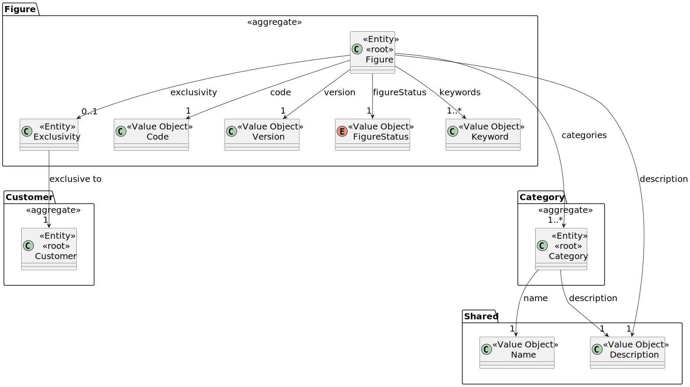
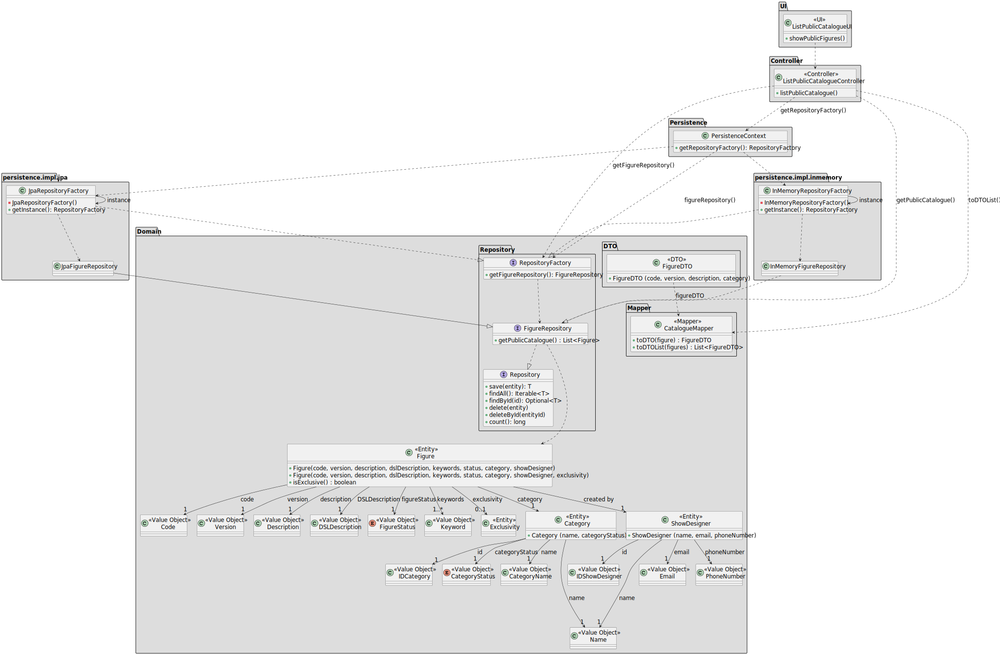

# US 231

## 1. Context

The purpose of this task is to provide a list of all public figures, enabling the appropriate selection during the show 
request process. This task is included in Sprint 2 and is being implemented for the first time.

### 1.1 List of issues

Analysis: 🧪 Testing

Design: 🧪 Testing

Implement: 📝 To Do

Test: 📝 To Do


## 2. Requirements

**As a** CRM Collaborator,
**I want** to list all public figures in the catalogue,
**So that** I can select them during a show request proposal.

**Acceptance Criteria:**

- **_US231.1_** Only active public figures must be listed.
- **_US231.2_** The list must include at least the figure's name, category, and version.
- **_US231.3_** The data must be retrieved using a dedicated DTO to decouple the internal domain model.
- **_US231.4_** The functionality should only be accessible to authenticated CRM Collaborator users.

**Dependencies/References:**

- **_US233 – Add Figure to the Catalogue_**: This user story is a direct dependency. It is required to have figures 
added to the catalogue before listing them.

## 3. Analysis

The figure aggregate includes several attributes, but for this user story the most relevant ones are:

- `Code` and `Version`, to uniquely identify and group figures.
- `Description`, to provide information in the UI.
- `FigureStatus`, which must be used to filter out inactive figures.
- `Keyword` and `Category`, which may support filtering and searching in the UI.
- `Exclusivity`, to ensure that exclusive figures are not shown in the listing.
- `ShowDesigner`, which is a reference to the show designer responsible for the figure.

Other attributes like DSL description and validation are not relevant in the context of listing figures and were omitted
from the diagram.



## 4. Design

In this section, we describe the design approach adopted for implementing **US231**. The class diagram includes the key 
components responsible for handling the listing of public figures, with a clear separation between the UI, application 
logic, domain model, and persistence infrastructure.


### 4.1. Realization

The class diagram below represents the realization of the **US231 — Figure Catalogue**. It illustrates how the UI
component communicates with the controller, which retrieves public figures from the configured repository (either JPA
or in-memory). The retrieved domain entities are then mapped to DTOs and returned to the presentation layer.

The diagram also includes the domain model elements relevant to this functionality, including the `Figure` aggregate,
its relation to `Category` and `ShowDesigner`, and the supporting infrastructure for persistence and mapping.



### 4.2. Applied Patterns

The design of the implementation for US231 applies several well-established design patterns, contributing to a modular, 
maintainable, and testable architecture. Below are the main patterns identified in this solution:

#### 1. **DTO (Data Transfer Object) Pattern**
- **Class Involved:** `FigureDTO`
- **Description:** Used to transfer only the necessary data about public figures from the domain layer to the 
presentation layer. It prevents exposure of the full domain entity and promotes decoupling between layers.

#### 2. **Mapper Pattern**
- **Class Involved:** `CatalogueMapper`
- **Description:** Converts `Figure` domain entities into `FigureDTO` objects. Centralizes the transformation logic, 
ensuring reusability and separation of concerns between the application and presentation layers.

#### 3. **Repository Pattern**
- **Classes Involved:** `FigureRepository`, `JpaFigureRepository`, `InMemoryFigureRepository`
- **Description:** Encapsulates data access logic. Provides a clear interface for retrieving public figures, allowing 
the persistence strategy (e.g. JPA or in-memory) to be swapped without affecting the rest of the application.

#### 4. **Factory Pattern**
- **Classes Involved:** `RepositoryFactory`, `JpaRepositoryFactory`, `InMemoryRepositoryFactory`
- **Description:** Responsible for creating instances of repositories depending on the context. Promotes flexibility 
and supports different persistence backends.

#### 5. **Singleton Pattern**
- **Classes Involved:** `JpaRepositoryFactory`, `InMemoryRepositoryFactory`
- **Description:** Ensures that only one instance of the factory is used across the application. The `getInstance()` 
method provides a controlled access point.

#### 6. **Controller Pattern**
- **Class Involved:** `ListPublicCatalogueController`
- **Description:** Orchestrates the listing use case by coordinating repository access and DTO mapping. Acts as the 
interface between the UI layer and the application logic.

#### 7. **Value Object Pattern**
- **Classes Involved:** `Code`, `Version`, `Description`, `CategoryName`, `FigureStatus`, etc.
- **Description:** These classes represent immutable values used in the domain model. They encapsulate data and 
potential validation rules, promoting domain expressiveness and consistency.

---

These patterns ensure a clear separation of concerns, ease of testing, and support for future changes in the underlying 
infrastructure or business rules. The use of factories and DTOs also enables the application to scale and adapt to 
different deployment environments or UI technologies.


### 4.3. Acceptance Tests

The following tests were designed to validate the acceptance criteria defined for US231. These tests focus on verifying 
that only valid public figures are listed, that the expected data is correctly returned to the UI, and that proper 
access control is enforced.

---

#### **Test 1: Only active public figures are listed**
**Refers to Acceptance Criteria:** _US231.1_  
**Description:** Ensures that figures marked as inactive or exclusive are not returned by the `listPublicCatalogue()` 
method.

```java
@Test
void ensureOnlyActiveAndPublicFiguresAreListed() {
    // setup: create and persist active public, inactive, and exclusive figures
    // action: call controller.listPublicCatalogue()
    // assert: result only contains active public figures
}
```

---

#### **Test 2: Returned data includes required attributes**
**Refers to Acceptance Criteria:** _US231.2_  
**Description:** Validates that the result includes each figure’s name (description), version, and category name.

```java
@Test
void ensureReturnedDTOContainsExpectedFields() {
    FigureDTO dto = controller.listPublicCatalogue().get(0);
    assertNotNull(dto.getDescription());
    assertNotNull(dto.getVersion());
    assertNotNull(dto.getCategoryName());
}
```

---

#### **Test 3: DTOs are used to decouple domain and UI**
**Refers to Acceptance Criteria:** _US231.3_  
**Description:** Verifies that no domain objects (`Figure`) are exposed directly by the controller, ensuring DTO usage.

```java
@Test
void ensureDomainEntitiesAreNotLeaked() {
    List<?> result = controller.listPublicCatalogue();
    for (Object dto : result) {
        assertTrue(dto instanceof FigureDTO, "Element is not an instance of FigureDTO");
    }
}
```

---

#### **Test 4: Access restricted to authenticated CRM Collaborator users**
**Refers to Acceptance Criteria:** _US231.4_  
**Description:** Validates that only users with the appropriate role can invoke the listing functionality.

```java
@Test
void ensureOnlyAuthenticatedCRMCollaboratorCanListFigures() {
    // setup: simulate login as CRM Collaborator
    // action: call controller.listPublicCatalogue()
    // assert: success

    // setup: simulate login as unauthorized user
    // action: call controller.listPublicCatalogue()
    // assert: access denied or exception thrown
}
```

## 5. Implementation

*In this section the team should present, if necessary, some evidencies that the implementation is according to the 
design. It should also describe and explain other important artifacts necessary to fully understand the implementation 
like, for instance, configuration files.*

*It is also a best practice to include a listing (with a brief summary) of the major commits regarding this requirement.*


## 6. Integration/Demonstration

*In this section the team should describe the efforts realized in order to integrate this functionality with the other 
parts/components of the system*

*It is also important to explain any scripts or instructions required to execute an demonstrate this functionality*


## 7. Observations

*This section should be used to include any content that does not fit any of the previous sections.*

*The team should present here, for instance, a critical prespective on the developed work including the analysis of 
alternative solutioons or related works*

*The team should include in this section statements/references regarding third party works that were used in the 
development this work.*