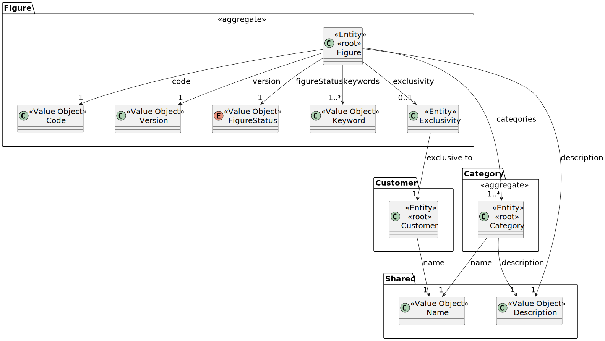
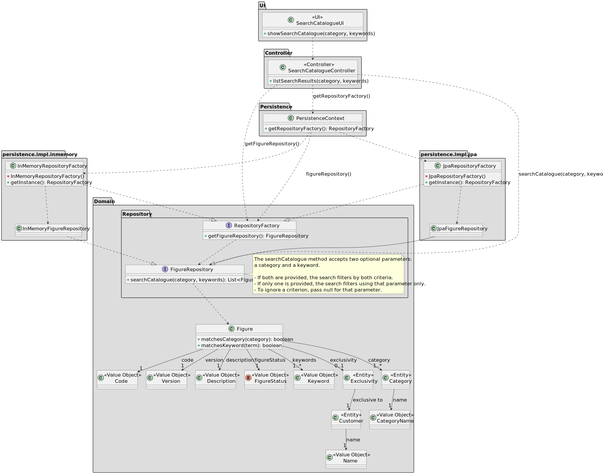

# US 232

## 1. Context

This user story is being developed as part of the Sprint 2. It introduces a search feature to the figure catalogue, 
allowing CRM Collaborators to filter figures based on categories and keywords.

### 1.1 List of issues

Analysis: 🧪 Testing

Design: 🧪 Testing

Implement: 🧪 Testing

Test: 🧪 Testing


## 2. Requirements

**As a** CRM Collaborator,
<br>
**I want** to search the figure catalogue by category and/or keyword,
<br>
**So that** it is easier to navigate through the catalogue.

**Acceptance Criteria:**

- **_US232.1_** The search should ignore accents and shouldn't be case-sensitive.
- **_US232.2_** The functionality must allow filtering by category only, keyword only, or both simultaneously.
- **_US232.3_** The results must include only active figures.

**Dependencies/References:**

- **_US233 – Add Figure to Catalogue_**: Figures must be present in the catalogue to be searchable.
- **_US234 - Decommission Figure_**: Inactive figures should not appear in the search results, even if they match the 
keyword or category.

**Client Clarification:**

> **[Topic: Versões de figuras](https://moodle.isep.ipp.pt/mod/forum/discuss.php?d=35125)**
>
> Figures may have multiple versions. According to the client, this has no impact on the backend implementation and 
should only affect the UI, where different versions may appear when searching for a figure.

> **[Topic: US232](https://moodle.isep.ipp.pt/mod/forum/discuss.php?d=35804)**
>
> The client confirmed that both public and exclusive figures may be shown in the search results. However, exclusive 
figures must be clearly marked to indicate their restricted usage.

## 3. Analysis

The `Figure` aggregate contains several domain attributes, but for this user story the most relevant ones are:

- `Code` and `Version` – uniquely identify each figure in the search results.
- `Description` – provides meaningful information to display in the user interface.
- `FigureStatus` – ensures that only active figures are included in the search.
- `Keyword` and `Category` – serve as filtering criteria in the search functionality.
- `Exclusivity` – indicates whether a figure is exclusive; if so, it references a `Customer` entity.
- `Customer` and its `Name` – allow exclusive figures to be clearly marked and associated with the correct client when 
shown in the results.

Attributes such as the DSL description or figure author are not relevant to this functionality and were intentionally 
omitted from the diagram for simplicity.



## 4. Design

In this section, we describe the design approach adopted for implementing **US232 – Search Figure Catalogue**. The 
class diagram defines the main components involved in the search operation, showcasing a clear separation of concerns 
between the UI, application logic, domain model, and persistence infrastructure.

### 4.1. Realization

The class diagram below illustrates the realization of **US232 – Search Figure Catalogue**. The `SearchCatalogueUI` 
component allows the user to initiate a search by providing a category and/or keyword. This request is forwarded to 
the `SearchCatalogueController`, which orchestrates the use case.

The controller retrieves the appropriate `FigureRepository` from the configured `RepositoryFactory` (resolved via the 
`PersistenceContext`) and delegates the operation using the method `searchCatalogue(category, keyword)`. This method 
accepts both parameters as optional:
- If both category and keyword are provided, the results are filtered by both.
- If only one is provided, the results are filtered accordingly.
- If a parameter should be ignored, `null` is passed for that argument.

The actual filtering logic is encapsulated in the domain model, particularly within the `Figure` class, which includes 
methods such as `matchesCategory(category)` and `matchesKeyword(term)` to support expressive and reusable criteria-based 
filtering.

The persistence layer supports two interchangeable implementations—JPA and in-memory—through the use of 
`JpaFigureRepository` and `InMemoryFigureRepository`, respectively. These implementations conform to the 
`FigureRepository` interface and are instantiated through their respective factories.

The model also includes domain concepts like `Category`, `Keyword`, `Exclusivity`, and `Customer`, as well as several 
value objects such as `Code`, `Version`, and `FigureStatus`, ensuring that the domain logic is expressive, consistent, 
and encapsulated.



### 4.2. Acceptance Tests

The following tests validate the acceptance criteria defined for **US232 – Search Figure Catalogue**. They ensure that 
the search functionality supports flexible filtering (by category and/or keyword), returns only active figures, and 
handles input in a case-insensitive and accent-insensitive manner.

---

#### **Test 1: Only active figures are returned**
**Refers to Acceptance Criteria:** _US232.3_  
**Description:** Ensures that inactive figures are excluded from the search results, even if they match the keyword or 
category.

```java
@Test
void ensureOnlyActiveFiguresAreReturned() {
    // setup: create two figures, one active and one inactive
    // action: call matchesCategory(category) and matchesKeyword(term)
    // assert: only active figure are true
}
```

---

#### **Test 2: Search by keyword only**
**Refers to Acceptance Criteria:** _US232.2_  
**Description:** Verifies that the search works correctly when filtering only by keyword.

```java
@Test
void ensureSearchByKeywordOnlyReturnsMatchingFigures() {
    // setup: create figure with the keyword "fire" and another with "water"
    // action: call matchesKeyword("fire") for both figures
    // assert: return true for the first and false for the second
}
```

---

#### **Test 3: Search by category only**
**Refers to Acceptance Criteria:** _US232.2_  
**Description:** Verifies that the search works when filtering only by category.

```java
@Test
void ensureSearchByCategoryOnlyReturnsMatchingFigures() {
    // setup: create figure with the category "mythology" and another with "nature"
    // action: call matchesCategory("mythology") for both figures
    // assert: return true for the first and false for the second
}
```

---

#### **Test 4: Search is case-insensitive and accent-insensitive**
**Refers to Acceptance Criteria:** _US232.1_  
**Description:** Ensures that keywords with different casing or accents still produce a match.

```java
@Test
void ensureSearchIgnoresCaseAndAccents() {
    // setup: create figure with the keyword "Fénix" and another with "Phoenix"
    // action: call matchesKeyword("fenix") and matchesKeyword("phoenix")
    // assert: return true for both
}
```

## 5. Implementation

*In this section the team should present, if necessary, some evidencies that the implementation is according to the
design. It should also describe and explain other important artifacts necessary to fully understand the implementation
like, for instance, configuration files.*

*It is also a best practice to include a listing (with a brief summary) of the major commits regarding this requirement.*


## 6. Integration/Demonstration

*In this section the team should describe the efforts realized in order to integrate this functionality with the other
parts/components of the system*

*It is also important to explain any scripts or instructions required to execute an demonstrate this functionality*


## 7. Observations

*This section should be used to include any content that does not fit any of the previous sections.*

*The team should present here, for instance, a critical prespective on the developed work including the analysis of
alternative solutioons or related works*

*The team should include in this section statements/references regarding third party works that were used in the
development this work.*