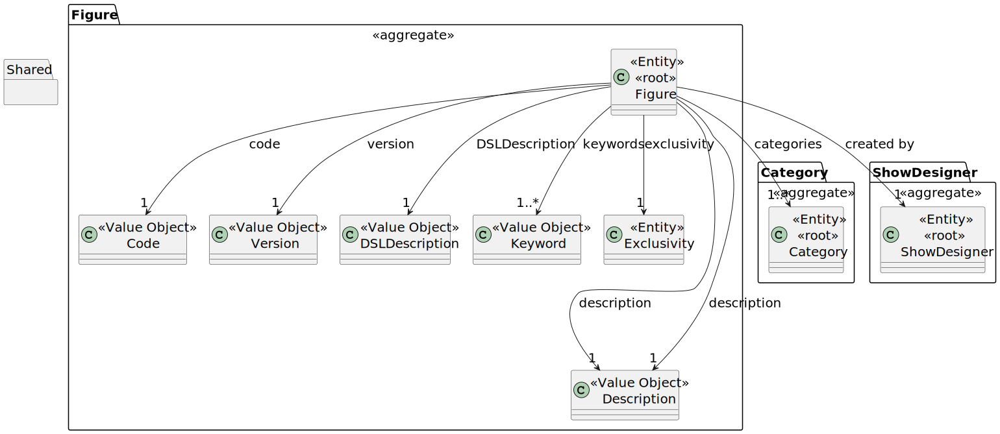
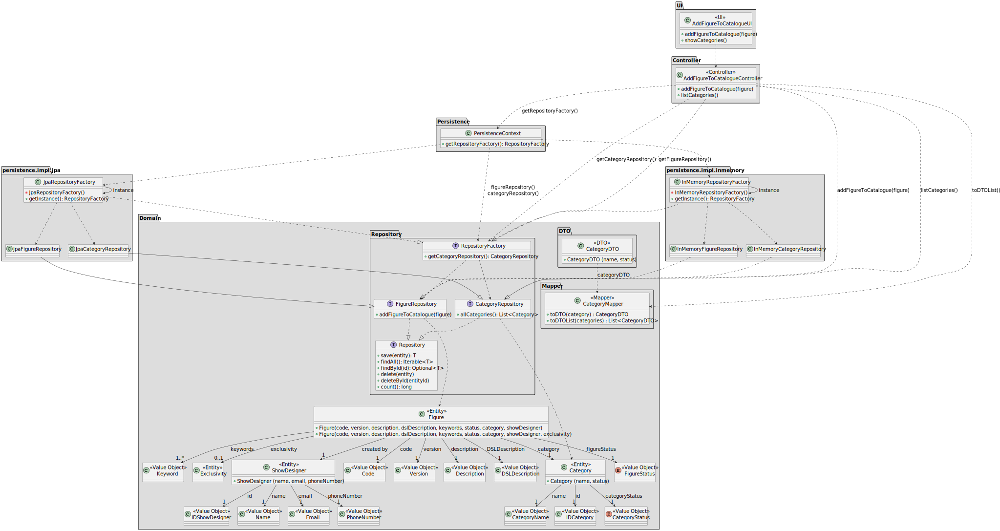

# US 233

## 1. Context

This user story is being developed as part of Sprint 2. It introduces the functionality to add a new figure to the 
public catalogue, including its associated category and keywords. If the figure is marked as exclusive, it will not be 
public and can only be used in shows for the customer holding the exclusivity rights.

### 1.1 List of issues

Analysis: 🧪 Testing

Design: 🧪 Testing

Implement: 🚧 Doing

Test: 📝 To Do


## 2. Requirements

**As a** Show Designer,
<br>
**I want** to add a figure to the public catalogue,
<br>
**So that** no figures are missing.

**Acceptance Criteria:**

- **US233.1** A figure must include the following parameters: code, version, description, DSL description, keywords, 
and category.
- **US233.2** If a figure is exclusive to a customer, it must not be added to the public catalogue and must only be 
available for use in shows for that customer.
- **US233.3** Only authenticated Show Designers are allowed to add figures to the catalogue.
- **US233.4** The system must store the Show Designer who created the figure.

**Dependencies/References:**

- **_US245 – Add figure category_**: A figure category must exist before it can be assigned to a new figure.

**Client Clarifications:**

> **[Topic: Questões de negócio](https://moodle.isep.ipp.pt/mod/forum/discuss.php?d=35186)**
>
> All figures must be added to the catalogue, regardless of whether they are public or exclusive.  
> Private figures may appear in the catalogue, but can only be used in proposals made for the customer holding 
exclusivity rights.

> **[Topic: Confusão sobre Figuras e DSL](https://moodle.isep.ipp.pt/mod/forum/discuss.php?d=35283)**
> 
> According to the client, "DSL code" and "DSL description" refer to the same thing — the high-level DSL file that 
defines a figure. This should not be confused with the figure's general textual description (e.g., "ISEP logo"), 
which is a separate attribute.

> **[Topic: Keyword e Category](https://moodle.isep.ipp.pt/mod/forum/discuss.php?d=35336)**
>
> Categories exist within a catalogue and can be selected from it. Keywords are free-form values introduced by the user. 
Additionally, keyword and category comparisons must be case-insensitive and accent-insensitive.

> **[Topic: Informações — Figure](https://moodle.isep.ipp.pt/mod/forum/discuss.php?d=35438)**
>
> The client confirmed that it is relevant to store the author (Show Designer) who created the figure, as a way of 
giving credit for their work.

> **[Topic: Figure category](https://moodle.isep.ipp.pt/mod/forum/discuss.php?d=35571)**
>
> The client confirmed that both the category and the keywords of a figure can change when a new version of that figure 
is released.

> **[Topic: Figure Version](https://moodle.isep.ipp.pt/mod/forum/discuss.php?d=35573)**
>
> The client clarified that each figure must have a unique identifier. This can either be a unique code per version or 
a combination of code and version to ensure uniqueness. What distinguishes one version from another is entirely up to 
the client's management of the catalogue.

> **[Topic: Figure](https://moodle.isep.ipp.pt/mod/forum/discuss.php?d=35621)**
>
> The client confirmed that the *description* and *keywords* of a figure are distinct attributes.  
> Additionally, it is possible to add a **new version** of an existing figure to the public catalogue.

## 3. Analysis

The `Figure` aggregate includes multiple domain attributes, but only a subset is relevant to this user story, which 
focuses on adding a new figure to the catalogue.

- `Code` and `Version` – together, they uniquely identify each figure in the system.
- `Description` – provides a human-readable label to identify the figure in the catalogue.
- `DSLDescription` – contains the DSL code that defines the figure’s visual representation.
- `Keyword` – a set of labels that help describe the figure and may support future search or filtering functionalities.
- `Category` – represents the classification to which the figure belongs and is selected from a predefined catalogue.
- `Exclusivity` – indicates whether the figure is exclusive to a specific customer; if present, the figure should not 
be listed publicly.
- `ShowDesigner` – the user who created the figure, stored for traceability and attribution.

Other elements not essential to this functionality have been omitted from the diagram to maintain clarity and focus.



## 4. Design

This section presents the design adopted for implementing **US233 – Add Figure to the Catalogue**.
The class diagram highlights the main components involved in the process, demonstrating a clear separation of concerns 
between the user interface (UI), application logic (Controller), domain model (Domain), and persistence infrastructure 
(Persistence).

### 4.1 Realisation

The class diagram below illustrates the realisation of **US233 – Add Figure to the Catalogue**.
The user interface (`AddFigureToCatalogueUI`) initiates the process by requesting all necessary data from the user. 
It reads the DSL code from a `.txt` file line by line, collects the remaining figure attributes, and invokes one of the 
available controller methods—`addPublicFigureToCatalogue(...)` or `addExclusiveFigureToCatalogue(...)`— depending on 
whether the figure is public or exclusive.

The `AddFigureToCatalogueController` is responsible for orchestrating the creation and persistence of the 
`Figure` entity.
It retrieves the required repositories through the `PersistenceContext`, which provides the appropriate 
`RepositoryFactory` implementation (either JPA or In-Memory). With the collected data, the controller instantiates the 
new `Figure` and persists it by calling `save(figure)` on the `FigureRepository`.

Before creating the figure, the UI allows the user to select one or more `Category` objects via the 
`showCategoriesAndSelect()` method. If the figure is exclusive, the `showCustomersAndSelect()` method is also invoked 
to associate a `Customer` with an `Exclusivity` object. These methods interact with the controller, which exposes the 
necessary data through `listCategories()` and `listCustomers()`.

The persistence layer follows the Abstract Factory pattern. The `RepositoryFactory` interface has multiple concrete 
implementations (JPA and In-Memory), enabling flexibility in the underlying persistence strategy. Each repository 
interface (e.g., `FigureRepository`, `CategoryRepository`, `CustomerRepository`) has corresponding implementations 
compatible with the selected storage backend.



### 4.2. Acceptance Tests

The following tests validate the acceptance criteria defined for **US233 – Add Figure to the Catalogue**. They ensure 
that figures are correctly structured and validated, that exclusivity is respected, that access control is enforced, 
and that authorship is properly recorded.

---

#### **Test 1: Figure must contain all required parameters**
**Refers to Acceptance Criteria:** _US233.1_  
**Description:** Ensures that a figure cannot be added if any of the mandatory attributes (code, version, description, 
DSL description, keywords or category) are missing.

```java
@Test
void ensureFigureIncludesAllRequiredParameters() {
    // setup: create a figure with missing attributes (e.g. no keywords or category)
    // action: attempt to add the figure to the catalogue
    // assert: expect InvalidFigureException to be thrown
}
```

---

#### **Test 2: Exclusive figures are not added to the public catalogue**
**Refers to Acceptance Criteria:** _US233.2_  
**Description:** Ensures that if a figure is exclusive to a customer, it is not made available in the public catalogue.

```java
@Test
void ensureExclusiveFiguresAreNotPublic() {
    // setup: create an exclusive figure for a specific customer
    // action: add the figure to the catalogue
    // assert: figure is not listed in public catalogue
}
```

---

#### **Test 3: Only authenticated Show Designers can add figures**
**Refers to Acceptance Criteria:** _US233.3_  
**Description:** Verifies that only users with the Show Designer role are allowed to add figures to the catalogue.

```java
@Test
void ensureOnlyShowDesignersCanAddFigures() {
    // setup: authenticate as a Show Designer
    // action: add a valid figure
    // assert: operation succeeds

    // setup: authenticate as a user without required role
    // action: attempt to add a valid figure
    // assert: expect AccessDeniedException or equivalent
}
```

---

#### **Test 4: The creator (Show Designer) is stored with the figure**
**Refers to Acceptance Criteria:** _US233.4_  
**Description:** Ensures that the system stores a reference to the authenticated Show Designer who created the figure.

```java
@Test
void ensureShowDesignerIsStoredWithFigure() {
    // setup: authenticate as a Show Designer
    // action: add a new figure
    // assert: saved figure contains reference to the authenticated Show Designer
}
```

## 5. Implementation

*In this section the team should present, if necessary, some evidencies that the implementation is according to the
design. It should also describe and explain other important artifacts necessary to fully understand the implementation
like, for instance, configuration files.*

*It is also a best practice to include a listing (with a brief summary) of the major commits regarding this requirement.*


## 6. Integration/Demonstration

*In this section the team should describe the efforts realized in order to integrate this functionality with the other
parts/components of the system*

*It is also important to explain any scripts or instructions required to execute an demonstrate this functionality*


## 7. Observations

*This section should be used to include any content that does not fit any of the previous sections.*

*The team should present here, for instance, a critical prespective on the developed work including the analysis of
alternative solutioons or related works*

*The team should include in this section statements/references regarding third party works that were used in the
development this work.*