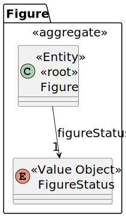
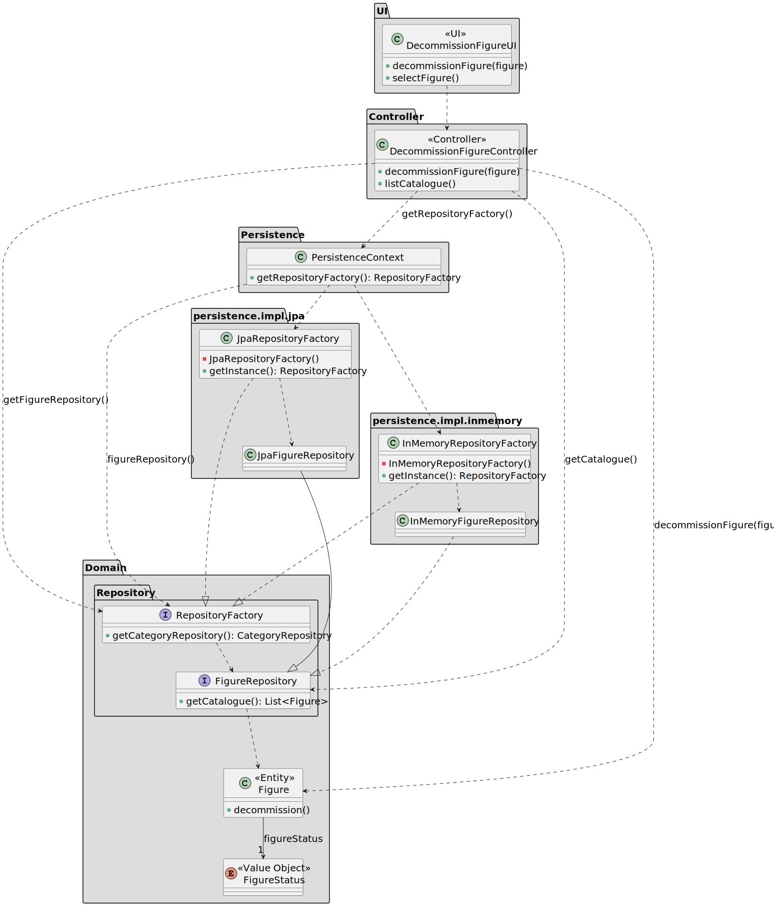

# US 234

## 1. Context

This user story is being developed as part of Sprint 2. It introduces the functionality to decommission a figure from 
the catalogue. Once a figure is decommissioned, it becomes inactive and can no longer be used in new shows or appear in 
catalogue search results. This allows CRM Managers to control and retire figures that are no longer relevant or approved 
for use.

### 1.1 List of issues

Analysis: 🧪 Testing

Design: 🧪 Testing

Implement: 🧪 Testing

Test: 🧪 Testing


## 2. Requirements

**As a** CRM Manager,
<br>
**I want** to decommission a figure from the catalogue,
<br>
**So that** it will not be used anymore.

**Acceptance Criteria:**

- **_US234.1_** Only active figures can be decommissioned
- **_US234.2_** Decommissioning a figure sets its status to disable

**Dependencies/References:**

- **_US233 – Add Figure to the catalogue_**: Figures are needed for these to be decommissioned.

**Client Clarifications:**

> **[Topic: Descomissionamento de uma figura](https://moodle.isep.ipp.pt/mod/forum/discuss.php?d=35559)** 
> 
> The client clarified that only a specific **version** of a figure is to be decommissioned. Versions are what truly 
matter in proposals, while the figure entity itself serves only as a cataloguing structure.

## 3. Analysis

The figure aggregate includes multiple attributes, but for this user story the most relevant one is the `FigureStatus`. 
This value object represents the current state of the figure — for instance, whether it is **active** or **disable**.

Decommissioning a figure involves changing its status to disable. Once disable, the figure should be excluded from all 
search results, listings, and proposals. Since, according to the client, each **version** of a figure is treated 
independently, the decommissioning operation applies only to the specific version being handled, not to all versions of 
a figure.

Other attributes such as `Code`, `Description`, `Keywords`, or `Exclusivity` are not directly impacted by this 
functionality and were omitted from the diagram for clarity.



## 4. Design

In this section, we describe the design approach adopted for implementing **US234 – Decommission Figure**. The class 
diagram defines the main components involved in the decommissioning operation, illustrating a clear separation of 
concerns between the UI, application logic, domain model, and persistence infrastructure.

### 4.1. Realization

The class diagram below illustrates the realization of **US234 – Decommission Figure**. The `DecommissionFigureUI` 
component allows a CRM Manager to select a figure from the catalogue and initiate the decommissioning process via the 
`decommissionFigure(figure)` method. This action is forwarded to the `DecommissionFigureController`, which coordinates 
the use case.

The controller retrieves the configured `FigureRepository` through the `RepositoryFactory`, made available via the 
`PersistenceContext`. It then delegates the operation by calling the domain method `decommission()` on the selected 
`Figure`.

The domain logic is encapsulated in the `Figure` aggregate, which includes the method `decommission()` responsible for 
changing the `FigureStatus` to a disable state. This ensures that the deactivation logic is kept within the domain 
layer, enforcing the necessary business rules.

The `FigureRepository` interface provides access to the current catalogue of figures through the method 
`findAll()`, which supports listing and selection. Two repository implementations are supported: `JpaFigureRepository` 
and `InMemoryFigureRepository`, both of which conform to the `FigureRepository` interface and are instantiated via their 
respective factories.

This design ensures that the decommissioning use case remains modular, testable, and consistent with the overall 
architecture of the system.



### 4.2. Acceptance Tests

The following tests validate the acceptance criteria defined for **US234 – Decommission Figure**. They ensure that only 
active figures can be decommissioned, that decommissioned figures become inactive and are excluded from listings, and 
that the operation is restricted to authorized users.

---

#### **Test 1: Only active figures can be decommissioned**
**Refers to Acceptance Criteria:** _US234.1_  
**Description:** Ensures that the system does not allow a figure to be decommissioned more than once.

```java
@Test
void ensureOnlyActiveFiguresCanBeDecommissioned() {
    // setup: create an active figure and decommission it
    // action: attempt to decommission the same figure again
    // assert: expect IllegalStateException to be thrown
}

```

---

#### **Test 2: Decommissioning sets figure as disable**
**Refers to Acceptance Criteria:** _US234.2_  
**Description:** Verifies that the status of a figure is updated to disable after decommissioning.

```java
@Test
void ensureDecommissionedFigureIsMarkedAsDisable() {
    // setup: create an active figure
    // action: decommission the figure
    // assert: verify that the figure status is set to DISABLE
}

```

## 5. Implementation

*In this section the team should present, if necessary, some evidencies that the implementation is according to the
design. It should also describe and explain other important artifacts necessary to fully understand the implementation
like, for instance, configuration files.*

*It is also a best practice to include a listing (with a brief summary) of the major commits regarding this requirement.*


## 6. Integration/Demonstration

*In this section the team should describe the efforts realized in order to integrate this functionality with the other
parts/components of the system*

*It is also important to explain any scripts or instructions required to execute an demonstrate this functionality*


## 7. Observations

*This section should be used to include any content that does not fit any of the previous sections.*

*The team should present here, for instance, a critical prespective on the developed work including the analysis of
alternative solutioons or related works*

*The team should include in this section statements/references regarding third party works that were used in the
development this work.*