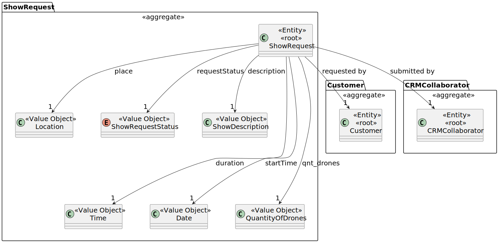
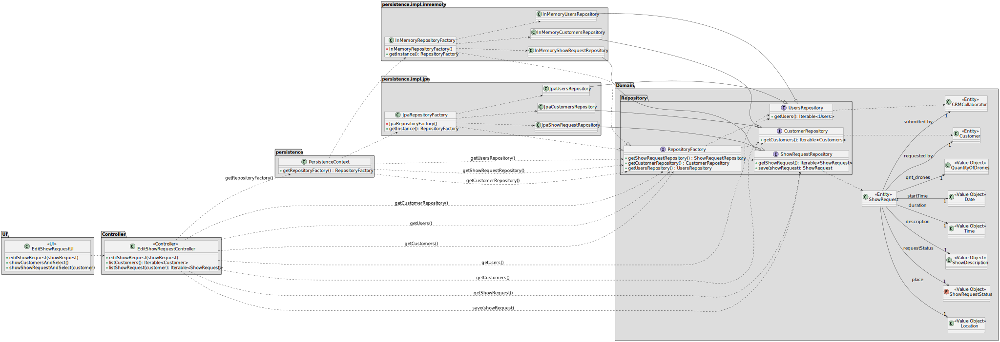

# US 236

## 1. Context
\
This task is being developed in sprint 2.\
The CRM Collaborator should be able to edit show requests from a client.\
The show request's editing can only be done before a proposal is made.

### 1.1 List of issues
\
Requirements: Done

Analysis: Done

Design: Done

Implement: Done

Test: Done


## 2. Requirements
\
US236 - As CRM Collaborator, I want to edit a show request of a client.\
Only show requests without a proposal can be edited.

\
**Acceptance Criteria:**

- AC01 - The CRM Collaborator must be a user in the system
- AC02 - The Client must be a user in the system

---
**Dependencies/References:**

- US211 - As Administrator, I want to be able to register users of the backoffice.\
  The CRM Collaborator must be registered before this functionality is executed


- US220 - As a CRM Collaborator, I want to register a customer,
  and that the system automatically creates a customer representative for that customer.\
  The client must be registered before this functionality is executed


- US230 - As a CRM Collaborator. I want to register (create) a show request.\
  In order to edit any Show Request, it should be created before this functionality is executed


- US235 - As CRM Manager or CRM Collaborator, I want to list all show requests of a client.\
  In order to provide a list of Show Request for the CRM Collaborator edit, the US235 should be used
  

- If there is no clients, the functionality can not show anything


- If there is a client but no show request for that client, the functionality can not show anything rather than the list of clients


- If there is a client and show requests for that client, but the show request does already have an proposal made, it should not be allowed to edit

---

**Client Clarifications**

> **[Topic: Status do Show Request e Show Proposal](https://moodle.isep.ipp.pt/mod/forum/discuss.php?d=35337)**\
> The Show Request status information should be either created or accepted


> **[Topic: Identificação do show request](https://moodle.isep.ipp.pt/mod/forum/discuss.php?d=35337)**\
> The Show Request is identified by a Customer, a CRM Collaborator and a Timestamp


> **[Topic: US 235](https://moodle.isep.ipp.pt/mod/forum/discuss.php?d=35706)**\
> When listing a Show Request, it should have a date, a time, a location, a status and a description
 

> **[Topic: US 236](https://moodle.isep.ipp.pt/mod/forum/discuss.php?d=35707)**\
> The Show Request history should register the modifications made.


## 3. Analysis
\
The `Show Request` aggregate includes:

- Time - Time for the Show
- Date - Date for the Show
- QuantityOfDrones - Number of drones to be used in the Show
- Location - Location for the Show
- ShowRequestStatus - Status for the Show Request (created, accepted, etc.)
- ShowDescription - List of figures to be used in the show (i.e. a document)

\
The `CRM Collaborator` aggregate includes:

- Name - Name of the CRM Collaborator
- Email - Email of the Collaborator
- PhoneNumber - Phone Number of the Collaborator

\
The `Customer` aggregate includes:

- Name - Name of the customer (name of the company)
- Address - Address of the customer
- VatNumber - Value-added tax identification number
- CustomerStatus - Status of the Customer (active, inactive, etc.)
- CustomerType - Type of customer (individual, company, etc.)
- CustomerRepresentative - Representative from the company

<br>
<br>




## 4. Design

\
In this section, the design for **US236 - Edit a Show Request** is presented.
It shows the separation between user interface, controller, domain model and persistence layers.

### 4.1. Realization



### 4.2. Acceptance Tests

**Test 1:** Ensure the CRM Collaborator is a user in the system\
**Refers to Acceptance Criteria:** AC01

```
@Test
void ensureCRMCollaboratorIsAUser() {
// setup: create and persist a crm collaborator
// action: get current user and get user list
// assert: crm collaborator is in the list of users
}
````

---

**Test 2:** Ensure the Customer is a user in the system\
**Refers to Acceptance Criteria:** AC02

```
@Test
void ensureCustomerIsAUser() {
    // setup: create and persist a customer
    // action: get customer identification and get user list
    // assert: customer is in the list of users
}
````

## 5. Implementation

The implementation of US236 is based on the design and analysis presented in the previous sections. The code is organized into packages that reflect the domain model, application logic, and user interface.
We included the necessary classes and methods to support the editing of a show request. And didn't diverge from the design.

The coding Commit messages related to this requirement are as follows:

- [#60 Implementation: EditShowRequestUI update
  ](https://github.com/Departamento-de-Engenharia-Informatica/sem4pi-2024-2025-sem4pi_2024_2025_g44/commit/fe13104ac07f8c8bc980e807039fc8696bcabd27)
- [#20 #59 #60 Implementation: All USs are working.
  ](https://github.com/Departamento-de-Engenharia-Informatica/sem4pi-2024-2025-sem4pi_2024_2025_g44/commit/17bbde30ede158aa48999c417ea474859ef5cf73)

## 6. Integration/Demonstration

Please go to the US230 for the integration and demonstration of the system.

## 7. Observations

Please go to the US230 for the observations of the system.
