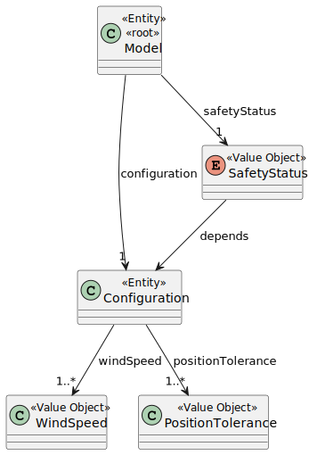
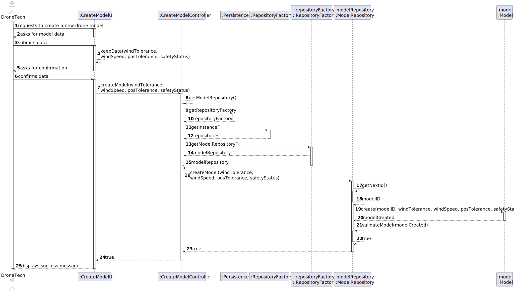

# US240 - Register Drone Model

## 1. Context

This task concerns the implementation of **US240**, part of Sprint 3, which introduces a new system feature: the ability to define and store different drone models. This functionality is essential to support the future creation and tracking of physical drone units (US241), and is a foundational step toward drone fleet management.

The system must ensure that each drone model includes specific physical and operational characteristics such as wind tolerance, maximum wind speed, position tolerance, and safety status. This information will guide validation and operation constraints in later features, including inventory and mission execution.

### 1.1 List of Issues

- **Analysis**: Done
- **Design**: Done
- **Implement**: To do
- **Test**: To do

---

## 2. Requirements

**As** a Drone Tech,  
**I want** to create a drone model in the system,  
**So that** a new model of drones can start being used.

### Acceptance Criteria

- **AC01**: This must also be achieved by a bootstrap process.
- **AC02**: A drone model includes its behaviour under wind as a tolerance of the drone’s position (x, y, z) as a function of the wind speed (x, y, z) (In a first crude approach, this can be done in steps).

### Dependencies

This user story does not depend on any previous functionality.

---

### Client Clarifications

> **[Topic: Validação do modelo de drone](https://moodle.isep.ipp.pt/mod/forum/discuss.php?d=35790#p45210)**  
> Sim, esses parâmetros são obrigatórios para garantir a segurança operacional dos drones. Um modelo mal definido pode causar falhas em voo.

---

## 3. Analysis

### Model Aggregate

The core domain concept for this user story is the **Model** aggregate, which captures all essential characteristics of a drone type.

#### Domain Attributes:

- **ModelID** – A unique identifier for internal referencing.
- **WindTolerance** – Maximum allowed wind force the model can handle.
- **WindSpeed** – Maximum wind speed operational limits.
- **PositionTolerance** – Tolerance of deviation during GPS-based navigation.
- **SafetyStatus** – A boolean or enumerated field indicating whether the model is certified for use.

These attributes must be validated during model creation. Invalid data should prevent the persistence of the model.

### Value Objects

- **ModelID** – Auto-generated unique ID for each model.
- **WindTolerance / WindSpeed / PositionTolerance** – Numeric value objects validated against domain rules.
- **SafetyStatus** – Boolean or status enum ensuring certified models only.

### Domain Model



---

## 4. Design

This section describes the design process for **US240**, which enables the creation of drone models. The interaction is initiated by a Drone Tech through a user interface and handled through a series of layered responsibilities, culminating in the creation and validation of a new `Model` entity.

### 4.1 Realization

The following diagram shows the flow of the drone model creation process:



---

## 5. Tests

### Test 1: Model data is persisted

**Refers to Acceptance Criteria:** AC01  
**Description:** Verifies that the key model attributes are stored correctly in the repository.

```java
@Test
void ensureModelDataIsPersisted() {
    controller.createModel(3.0, 40.0, 0.5, true);
    assertTrue(repository.containsModelWithTolerance(3.0));
}

````

## 6. Implementation

*In this section the team should present, if necessary, some evidencies that the implementation is according to the design. It should also describe and explain other important artifacts necessary to fully understand the implementation like, for instance, configuration files.*

*It is also a best practice to include a listing (with a brief summary) of the major commits regarding this requirement.*

## 7. Integration/Demonstration

*In this section the team should describe the efforts realized in order to integrate this functionality with the other parts/components of the system*

*It is also important to explain any scripts or instructions required to execute an demonstrate this functionality*

## 8. Observations

*This section should be used to include any content that does not fit any of the previous sections.*

*The team should present here, for instance, a critical prespective on the developed work including the analysis of alternative solutioons or related works*

*The team should include in this section statements/references regarding third party works that were used in the development this work.*