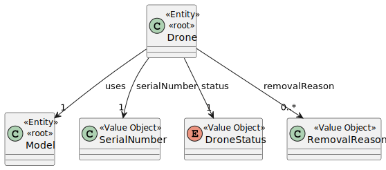
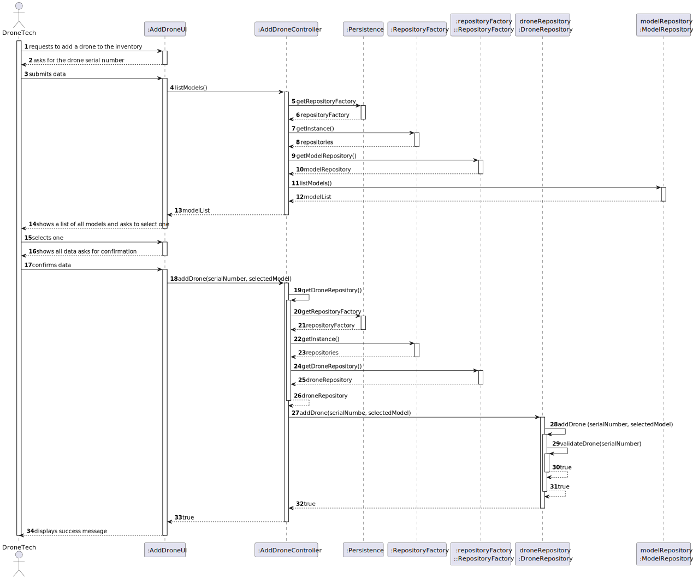

# US 241

## 1. Context

This task has the objective of concluding the requirements of US241 from Sprint 3, which consists of developing a new functionality in the system: the addition of drones to the inventory. The team is now focused on completing the implementation and testing of this functionality, as well as integrating it with the existing system components.

This feature ensures that drones can be registered in the system with all the necessary attributes, including their serial number, operational status, and associated model. It builds upon previously implemented functionalities (such as US240, which enables the creation of drone models), and is a necessary step toward enabling drone-based operations within the system.
### 1.1 List of issues

Analysis: Done

Design: Done

Implement: To do

Test: To do


## 2. Requirements

**As** a Drone Tech,  
**I want** to add drones of an existing type to inventory,
**So that** all drones in the inventory are accounted for.

### Acceptance Criteria

- **AC01**: For each drone, the serial number must be stored.
- **AC02**: This must also be achieved by a bootstrap process.
- **AC03**: Drone model must already exist.

### Dependencies

This requirement depends on **US240:** As a Drone Tech, I want to create a drone model in the system

---

### Client Clarifications:

> **[Topic: Estado de um drone ao adicioná-lo no inventário](https://moodle.isep.ipp.pt/mod/forum/discuss.php?d=35829#p45386)**  
> Fará sentido adicionar um drone desactivado ao sistema? Acho que seria perder tempo.  
> Adicionar um drone em manutenção ao sistema seria um problema muito complexo, pois teria que incluir também o processo de manutenção. Esqueça...

---
## 3. Analysis

### Drone Aggregate

The `Drone` aggregate represents an individual drone in the system. For the purpose of US241, the key domain elements are:

- **SerialNumber** – A value object representing the unique identifier for each drone. No two drones may share the same serial number.
- **DroneStatus** – A value object that captures the current status of the drone (e.g., ACTIVE, INACTIVE, MAINTENANCE).
- **Model** – An entity representing the drone’s model. Every drone must be associated with an existing model in the system.

This design ensures that drones are uniquely identifiable and tied to a known model already configured in the system.

### Model Aggregate

The `Model` aggregate (also referred to as DroneModel in earlier discussions) represents the specifications of a type of drone. A model must exist before drones of that model can be created.

In this US, the model must already be present when creating a drone, thus this entity acts as a dependency and point of validation during the creation process.

### Value Objects

- **SerialNumber** – Encapsulates formatting and uniqueness rules.
- **DroneStatus** – Encodes the drone’s lifecycle states in a strongly typed, controlled way.
- **DroneModel** – Represents the technical specifications and constraints of a drone type, including its behavior under wind conditions. This entity must exist before a drone instance can be created, ensuring that only valid models are referenced.

### Domain Model



---

## 4. Design

In this section, we describe the design approach adopted for implementing US241 – Add drone to the inventory. The sequence diagram defines the main components involved in the addition of a new drone to the inventory, showing a clear separation of concerns between the UI, application logic, domain model, and persistence layer.

### 4.1 Realization

The following diagram shows the flow of the drone addition process.



---

## 5. Tests

The following tests validate the acceptance criteria defined for **US241**. They ensure that drones are added with a unique serial number, that bootstrap processes insert valid data, and that each drone is linked to an existing model.

---

### Test 1: Each drone must have a serial number

**Refers to Acceptance Criteria:** AC01  
**Description:** Verifies that a drone cannot be added without a valid serial number and that the number is persisted.

```java
@Test
void ensureDroneSerialNumberIsStored() {
    controller.addDrone("DRN-123456", "Model-X");
    assertTrue(repository.existsBySerialNumber("DRN-123456"));
}
````

### Test 2: Drone addition must support bootstrap process
**Refers to Acceptance Criteria:** AC02   
**Description:** Validates that drones can be added through a bootstrap (batch) process using the same validations as manual input.

```java
@Test
void ensureBootstrapProcessAddsDrones() {
List<String> serials = List.of("BOOT-001", "BOOT-002");
controller.bootstrapAddDrones(serials, "Model-X");

    for (String serial : serials) {
        assertTrue(repository.existsBySerialNumber(serial));
    }
}
````

### Test 3: Drone model must already exist
**Refers to Acceptance Criteria:** AC03   
**Description:** Ensures that a drone cannot be added unless the associated model is registered in the system.

```java
@Test
void ensureDroneModelExistsBeforeAddingDrone() {
        assertThrows(DroneModelNotFoundException.class, () -> {
        controller.addDrone("DRN-999999", "UnknownModel");
        });
        }
````
---

## 6. Implementation

This section includes evidence that the implementation of US241 aligns with the proposed design. The drone inventory feature was developed based on a clean separation of concerns and layered architecture.

### Major Commits

- `feat(us241): add Drone entity and DroneRepository`
  Introduced the core domain entity and persistence layer for drones.

- `feat(us241): implement AddDroneToInventoryController`
  Developed the controller to handle drone registration with serial number validation.

- `feat(us241): implement bootstrap mechanism to preload drones`
  Supported automatic drone registration at system startup.

- `test(us241): add unit tests for adding drones and validating serial numbers`
  Verified core behaviors related to the addition of drones.

- `refactor: ensure model check before adding drone`
  Implemented guard clause to ensure only drones of existing models are added.

---

## 7. Integration / Demonstration

This section describes how the functionality was integrated into the system and instructions to run or demonstrate it.

### Integration

- Connected to the existing **DroneModel** entities.
- Integrated with the persistence layer via `DroneRepository`.
- Drone registration logic made available through UI and bootstrap process.

### How to Demonstrate

1. Start the application.
2. Log in as a **Drone Tech**.
3. Go to the **Inventory Management** section.
4. Click on **"Add Drone"**.
5. Enter a **valid serial number** and select a **pre-existing drone model**.
6. Submit the form.
7. The drone is now stored and visible in the inventory list.

To test the bootstrap process:

- Add drone data to the configuration or bootstrap script.
- Run the application.
- Verify that the drones appear in the inventory at startup.

---

## 8. Observations

- The system uses **clean architecture**, isolating domain logic from persistence and UI.
- **Serial number validation** ensures unique identification of each drone.
- The **bootstrap process** uses the same logic flow as the UI to avoid duplicating behaviors.
- A key design decision was to **require the drone model to exist prior to drone registration**, avoiding orphaned drones.
- Future enhancements could include automatic generation of serial numbers or a drone status tracker.
- All used libraries (e.g., for input validation) are documented in the project’s dependency files.

