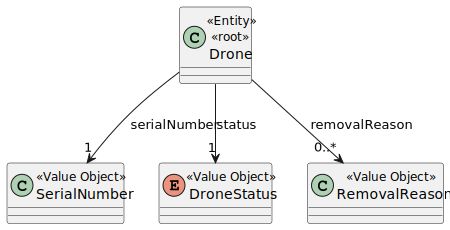

# US242 - Remove Drone from Inventory

## 1. Context

This task focuses on completing the functionality for **US242**, which enables the removal of a specific drone from the inventory. This complements **US241** (adding drones) by giving Drone Techs the ability to manage which drones are actively listed in the system.

The main objective is to allow operators to remove a drone when it's no longer needed or operational, while ensuring that the removal is recorded with a valid reason and timestamp for future auditing.

### 1.1 List of Issues

- **Analysis**: Done
- **Design**: Done
- **Implement**: To do
- **Test**: To do

---

## 2. Requirements

**As** a Drone Tech,  
**I want** to remove a specific drone from the inventory,  
**So that** only required drones are shown.

### Acceptance Criteria

- **AC01**: The reason for removal and the date must be stored.

### Dependencies

- **US241** – Adding drones to the inventory.

---

## 3. Analysis

### Drone Aggregate

The `Drone` aggregate represents a physical drone in the system, uniquely identified by its `SerialNumber`. In the context of **US242**, the goal is not to delete the drone physically from the system, but to **logically remove** it from the active inventory by recording:

- The **reason** for removal (e.g., "decommissioned", "damaged", "lost").
- The **date/time** the removal occurred.

This approach ensures that data integrity and auditability are maintained, as removed drones may still be referenced for historical or regulatory purposes.

### Value Objects

- **SerialNumber** – Uniquely identifies a drone and ensures consistent formatting.
- **RemovalReason** – Text or predefined enumeration describing why the drone is being removed.

### Domain Model



---

## 4. Design

This section describes the design process for US242, which enables the removal of drones from the inventory. The interaction begins when a Drone Tech initiates a removal request through the user interface. The request flows through a structured application layer, which ensures proper validation, including the existence of the drone and the capture of a removal reason and timestamp. The process culminates in the logical removal of the drone from active inventory, while retaining historical data for auditing and traceability purposes.

### 4.1 Realization

The following diagram shows the flow of the drone removal process.


---

### 5. Tests

### Test 1: Removal reason and date are stored

**Refers to Acceptance Criteria:** AC01
**Description:** Validates that when a drone is removed, the reason and current date are saved.

```java
@Test
void ensureDroneRemovalReasonAndDateAreSaved() {
    controller.removeDrone("DRN-123456", "Decommissioned");

    DroneRemovalLog log = repository.getRemovalLog("DRN-123456");
    assertEquals("Decommissioned", log.getReason());
    assertNotNull(log.getDate());
}
```

### Test 1: Cannot remove non-existent drone

**Description:** Verifies that attempting to remove a drone that doesn’t exist results in a failure.

```java
@Test
void ensureCannotRemoveNonexistentDrone() {
        assertThrows(DroneNotFoundException.class, () -> {
        controller.removeDrone("UNKNOWN-001", "Lost");
        });
        }

```

### Test 1: Removed drone is no longer listed

**Description:** Checks that a drone removed from the inventory is not returned in future inventory listings.

```java
@Test
void ensureRemovedDroneNotInInventory() {
        controller.removeDrone("DRN-123456", "Broken");
        List<Drone> activeDrones = repository.listActiveDrones();
        assertFalse(activeDrones.stream()
        .anyMatch(d -> d.getSerialNumber().equals("DRN-123456")));
        }

```
---

## 6. Implementation

### Major Commits

- `feat(us242): add Drone removal capability`  
  Added ability to remove drones and log removal reason and date.

- `feat(us242): implement RemoveDroneController and UI flow`  
  Provided UI interaction for removal confirmation and input.

- `test(us242): unit tests for removal scenarios`  
  Ensured proper validation, storage, and filtering of removed drones.

- `refactor: reuse repository instance via factory`  
  Improved access to `DroneRepository` via singleton repository factory.

---

## 7. Integration / Demonstration

### Integration

- Connected to existing `DroneRepository`.
- UI linked with new controller: `RemoveDroneController`.
- Removal logs persisted with timestamp and reason.

### How to Demonstrate

1. Start the application.
2. Log in as a **Drone Tech**.
3. Go to **Inventory Management**.
4. Select a drone to remove.
5. Enter a **reason** for removal and confirm.
6. Check the inventory: the drone should no longer appear.
7. View removal logs for auditability (optional).

---

## 8. Observations

- Drone removal is **logical**, not physical — records persist for auditing.
- The removal includes the **reason** and **timestamp**, as per safety and traceability standards.
- **Validation ensures** the drone exists before removal is allowed.
- The system avoids data loss by retaining logs of removal operations.
- Future improvements may include **status tagging** instead of hard removal (e.g., `"decommissioned"`, `"lost"`).
