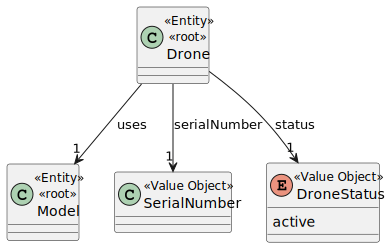
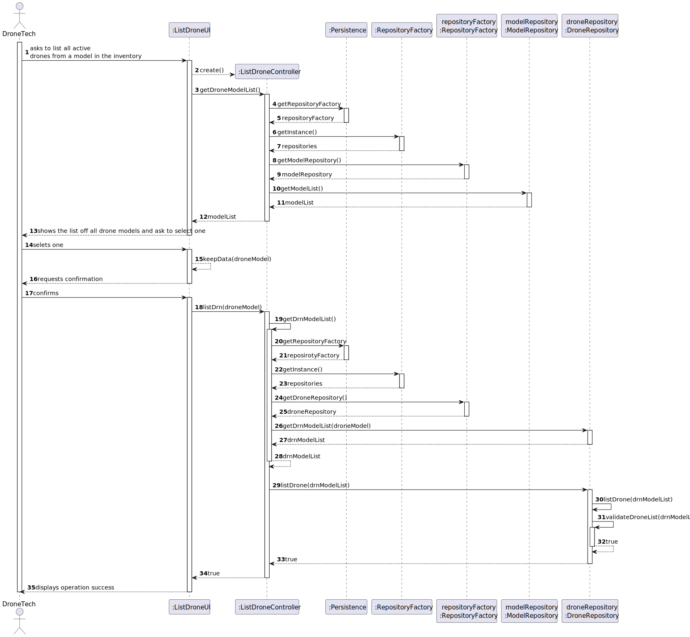

# US 243 - List Active Drones of a Given Model in the Inventory

## 1. Context

This task is part of the larger effort to manage drones within the system. It focuses on enabling the **Drone Tech** to list all active drones associated with a specific drone model. This helps in tracking and managing the active drones in the inventory, which is crucial for operational decisions.

The feature builds upon the functionalities established in **US241**, where drones can be added to the system. In this feature, the system provides a way for the Drone Tech to query and view only those drones that are active and associated with a particular model.

### 1.1 List of Issues

- **Analysis**: Done
- **Design**: Done
- **Implementation**: To do
- **Test**: To do

## 2. Requirements

**As** a Drone Tech,  
**I want** to list active drones of a given model in the inventory,  
**So that** it helps in making decisions.

### Acceptance Criteria

- **AC01**: Drones must be filtered by model.

### Dependencies

This feature depends on **US241**: As a Drone Tech, I want to add drones of an existing type to the inventory.

---

## 3. Analysis

### Drone Aggregate

The `Drone` aggregate represents each individual drone in the system, including its current **status** (e.g., ACTIVE, INACTIVE, MAINTENANCE) and its association with a **Model**.

For US243, the key domain element is:

- **Model** – The specific model that the drone belongs to. This is a required reference for filtering drones.

### Value Objects

- **Model** – The drone's model, which must already exist in the system before drones of that model can be listed.

### Domain Model



---

## 4. Design

In this section, we describe the design approach adopted for implementing US243 – List Active Drones of a Given Model in the Inventory. The interaction is initiated by a Drone Tech through a user interface, and involves querying the system for active drones by model.

### 4.1 Realization

The following diagram shows the flow of the active drone listing process based on a selected model.



---


### 5. Tests

### Test 1: Drones are filtered by model

**Refers to Acceptance Criteria:** AC01
**Description:** Drones must be filtered by model.

```java
@Test
void ensureDronesAreFilteredByModel() {
        List<Drone> drones = controller.listActiveDrones("Model-X");
        for (Drone drone : drones) {
        assertEquals("Model-X", drone.getModel().getName());
        }
        }

```

## 6. Implementation

This section includes evidence that the implementation of **US243** aligns with the proposed design. The listing of active drones was developed based on a clean separation of concerns and layered architecture.

### Major Commits

- `feat(us243): add list active drones by model functionality`  
  Implemented logic to filter and display active drones by model.

- `feat(us243): create ListActiveDronesController and UI flow`  
  Developed controller and UI components for selecting and displaying active drones.

- `test(us243): add unit tests for active drones listing`  
  Verified correct filtering and display of active drones.

- `refactor: optimize drone query logic`  
  Improved the efficiency of querying for active drones by model.

---

## 7. Integration / Demonstration

This section describes how the functionality was integrated into the system and instructions to run or demonstrate it.

### Integration

- Connected to the `DroneRepository` to query and retrieve active drones by model.
- Integrated with the UI to allow Drone Techs to filter drones based on their model and active status.

### How to Demonstrate

1. Start the application.
2. Log in as a **Drone Tech**.
3. Go to the **Inventory Management** section.
4. Select a drone model from the available options.
5. Submit the request.
6. The system displays a list of **active drones** for the selected model.

---

## 8. Observations

- The system only lists **active drones** and ensures that each drone is associated with a **valid model**.
- Model-based filtering helps in making decisions by narrowing down the available inventory to just those drones that are relevant.
- Future improvements could include adding additional filters, such as **drone location** or **last service date**, to further assist in decision-making.
