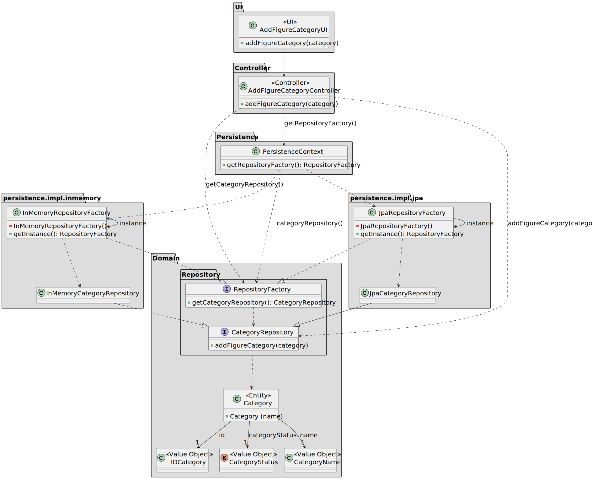

# US 245

## 1. Context

The objective of this task is to add a new figure category to the figure category catalogue. This task is included in Sprint 2 and it's the first time it's being implemented.

### 1.1 List of issues

Analysis: 🧪 Testing

Design: 🧪 Testing

Implement: 📝 To Do

Test: 📝 To Do


## 2. Requirements

**As a** Show Designer,
<br>
**I want** to add a new figure category to the catalogue,
<br>
**So that** we can filter figures by category.

**Acceptance Criteria:**

- US245.1: The category name must be unique (not case-sensitive).
- US245.2: The functionality should only be accessible to authenticated Show Designer users.

**Dependencies/References:**

- **_US211 - Register users_**: This user story is a direct dependency. It is required to have a Show Designer registered in the system so he can add a new category.

## 3. Analysis

The `Category` aggregate is central to this functionality. It includes the following value objects:

* `CategoryName`: Name by which the category is known.

* `CategoryDescription`: Describes the scope or purpose of the category.

* `CategoryStatus`: Represents the current status of a category, active or disable.

## 4. Design

This section outlines the design adopted for implementing **US245**. The class diagram presents the essential components
involved in adding new figure categories, with a clear separation between the user interface, application logic, domain model,
and persistence layer.

### 4.1. Realization

The class diagram below illustrates the design for adding a new figure category:

* The UI (`AddFigureCategoryUI`) calls the controller to request a category creation.

* The controller (`AddFigureCategoryController`) accesses the repository factory via the `PersistenceContext`.

* The factory returns the configured `CategoryRepository instance, which persists the category.

* Both JPA and in-memory repository implementations are supported.

Business rules (e.g., validating uniqueness of category names, input constraints) are assumed to be enforced inside the domain layer or repository validation logic.




### 4.2. Acceptance Tests

#### **Test 1:** *Verifies that a new category can be created*
**Refers to Acceptance Criteria:** _US245.1_

Description: Validates that the user can add a category with a name and description, the name must be unique.

```java
@Test
void ensureCategoryCanBeCreatedWithValidNameAndDescription() {
// Setup: create a category with a valid name and description
// Action: invoke controller.addFigureCategory(category)
// Assert: category is persisted and retrievable from repository
}

```

#### **Test 2:** *Verifies that only the Show Designer can add a category*
**Refers to Acceptance Criteria:** _US245.2_

**Description:** Validates that the functionality is restricted to authenticated Show Designer users.

```java
@Test
void ensureOnlyShowDesignerCanAddCategory() {
// Setup: create a non-Show Designer user
// Action: attempt to invoke controller.addFigureCategory(category)
// Assert: an exception is thrown indicating insufficient permissions
}
```


## 5. Implementation

*In this section the team should present, if necessary, some evidencies that the implementation is according to the design. It should also describe and explain other important artifacts necessary to fully understand the implementation like, for instance, configuration files.*

*It is also a best practice to include a listing (with a brief summary) of the major commits regarding this requirement.*

## 6. Integration/Demonstration

*In this section the team should describe the efforts realized in order to integrate this functionality with the other parts/components of the system*

*It is also important to explain any scripts or instructions required to execute an demonstrate this functionality*

## 7. Observations

*This section should be used to include any content that does not fit any of the previous sections.*

*The team should present here, for instance, a critical prespective on the developed work including the analysis of alternative solutioons or related works*

*The team should include in this section statements/references regarding third party works that were used in the development this work.*