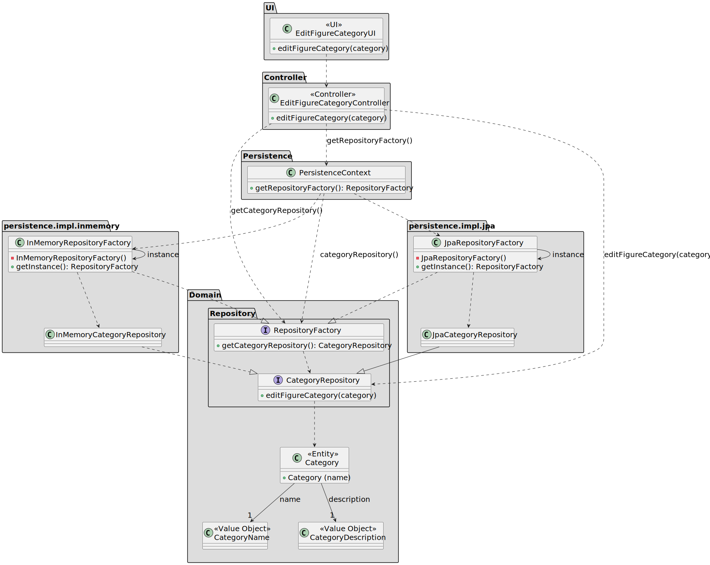

# US 246

## 1. Context

The objective of this task is to edit a figure category. This task is included in Sprint 2 and it's the first time it's being implemented.

### 1.1 List of issues

Analysis: ✅ Done

Design: ✅ Done

Implement: ✅ Done

Test: ✅ Done


## 2. Requirements

**As a** Show Designer,
<br>
**I want** to edit a existing figure category,
<br>
**So that** categories are correct and updated.

**Acceptance Criteria:**

- US246.1 The category name must be unique (not case-sensitive).
- US246.2 The functionality should only be accessible to authenticated Show Designer users.

**Dependencies/References:**

- **_US211 - Register users_**: This user story is a direct dependency. It is required to have a Show Designer registered in the system so he can edit a category.
- **_US245 - Add figure category to the catalogue_**: This user story is a direct dependency. It is required to have a figure category added to the catalogue so it can be edited.

## 3. Analysis

The core aggregate involved is `Category`, which includes the following value objects:

* `CategoryName`: Name by which the category is known.

* `CategoryDescription`: Describes the scope or purpose of the category.


## 4. Design

### 4.1. Realization

The class diagram depicts the high-level design used to implement category editing:

* UI delegates user input to the controller.
* the controller accesses the repository via the `PersistenceContext`, calling `editFigureCategory`.
* Repository implementations (JPA or in-memory) update the stored entity.
* Business validation (e.g., unique name enforcement or format constraints) can be validated within the repository.




### 4.2. Acceptance Tests

**Test 1:** *Edit the category name and description*

**Refers to Acceptance Criteria:** US246.1

```
@Test
void ensureCategoryCanBeEdited() {
    // Setup: create and persist a category
    // Action: edit name and description, then persist, check if the name is unique
    // Assert: the updated category reflects the changes
}
````

## 5. Implementation


* The implementation of US246 follows the design and analysis presented earlier. The Category aggregate was updated to allow editing of existing categories, ensuring the uniqueness of the CategoryName value object and proper validation of inputs.  
* Key Implementation Details:
* Domain Layer: The Category aggregate ensures that the CategoryName is unique and immutable. The CategoryName value object validates the input and enforces constraints.
* Application Layer: The EditCategoryController handles the logic for editing an existing category, ensuring that the new name is unique before persisting the changes.
* Persistence Layer: The CategoryRepository interface and its JPA implementation ensure that categories are updated and retrieved correctly.

## 6. Integration/Demonstration

The functionality developed in US246 was integrated into the existing system. The EditCategoryController was exposed through the UI layer, allowing authenticated Show Designers to edit existing categories.

* Steps to Demonstrate:
* Launch the application: Start the system using the provided scripts or instructions in the main README.md.
* Log in as a Show Designer: Ensure the user has the appropriate role.
* Navigate to the Category Management Section: Select the option to edit a category.
* Edit a Category: Select an existing category, update its name and description, and save the changes.
* Verify: Confirm that the category is updated successfully and reflects the changes in the list of categories.

## 7. Observations

For the implementation of this project, I used the following sources:

- **EAPLI Framework**: A Java framework that provides a set of libraries and tools developed by our department (ISEP).
- **eCafeteria Project**: A reference project developed by our department, used as a source of inspiration for similar
  functionalities and a guide for best practices.
- **JPA (Hibernate)**: A Java framework for object-relational mapping (ORM) that simplifies database interactions.
- **H2 Database**: A lightweight Java database that is easy to set up and use for development and testing purposes.