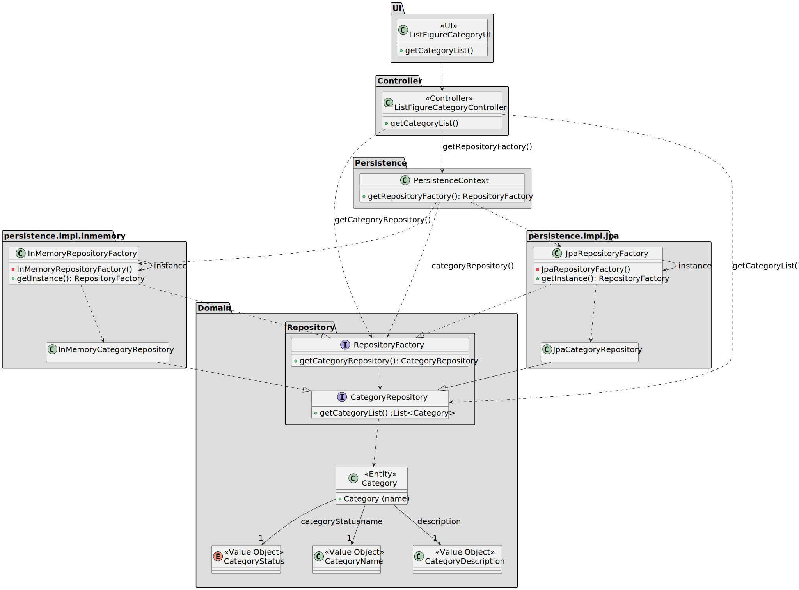

# US 247

## 1. Context

The objective of this task is to allow the listing of all figure categories stored in the system. 
This user story is included in Sprint 2 and represents the first implementation of the category listing functionality.

### 1.1 List of issues

Analysis: ✅ Done

Design: ✅ Done

Implement: ✅ Done

Test: ✅ Done

## 2. Requirements

**As a** Show Designer or CRM Collaborator,
<br>
**I want** to list all figure categories in the catalogue,
<br>
**So that** the user can see the categories available in the system.

**Acceptance Criteria:**

- US247.1. The category status information should be provided.
- US247.2. The functionality should only be accessible to authenticated Show Designer or CRM Collaborator users.

**Dependencies/References:**

- **_US211 - Register users_**: This user story is a direct dependency. It is required to have a Show Designer registered in the system, so he can edit a category.

- **_ US245 - Add figure category to the catalogue_**: This user story is a direct dependency. It is required to have a figure category added to the catalogue, so it can be listed.

## 3. Analysis

The Category aggregate encapsulates all figure category data. It comprises the following value objects:

* `CategoryName`: The name by which the category is known.
* `CategoryDescription`: Describes the scope or purpose of the category.
* `CategoryStatus`: Represents the current status of a category, either active or inactive.

## 4. Design

This section describes the class structure used to implement **US247**. It illustrates how the UI, controller, domain model, and persistence layers interact.

### 4.1. Realization

The class diagram below depicts the core design for retrieving figure categories:
* The UI (`ListFigureCategoryUI`) calls the controller to request a category listing.
* The controller (`ListFigureCategoryController`) accesses the repository factory via the `PersistenceContext`.
* The factory returns the configured `CategoryRepository` instance, which retrieves the list of categories.
* The controller then returns the list to the UI for display.



### 4.2. Acceptance Tests

**Test 1:** *Verifies that the category status is provided in the output*

**Refers to Acceptance Criteria:** US247.1

**Description**: Ensures that each listed category includes its current status.
```
@Test
void ensureCategoryStatusIsIncludedInList() {
    // Setup: create categories with varying statuses (ACTIVE, INACTIVE)
    // Action: invoke controller.getCategoryList()
    // Assert: each category in the result contains a non-null status field
    //         and the status is either ACTIVE or INACTIVE
}
````

**Test 2:** *Verifies that the category status is provided in the output*

**Refers to Acceptance Criteria:** US247.2

**Description**: Ensures that only a Show Designer or CRM Collaborator can access the functionality.
```
@Test
void ensureOnlyAuthorizedUsersCanListCategories() {
    // Setup: authenticate as a user without the Show Designer or CRM Collaborator role
    // Action: attempt to invoke controller.getCategoryList()
    // Assert: an AccessDeniedException (or equivalent) is thrown
}

@Test
void ensureShowDesignerCanAccessCategoryList() {
    // Setup: authenticate as a Show Designer
    // Action: invoke controller.getCategoryList()
    // Assert: category list is returned successfully
}

@Test
void ensureCrmCollaboratorCanAccessCategoryList() {
    // Setup: authenticate as a CRM Collaborator
    // Action: invoke controller.getCategoryList()
    // Assert: category list is returned successfully
}
````

## 5. Implementation

* The implementation of US247 involves creating a controller to retrieve all categories and a UI to display them. The ListFigureCategoryController will interact with the CategoryRepository to fetch the data, and the ListFigureCategoryUI will present it to the user.  
* Key Implementation Details:
* Domain Layer: The Category aggregate encapsulates the data for each category, including its name, description, and status.
* Application Layer: The `ListFigureCategoryController` retrieves the list of categories from the repository.
* Persistence Layer: The `CategoryRepository` interface and its JPA implementation ensure that categories are fetched from the database.

## 6. Integration/Demonstration

* The `ListFigureCategoryUI` was added to the menu for authenticated users with the ShowDesigner or CRM Collaborator roles.
* Steps to Demonstrate:
* Launch the application: Start the system using the provided scripts or instructions.
* Log in as a Show Designer or CRM Collaborator.
* Navigate to the Category Management Section: Select the option to list all categories.
* View Categories: Verify that the list includes the name, description, and status of each category.

## 7. Observations

For the implementation of this project, I used the following sources:

- **EAPLI Framework**: A Java framework that provides a set of libraries and tools developed by our department (ISEP).
- **eCafeteria Project**: A reference project developed by our department, used as a source of inspiration for similar
  functionalities and a guide for best practices.
- **JPA (Hibernate)**: A Java framework for object-relational mapping (ORM) that simplifies database interactions.
- **H2 Database**: A lightweight Java database that is easy to set up and use for development and testing purposes.