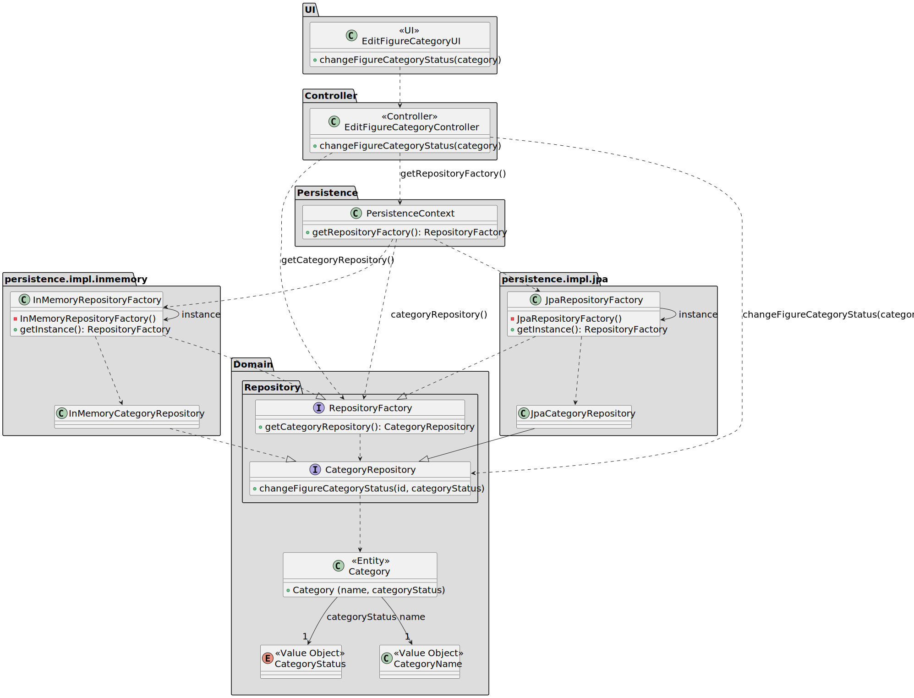

# US 248

## 1. Context

The goal of this task is to allow authorized users to change the status of a figure category.
This task is included in Sprint 2 and represents the first implementation of the category status change functionality.

### 1.1 List of issues

Analysis: ✅ Done

Design: ✅ Done

Implement: ✅ Done

Test: ✅ Done


## 2. Requirements


*Example*

**As a** Show Designer 
**I Want** to change the status of an existing figure category in the figure category catalogue.
**So that** the status of the category is correct and updated.

**Acceptance Criteria:**

- US248.1 Inactive categories cannot be used in new figures.
- US248.2 The functionality should only be accessible to authenticated Show Designer users.

**Dependencies/References:**

- **_US211 - Register users_**: This user story is a direct dependency. It is required to have a Show Designer registered in the system, so he can change the status of a category.
- **_US245 - Add figure category to the catalogue_**: This user story is a direct dependency. It is required to have a figure category added to the catalogue, so it can be changed.

## 3. Analysis

The `Category` aggregate contains a `CategoryStatus value object which reflects whether a category is active or disabled.
Changing the category's status is a domain-level operation and must preserve business invariants (e.g., a disabled category should not be used to tag new figures).
Relevant components include:
- `Category`: The aggregate root representing a figure category.
- `CategoryStatus`: A value object representing the status of a category (active or disabled).
- `CategoryRepository`: The repository interface for accessing and modifying category data.

## 4. Design

The class diagram illustrates how the change of category status is supported across the layers of the system:

* The UI layer (`EditFigureCategoryUI`) interacts with the controller to initiate the change.

* The Controller (`EditFigureCategoryController`) queries the repository factory and invokes the domain-level change operation.

* The Domain layer performs the change, enforcing validations.

* Both JPA and in-memory persistence implementations are supported for flexibility and testing.


### 4.1. Realization

The class diagram below depicts the core design for changing the status of a figure category:
* The UI (`EditFigureCategoryUI`) calls the controller to request a status change.
* The controller (`EditFigureCategoryController`) accesses the repository factory via the `PersistenceContext`.
* The factory returns the configured `CategoryRepository` instance, which performs the status change.
* The controller then returns the result to the UI for display.



### 4.2. Acceptance Tests

**Test 1:** *Validate that inactive categories cannot be used in new figures*

**Refers to Acceptance Criteria:** US248.1

**Description:** Ensures that when a category is marked as inactive, it cannot be used in the creation of new figures.

```
@Test
void ensureInactiveCategoriesCannotBeUsedInNewFigures() {
    // Setup: create and persist a category, then change its status to INACTIVE
    // Action: attempt to create a new figure with the inactive category
    // Assert: the system should throw an exception or return an error indicating the category is inactive
}
````

**Test 2:** *Validate that only authenticated Show Designer users can change the status*

**Refers to Acceptance Criteria:** US248.2

**Description:** Ensures that only users with the Show Designer role can access the functionality to change category status.

```
@Test
void ensureOnlyShowDesignerCanChangeCategoryStatus() {
    // Setup: authenticate as a user without the Show Designer role
    // Action: attempt to invoke controller.changeCategoryStatus()
    // Assert: the system should throw an exception or return an error indicating insufficient permissions
}
````


## 5. Implementation

* The implementation of US248 involves creating functionality to allow authorized users to change the status of a figure category. The `ChangeCategoryStatusController` handles the logic for changing the status, while the `ChangeCategoryStatusUI` provides the user interface for interacting with this functionality.  
* Key Implementation Details:
* Domain Layer: The Category aggregate contains the `CategoryStatus` value object, which reflects whether a category is active or inactive. The changeStatus method ensures the status is updated correctly.
* Application Layer: The `ChangeCategoryStatusController` handles the logic for changing the status of a category and ensures the category exists before performing the operation.
* Persistence Layer: The `CategoryRepository` interface and its JPA implementation ensure that categories are retrieved and updated correctly.

## 6. Integration/Demonstration

* The `ChangeCategoryStatusUI` was added to the menu for authenticated users with the ShowDesigner role.
* Steps to Demonstrate:
* Launch the application: Start the system using the provided scripts or instructions.
* Log in as a Show Designer.
* Navigate to the Category Management Section: Select the option to change the status of a category.
* Change Status: Select a category and toggle its status between active and inactive.
* Verify: Confirm that the status is updated successfully.
## 7. Observations

For the implementation of this project, I used the following sources:

- **EAPLI Framework**: A Java framework that provides a set of libraries and tools developed by our department (ISEP).
- **eCafeteria Project**: A reference project developed by our department, used as a source of inspiration for similar
  functionalities and a guide for best practices.
- **JPA (Hibernate)**: A Java framework for object-relational mapping (ORM) that simplifies database interactions.
- **H2 Database**: A lightweight Java database that is easy to set up and use for development and testing purposes.