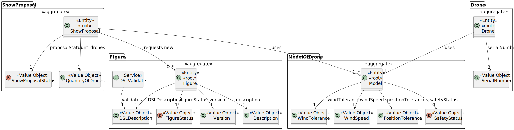
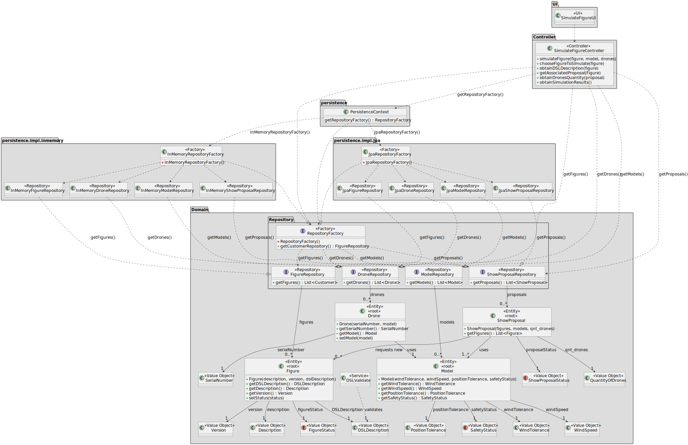

# US261 – Initiate Simulation for a Figure

## 1. Context

This task aims to conclude the requirements for **US261** of **Sprint 2**, which consists of developing a new functionality for the system. The team will now focus on completing the implementation and testing of this feature, as well as integrating it with the rest of the system.

### 1.1 List of Issues

- **Analysis**: To do 
- **Design**: To do 
- **Implementation**: To do  
- **Testing**: To do  

---

## 2. Requirements

**As** a System User,
 
**I want** to start a simulation process for a figure,
 
**So that** I can check for any mistake before approving it.

### Acceptance Criteria

- **AC01:** This component must be implemented in C and must utilize processes, pipes, and signals.
- **AC02:** The system should fork a new process for each drone in the figure.
- **AC03:** Each drone process should execute its designated movement script.
- **AC04:** Pipes should facilitate communication between the main process and each drone process.
- **AC05:** The main process should track drone positions over time using an appropriate data structure.

### Dependencies

This requirement depends on **US233**, as a figure must be in the catalogue before it can be simulated.

---

## 3. Analysis

It is important that we are able to simulate a figure. As we have a DSL description that describes how the figure will be presented in the show.

So there should be a necessity before the show to simulate the figure. Also we need to accept a figure for a proposal.

The Figure will be composed of drones that will use a specific drone model, specified in the DSL description.

---

### Figure Aggregate

The `Figure` aggregate includes:

- **DSLDescription** – Domain-specific language expression describing the figure
- **Version** – Current version of the figure
- **Description** – Description of the figure
- **FigureStatus** – Status of the figure

External dependencies:

- **DSLValidate** – A service used to validate the DSLDescription before approval or usage

This aggregate is often involved in show proposals and is subject to validation constraints.

---

### ShowProposal Aggregate

The `ShowProposal` aggregate includes:

- **ShowProposalStatus** – Status of the proposal
- **Figures** – A list of associated figures used in the proposal
- **Models** – A list of drone models employed in the proposal

This aggregate plays a central role in orchestrating figures and models for show purposes.

---

### ModelOfDrone Aggregate

The `ModelOfDrone` aggregate includes:

- **WindTolerance** – How much wind deviation is tolerable for stable operation
- **WindSpeed** – Maximum or recommended operating wind speed
- **PositionTolerance** – The tolerance to environmental factors affecting drone positioning
- **SafetyStatus** – Safety of the drone model

These attributes are essential for selecting appropriate models for show proposals and operational use.

---

### Drone Aggregate

The `Drone` aggregate includes:

- **SerialNumber** – Unique identifier for tracking and maintenance
- **Model** – The model type of this particular drone, linking it to specifications defined in the `ModelOfDrone` aggregate

This aggregate ensures traceability and supports inventory, usage, or compliance tracking.

---

---

## 4. Design

In this section, we describe the design approach adopted for implementing **US261 – Initiate Simulation for a Figure**. The class diagram defines the main components involved in the simulation of a figure, showing a clear separation of concerns between the UI, application logic, domain model, and persistence layer.

### 4.1 Realization

---

## 5. Tests

In accordance with the non-functional requirements, there are no specific tests for this functionality. However, we will ensure that the implementation adheres to the principles of clean architecture and follows best practices in software development.

As we are going to follow all acceptance criteria, we will ensure that the implementation is correct and that the system is able to simulate a figure.

---

## 6. Implementation

This section should include evidence that the implementation aligns with the proposed design. Additional artifacts such as configuration files may also be included to help understand the implementation.

### Major Commits (Sample Format)

- `feat(us221): add CustomerRepresentative entity and repository`
- `feat(us221): implement DTO mapping for representative registration`
- `test(us221): add unit tests for representative creation and validation`
- `refactor: adjust Customer aggregate to support representatives`

---

## 7. Integration / Demonstration

This section describes how the functionality was integrated with the system. It should also provide instructions for running or demonstrating the feature.

### Example:

1. Start the application.
2. Log in with a CRM Collaborator account.
3. Navigate to the Customer page.
4. Click on "Add Representative".
5. Fill in the representative's details and submit.
6. Verify the representative is added and listed correctly.

---

## 8. Observations

- The solution follows a clean architecture separating domain, application, and infrastructure layers.
- The use of DTOs effectively prevents domain leakage.
- Alternatives considered included merging representative data into the customer aggregate directly, but this was dismissed to preserve modularity.
- All third-party libraries used (e.g., validation frameworks, mapping tools) are properly documented in the project repository.

---

