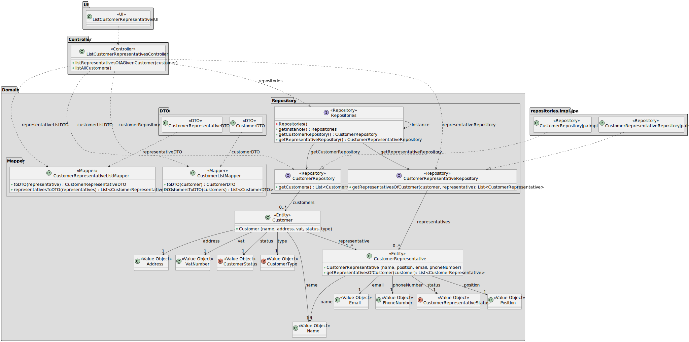

# US 222

## 1. Context

This task as the objective of concluding the requirements of the us222 of sprint2, where it is asked to develop a new functionality to the system. The team will now focus on completing the implementation and testing of this functionality as well as integrating it with the rest of the system.

### 1.1 List of issues

Analysis: Testing

Design: Testing

Implement: To do

Test: To do


## 2. Requirements

**As** a CRM Collaborator,
**I want** to list all customer representatives of a given customer,
**So that** decision-making by the CRM Collaborator is easier.

**Acceptance Criteria:**

**AC01:** It should not list disabled representatives.

**Dependencies:**

*Regarding this requirement we understand that it relates to US220, as there needs to be a customer registered in the system before listing a customer representative of a given customer.*
*Regarding this requirement we understand that it relates to US221, as there needs to be a customer representative registered in the system before listing them.*

## 3. Analysis

It is important that we are able to list all the representatives of a customer. As we have a one-to-many relationship between the customer and the representative, we can easily list all the representatives of a customer.

This method will be used in the UI to show the list of representatives of a customer.


## 4. Design

*In this section we are going to present the design of the system. We will focus on the design of the new functionality, but we will also include other parts of the system that are important to understand the implementation.*

### 4.1. Realization



### 4.3. Applied Patterns

The system architecture continues to apply several recognized design patterns, ensuring a robust and maintainable organization. Below are the patterns applied to the customer representative listing functionality:

#### 1. **DTO (Data Transfer Object) Pattern**
- **Classes Involved:** `CustomerDTO`, `CustomerRepresentativeDTO`
- **Description:** DTOs encapsulate the data to be transferred from the domain layer to the user interface, avoiding direct coupling with entities and facilitating serialization/deserialization.

#### 2. **Mapper Pattern**
- **Classes Involved:** `CustomerListMapper`, `CustomerRepresentativeListMapper`
- **Description:** Perform the conversion between domain entities and their respective DTOs. The transformation responsibility is isolated, promoting reuse and clarity in the application's structure.

#### 3. **Repository Pattern**
- **Classes Involved:** `CustomerRepository`, `CustomerRepresentativeRepository`, `Repositories`
- **Description:** Abstract access to persistent data. They allow retrieving customers and their representatives through well-defined interfaces, decoupling the domain from the concrete persistence implementation.

#### 4. **Singleton Pattern**
- **Class Involved:** `Repositories`
- **Description:** The `Repositories` class follows the Singleton pattern by exposing a `getInstance()` method that ensures a single globally accessible instance. This centralizes access to repository instances.

#### 5. **Controller Pattern**
- **Class Involved:** `ListCustomerRepresentativesController`
- **Description:** The controller manages the interaction flow between the user interface and the domain. It orchestrates the listing of customers and their representatives, interacting with repositories and mappers to prepare the data for presentation.

#### 6. **Value Object Pattern**
- **Classes Involved:** `Address`, `VatNumber`, `CustomerStatus`, `CustomerType`, `Position`, `Name`, `Email`, `PhoneNumber`, `CustomerRepresentativeStatus`
- **Description:** Represent immutable values without identity, used to compose entities like `Customer` and `Representative`. They ensure expressiveness and consistency in the domain model.

---

These patterns contribute to the modular organization of the code and help maintain a clear separation of responsibilities across the various layers of the application.

### 5. Tests

Include here the main tests used to validate the functionality. Focus on how they relate to the acceptance criteria. May be automated or manual tests.

**Test 1:** *Verifies that it is not possible to ...*

**Refers to Acceptance Criteria:** US101.1

```
@Test(expected = IllegalArgumentException.class)
public void ensureXxxxYyyy() {
	...
}
````

## 6. Implementation

*In this section the team should present, if necessary, some evidencies that the implementation is according to the design. It should also describe and explain other important artifacts necessary to fully understand the implementation like, for instance, configuration files.*

*It is also a best practice to include a listing (with a brief summary) of the major commits regarding this requirement.*

## 7. Integration/Demonstration

*In this section the team should describe the efforts realized in order to integrate this functionality with the other parts/components of the system*

*It is also important to explain any scripts or instructions required to execute an demonstrate this functionality*

## 8. Observations

*This section should be used to include any content that does not fit any of the previous sections.*

*The team should present here, for instance, a critical prespective on the developed work including the analysis of alternative solutioons or related works*

*The team should include in this section statements/references regarding third party works that were used in the development this work.*