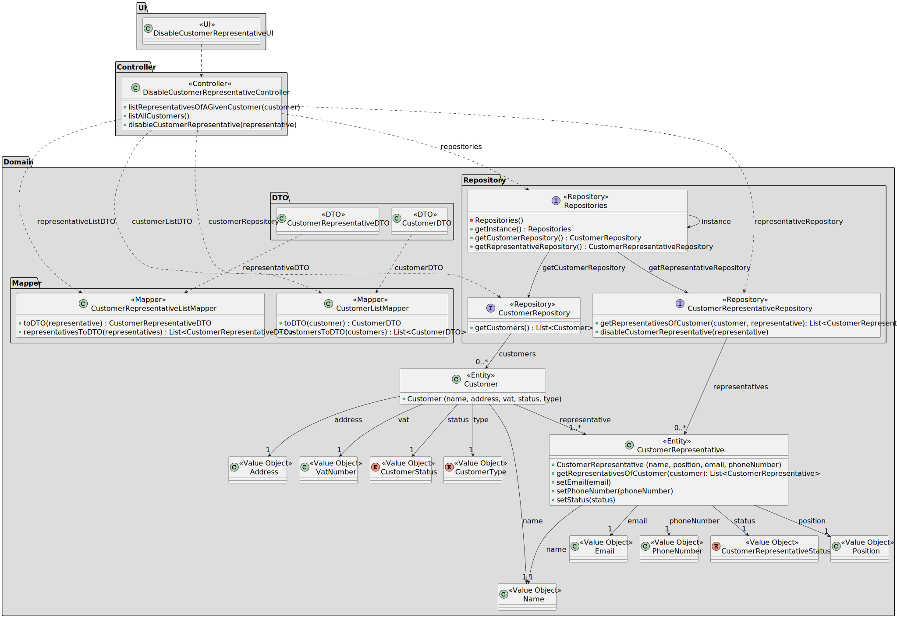

# US 224

## 1. Context

This task as the objective of concluding the requirements of the us224 of sprint2, where it is asked to develop a new functionality to the system. The team will now focus on completing the implementation and testing of this functionality as well as integrating it with the rest of the system.

### 1.1 List of issues

Analysis: Testing

Design: Testing

Implement: To do

Test: To do


## 2. Requirements

**As** a CRM Collaborator,
**I want** to disable a customer representative,
**So that** they are not contacted in the future.

**Dependencies:**

*Regarding this requirement we understand that it relates to US221, as there needs to be a customer representative registered in the system before disabling him.*

## 3. Analysis

The system should allow the user to disable a customer representative. This is important because the customer representative might stop working for that enterprise, and it is important that the representatives registered that are integrated in the system are the ones that are still working for the enterprise. 

The system should allow the user to disable a customer representative through the user interface, and the system should validate the input to ensure that it is valid.


## 4. Design

*In this section we are going to present the design of the system. We will focus on the design of the new functionality, but we will also include other parts of the system that are important to understand the implementation.*

### 4.1. Realization



### 4.3. Applied Patterns

Below are the main design patterns used in the implementation of the customer representative deactivation functionality, according to the class diagram:

#### 1. **DTO (Data Transfer Object) Pattern**
- **Classes Involved:** `CustomerDTO`, `CustomerRepresentativeDTO`
- **Description:** DTOs encapsulate the data transferred between the domain and presentation layers. This allows for separation between domain logic and the user interface, and provides control over which data is exposed.

#### 2. **Mapper Pattern**
- **Classes Involved:** `CustomerListMapper`, `CustomerRepresentativeListMapper`
- **Description:** Responsible for converting between domain entities (`Customer`, `CustomerRepresentative`) and their respective DTOs. Promote reuse and centralization of transformation logic.

#### 3. **Repository Pattern**
- **Classes Involved:** `CustomerRepository`, `CustomerRepresentativeRepository`, `Repositories`
- **Description:** Repository interfaces provide a contract for accessing customer and representative data. The use of this pattern decouples persistence logic from business logic.

#### 4. **Singleton Pattern**
- **Class Involved:** `Repositories`
- **Description:** The `Repositories` class applies the Singleton pattern to ensure that there is only one global instance, providing centralized access to the repositories used by the application.

#### 5. **Controller Pattern**
- **Class Involved:** `DisableCustomerRepresentativeController`
- **Description:** The controller coordinates the interaction between the user interface and the service/repository layers. It encapsulates the logic needed to list customers, list representatives, and deactivate customer representatives.

#### 6. **Value Object Pattern**
- **Classes Involved:** `Address`, `VatNumber`, `CustomerStatus`, `CustomerType`, `Position`, `Name`, `Email`, `PhoneNumber`, `CustomerRepresentativeStatus`
- **Description:** These objects represent immutable values that are part of entities and have no individual identity. They encapsulate validation rules and semantics, strengthening the domain model.

---

These patterns contribute to the modular organization of the code and help maintain a clear separation of responsibilities across the various layers of the application.


### 5. Tests

Include here the main tests used to validate the functionality. Focus on how they relate to the acceptance criteria. May be automated or manual tests.

**Test 1:** *Verifies that it is not possible to ...*

**Refers to Acceptance Criteria:** US101.1


```
@Test(expected = IllegalArgumentException.class)
public void ensureXxxxYyyy() {
	...
}
````

## 6. Implementation

*In this section the team should present, if necessary, some evidencies that the implementation is according to the design. It should also describe and explain other important artifacts necessary to fully understand the implementation like, for instance, configuration files.*

*It is also a best practice to include a listing (with a brief summary) of the major commits regarding this requirement.*

## 7. Integration/Demonstration

*In this section the team should describe the efforts realized in order to integrate this functionality with the other parts/components of the system*

*It is also important to explain any scripts or instructions required to execute an demonstrate this functionality*

## 8. Observations

*This section should be used to include any content that does not fit any of the previous sections.*

*The team should present here, for instance, a critical prespective on the developed work including the analysis of alternative solutioons or related works*

*The team should include in this section statements/references regarding third party works that were used in the development this work.*