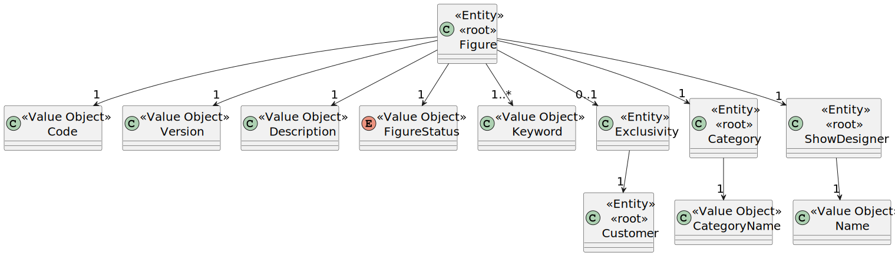

# US 231

## 1. Context

The purpose of this task is to provide a list of all public figures, enabling the appropriate selection during the show 
request process. This task is included in Sprint 2 and is being implemented for the first time.

### 1.1 List of issues

Analysis: 🧪 Testing

Design: 📝 To Do

Implement: 📝 To Do

Test: 📝 To Do


## 2. Requirements

**As a** CRM Collaborator,
**I want** to list all public figures in the catalogue,
**So that** I can select them during a show request proposal.

**Acceptance Criteria:**

- **_US231.1_** Only active public figures must be listed.
- **_US231.2_** The list must include at least the figure's name, category, and version.
- **_US231.3_** The data must be retrieved using a dedicated DTO to decouple the internal domain model.
- **_US231.4_** The functionality should only be accessible to authenticated CRM Collaborator users.

**Dependencies/References:**

- **_US233_** – Add Figure to the Catalogue: This user story is a direct dependency. It is required to have figures added to 
the catalogue before listing them.

## 3. Analysis

The figure aggregate includes several attributes, but for this user story the most relevant ones are:

- `Code` and `Version`, to uniquely identify and group figures.
- `Description`, to provide information in the UI.
- `FigureStatus`, which must be used to filter out inactive figures.
- `Keyword` and `Category`, which may support filtering and searching in the UI.
- `Exclusivity`, to ensure that exclusive figures are not shown in the listing.
- `ShowDesigner`, which is a reference to the show designer responsible for the figure.

Other attributes like DSL description and validation are not relevant in the context of listing figures and were omitted
from the diagram.



## 4. Design

*In this sections, the team should present the solution design that was adopted to solve the requirement. This should 
include, at least, a diagram of the realization of the functionality (e.g., sequence diagram), a class diagram 
(presenting the classes that support the functionality), the identification and rational behind the applied design 
patterns and the specification of the main tests used to validade the functionality.*

### 4.1. Realization


### 4.3. Applied Patterns

### 4.4. Acceptance Tests

Include here the main tests used to validate the functionality. Focus on how they relate to the acceptance criteria. 
May be automated or manual tests.

**Test 1:** *Verifies that it is not possible to ...*

**Refers to Acceptance Criteria:** US101.1


```
@Test(expected = IllegalArgumentException.class)
public void ensureXxxxYyyy() {
	...
}
````

## 5. Implementation

*In this section the team should present, if necessary, some evidencies that the implementation is according to the 
design. It should also describe and explain other important artifacts necessary to fully understand the implementation 
like, for instance, configuration files.*

*It is also a best practice to include a listing (with a brief summary) of the major commits regarding this requirement.*

## 6. Integration/Demonstration

*In this section the team should describe the efforts realized in order to integrate this functionality with the other 
parts/components of the system*

*It is also important to explain any scripts or instructions required to execute an demonstrate this functionality*

## 7. Observations

*This section should be used to include any content that does not fit any of the previous sections.*

*The team should present here, for instance, a critical prespective on the developed work including the analysis of 
alternative solutioons or related works*

*The team should include in this section statements/references regarding third party works that were used in the 
development this work.*