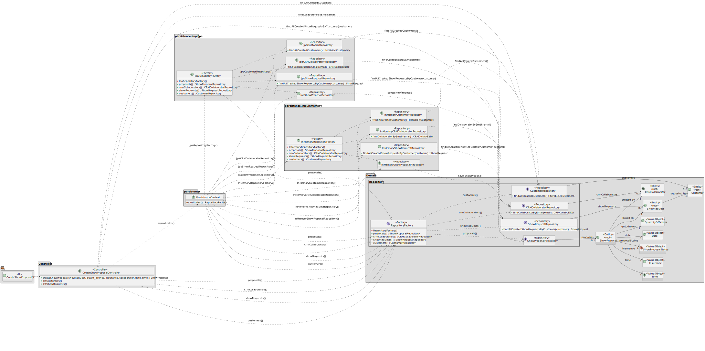

# US310 - Create Show Proposal

## 1. Context

This task as the objective of concluding the requirements of the us310 of sprint3, where it is asked to develop a new functionality to the system. The team will now focus on completing the implementation and testing of this functionality as well as integrating it with the rest of the system.

### 1.1 List of Issues

- **Analysis**: Done
- **Design**: Done
- **Implementation**: Done
- **Testing**: In Progress

---

## 2. Requirements

**As** a CRM Collaborator,  
**I want** to start the process of creating a show proposal,  
**So that** we can replay to the customer.

### Acceptance Criteria

- **AC01:** The show proposal should include the total number of drones to be used in the show.
- **AC02:** All figures in a show must use all drones.
- **AC03:** The show proposal must follow a predefined template.
- **AC04:** The show proposal must be associated with a show request.
- **AC05:** The show proposal should have a link for a video of his simulation associated with it (while analyzing the show proposal).

### Dependencies

This requirement depends on [US230](../../SPRINT_2/US230/readme.md), as a show request must be registered in the system before a show proposal can be created.

---

## 3. Analysis

It is important that we are able to create a new show proposal with an associated show request. We need to communicate with the customer to update them and continue planning the show.

This method will be used in the UI to register a new show proposal.

### Show Proposal Aggregate

The `Show Proposal` aggregate includes:

- **CRMCollaborator** – Collaborator responsible for creating the proposal.
- **ShowRequest** – Show request on which the proposal is based.
- **ShowProposalStatus** – Current status of the show proposal.
- **Figures** – List of figures requested for the show.
- **ShowProposalTemplate** – Predefined template the proposal must follow.
- **Models** – Drone models used in the show.
- **QuantityOfDrones** – Total number of drones to be used in the show.
- **Time** – Duration of the show.
- **Date** – Date of the show.
- **Insurance** – Value of the insurance for the show.
- **FeedbackEmail** – Email from the customer with feedback on the proposal.

For this requirement we will add the following elements:
- **ShowRequest**
- **ShowProposalStatus** - Initially set to `Testing`.
- **CRMCollaborator** 
- **Time** 
- **Date** 
- **Insurance**

The other elements will be added to the system and on other requirements.


---

## 4. Design

In this section, we describe the design approach adopted for implementing **US310 - Create Show Proposal**. The class diagram defines the main components involved in the creation of a new show proposal, showing a clear separation of concerns between the UI, application logic, domain model, and persistence layer.

### 4.1 Realization



---

## 5. Tests

The following tests validate the acceptance criteria defined for US310. They ensure that only valid show proposals are created.

---

### Test 1: Show proposal includes total number of drones

**Refers to Acceptance Criteria:** AC01
**Description:** Ensures that a valid show proposal contains a positive number of drones.


```java
@Test
void ensureProposalIncludesTotalNumberOfDrones() {
    ShowProposal proposal = controller.createShowProposal(showRequest, quant_drones, insurance, collaborator, date, time);
    assertTrue(proposal.getQuantityOfDrones() > 0);
}
```

---

### Test 2: Show proposal uses predefined template

**Refers to Acceptance Criteria:** AC03
**Description:** Confirms the proposal includes the predefined template.

```java
@Test
void ensureProposalUsesPredefinedTemplate() {
    ShowProposal proposal = controller.createShowProposal(showRequest, quant_drones, insurance, collaborator, date, time);
    proposal.addTemplate(template);
    assertNotNull(proposal.getTemplate());
    assertEquals(expectedTemplateId, proposal.getTemplate().getId());
}
```

---

### Test 3: Show proposal must be associated with a show request

**Refers to Acceptance Criteria:** AC04
**Description:** Validates that the proposal is linked to an existing show request.

```java
@Test
void ensureProposalIsAssociatedWithShowRequest() {
    ShowProposal proposal = controller.createShowProposal(showRequest, quant_drones, insurance, collaborator, date, time);
    assertNotNull(proposal.getShowRequest());
}
```

---

## 6. Implementation

The implementation of US310 is based on the design and analysis presented in the previous sections. The code is organized into packages that reflect the domain model, application logic, and user interface.
We included the necessary classes and methods to support the creation of a new show proposal. And didn't diverge from the design.

The coding Commit messages related to this requirement are as follows:

- [Multiple changes to the show proposal and request class soo now the id is generated correctly also slightly changed the uis for us310 and 315](https://github.com/Departamento-de-Engenharia-Informatica/sem4pi-2024-2025-sem4pi_2024_2025_g44/commit/38b0902705b7983d1fdea497785e2859b6fea4b8)

- [Added all the necessary missing tests of us310 and us315](https://github.com/Departamento-de-Engenharia-Informatica/sem4pi-2024-2025-sem4pi_2024_2025_g44/commit/13b89c9f055017b05f840f70fa7a344a49856043)

- [ Finished the implementation of us310 and us315 missing some documentation and tests](https://github.com/Departamento-de-Engenharia-Informatica/sem4pi-2024-2025-sem4pi_2024_2025_g44/commit/4fb53c686ebf47e7c6766f895d7e8d01a2e32c27)

## 7. Integration/Demonstration

To integrate the new functionality with the existing system, we followed these steps:

1. **Persistence Layer**: To connect the new functionality with the database, we used the existing repository pattern. The `ShowProposalRepository` was updated to include the necessary methods for the new functionality.
2. **Controller Layer**: The controller was updated to include methods for handling requests related to the creation of a show proposal. This includes methods for creating a new proposal, validating the input, and saving it to the database.
3. **UI Layer**: The user interface was updated to include forms and views for creating the proposal. This includes input validation and error handling.
4. **Testing**: We ran the unit tests to ensure that the new functionality works as expected. The tests cover all acceptance criteria and other important scenarios.

To run the project, follow the instructions in the [README.md](../../../readme.md) file located in the root directory of the project. This file contains detailed instructions on how to set up the development environment, run the application, and execute the tests.

### Demonstration Instructions

To demonstrate the functionality, follow these steps:

1. **Launch the application via the backoffice application**.
2. **Log in as a CRM Collaborator**.
3. Navigate to the **Show Proposal** section.
4. Select the corresponding option to what you want to do.
5. Follow the instructions in the UI.

## 8. Observations

For the implementation of this project, we used the following sources:

- **EAPLI Framework**: A Java framework that provides a set of libraries and tools of our department(ISEP).
- **ECafetaria project**: A project developed by our department that serves as a reference and source for implementing similar functionalities and as a guide for best practices.
- **Jpa Hibernate**: A Java framework for object-relational mapping (ORM) that simplifies database interactions.
- **H2 Database**: A lightweight Java database that is easy to set up and use for development and testing purposes.
