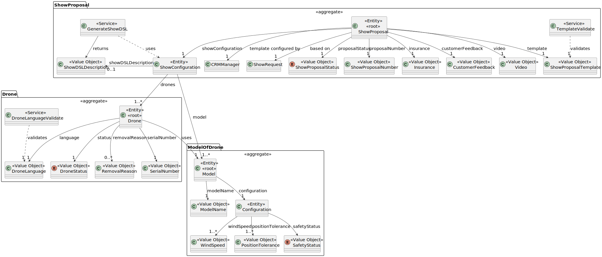
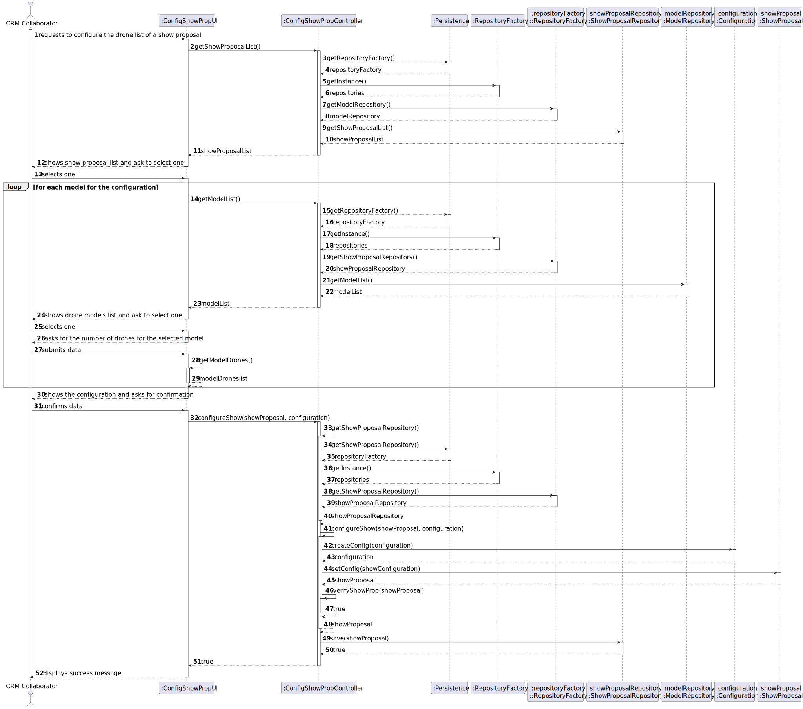

# US 311 

## 1. Context

This task as the objective of concluding the requirements of the us311 of sprint3, where it is asked to develop a new functionality to the system. The team will now focus on completing the implementation and testing of this functionality as well as integrating it with the rest of the system.

### 1.1 List of Issues

- **Analysis**: Done  
- **Design**: Done  
- **Implementation**: Doing
- **Testing**: Doing  

---

## 2. Requirements

**As** a CRM Collaborator,  
**I want** to configure the list of drone models (number of drones and model) of a show proposal.
**So that** I can configure the list of the drones and the model to be used.

### Acceptance Criteria

- **AC01**: The drones in the proposal must be compatible with the drones in the Shodrone’s inventory.
- **AC02**: There is no need to verify if these drones are used in another show on the same date.
- **AC03**: The same drone cannot be used more than once in the same configuration.

### Dependencies

- This requirement depends on [US310](../../SPRINT_3/US310/readme.md), as a show proposal must be created before drones can be added to it.
- This requirement depends on [US240](../../SPRINT_2/US240/readme.md), as a drone model must be registered in the system before it can be added to a show proposal.
- This requirement depends on [US241](../../SPRINT_2/US241/readme.md), as a drone must be registered in the system before it can be added to a show proposal.

---

### Client Clarifications:

> **Empty**

---

## 3. Analysis

### Show Proposal Aggregate

The ShowProposal aggregate is responsible for representing a complete show proposal within the system. It includes the show’s configuration, proposal status, feedback, and various linked entities required for a successful proposal.

It is important that we are able to configure the list of drone models (number of drones and model) of a show proposal. As we have a one-to-many relationship between the show proposal and the drone models, we can easily configure the list of drone models for a show proposal.

The `Show Proposal` aggregate  includes:

- **ShowProposalStatus** – The current status of the proposal (e.g., pending, approved, rejected).  
- **ShowProposalTemplate** – The template used as a base for configuring the proposal.
- **ShowProposalNumber** – Unique identifier number for the proposal.
- **Insurance** – Insurance details related to the show.
- **CustomerFeedback** – Feedback provided by the customer about the proposal.
- **ShowConfiguration** – Detailed configuration of the show, including assigned drones.
- **Video** –  Preview or demo video related to the show proposal.
- **ShowRequest** – The original request on which this proposal is based.
- **TemplateValidate** – A domain service that validates the proposal template.
- **GenerateShowDSL** – A domain service that generates a DSL (domain-specific language) description of the show.
- **ShowDSLDescription** – A DSL representation of the show’s technical configuration.

The principal element of show proposal for this US is the **ShowConfiguration**, with a list of all the drones needed for the show proposal, for each **DroneModel**.

### Drone Aggregate
The Drone aggregate is responsible for representing an individual drone in the system. This aggregate ensures the integrity and consistency of a drone throughout its lifecycle, including its unique identifiers, operational status, and language settings.

The `Drone` aggregate includes:

- **SerialNumber** – Unique identifier for each drone.
- **DroneStatus** – Current status of the drone (e.g., active, under maintenance, removed).
- **RemovalReason** – Reason for the drone’s removal, if applicable.
- **DroneLanguage** – Configuration or operational language of the drone.
- **DroneLanguageValidate** – Domain service that validates the selected language for a drone.

For this US, the important elemente from **Drone** is the **SerialNumber**, to indentify the drone in the proposal.

### ModelOfDrone  Aggregate
The Model aggregate represents a generic drone model, including its technical specifications, name, and configuration. It is directly related to physical drones (Drone entities) that adopt this model.

The `ModelOfDrone ` aggregate includes:

- **ModelName** – Identifier for the model’s name.
- **Configuration** – Technical configuration and specifications of the drone model.
- **WindSpeed** – Maximum wind speed tolerances defined for the model.
- **PositionTolerance** – Accepted deviation or precision in positioning.
- **SafetyStatus** – Current safety certification of the model (e.g., approved, rejected, under review).

For this US, the important elemente from **Model** is the **ModelName**, to indentify the model to add the drones in the proposal.

---


---

## 4. Design

This document provides an overview of the system design for configuring drone models in a show proposal. The architecture follows a layered approach with UI, controller, repository, persistence, and domain layers.

---

### 👤 Actor

#### CRM Collaborator
- **Role:** The end-user who initiates the configuration of drone models for a show proposal.
- **Interaction:** Navigates the UI to select a show proposal, choose drone models, specify quantities, and confirm the configuration.

---

### 💻 UI Layer

#### :ConfigShowPropUI
- **Role:** Manages interaction with the CRM Collaborator. Collects and displays data.
- **Main Methods:**
  - `getShowProposalList()`: Requests available show proposals.
  - `getModelList()`: Requests a list of drone models for selection.
  - `getModelDrones()`: Requests the selected number of drones of the selected model.
  - `configureShow(showProposal, configuration)`: Sends the final configuration to the controller.

---

### 🎮 Application Layer

#### :ConfigShowPropController
- **Role:** Orchestrates the logic of configuring the drone list by coordinating repositories and domain objects.
- **Main Methods:**
  - `getShowProposalList()`: Fetches show proposals using the `ShowProposalRepository`.
  - `getModelList()`: Fetches drone models using the **ModelRepository**.
  - `configureShow(showProposal, configuration)`: Builds, validates, and saves the configuration.
  - `getShowProposalRepository()`: Resolves and caches the repository instance.

---

### 🗃 Persistence Layer

#### :Persistence
- **Role:** Provides access to the persistence infrastructure and repository factory.
- **Main Method:**
  - `getRepositoryFactory()`: Returns a factory capable of creating repository instances.

---

### 🏗 Repository Layer

#### :RepositoryFactory
- **Role:** Abstract factory interface to provide access to various domain repositories.

#### :repositoryFactory::RepositoryFactory (Singleton)
- **Role:** Singleton implementation that returns concrete repositories for domain access.
- **Main Methods:**
  - `getShowProposalRepository()`: Retrieves the `ShowProposalRepository` instance.
  - `getModelRepository()`: Retrieves the `ModelRepository` instance.

#### showProposalRepository: ShowProposalRepository
- **Role:** Handles persistent storage and retrieval of `ShowProposal` entities.
- **Main Methods:**
  - `getShowProposalList()`: Returns all existing show proposals.
  - `save(showProposal)`: Persists the updated show proposal with the new configuration.

#### modelRepository: ModelRepository
- **Role:** Provides access to drone model data.
- **Main Method:**
  - `getModelList()`: Returns the list of available drone models.

---

### 🧠 Domain Layer

#### configuration: Configuration
- **Role:** Responsible for encapsulating the logic and data structure for a show configuration.
- **Main Method:**
  - `createConfig(configuration)`: Builds a configuration object from the user input (model and quantity data).

#### showProposal: ShowProposal
- **Role:** Represents a single show proposal entity and contains business rules.
- **Main Methods:**
  - `setConfig(showConfiguration)`: Adds the configuration to the proposal.
  - `verifyShowProp(showProposal)`: Validates the configuration according to business rules.

---

### 🔁 Process Flow Summary

1. **CRM Collaborator** starts the process in the UI.
2. The UI requests available **Show Proposals** via the **Controller**, which fetches them through the **ShowProposalRepository**.
3. The user selects a proposal.
4. For each drone model:
  - The UI requests available models via the **ModelRepository**.
  - The CRM Collaborator selects a model and provides a drone count.
5. The UI collects these inputs into a configuration.
6. The user confirms the configuration.
7. The Controller:
  - Builds the configuration using the **Configuration** domain object.
  - Assigns it to the **ShowProposal**.
  - Validates the **ShowProposal**.
  - Persists the updated proposal via the **ShowProposalRepository**.
8. A success message is shown to the CRM Collaborator.

---

This layered architecture ensures clear separation of concerns and supports maintainability, extensibility, and adherence to Domain-Driven Design principles.

### 4.1 Realization



---

## 5. Tests

The following tests validate the acceptance criteria defined for **US311**. These tests ensure that the system behaves as expected when configuring drone models in a show proposal.

---

### Test 1: Customer is a user of the system

**Refers to Acceptance Criteria:** AC01  
**Description:** The drones in the proposal must be compatible with the drones in the Shodrone’s inventory.

```java
@Test
void ensureValidDrones() {
    // setup: create and persist a Show proposal configuration with models and drones
    // action: call controller.getDroneList() and get all drones list
    // assert: creates the configuration and checks if the drones are compatible with the Shodrone’s inventory
}
```

---

### Test 2: Configuration cant have the same drone multiple times

**Refers to Acceptance Criteria:** AC03  
**Description:** Verifies that the same drone is not used more than 1 time on the same configuration.

```java
@Test
void ensureNotSameDrone() {
        // setup: create and persist a Show proposal configuration with models and drones
        // assert: creates the configuration and checks if the same drone is used multiple times 
        }
```

---
## 6. Implementation

---

## 7. Integration/Demonstration


### Demonstration Instructions

---

## 8. Observations

---