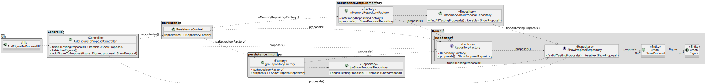

# US 312

## 1. Context

The point of this task is to be able to add a figure to a proposal, as a CRM Collaborator. This task is included in Sprint 3 and it's the first time it's being implemented.

### 1.1 List of issues

Analysis:

Design:

Implement:

Test:


## 2. Requirements

**As a** CRM Collaborator,
<br>
**I want** to add one of the available figures to a show proposal,
<br>
**So that** we can add figures to the proposal.

**Acceptance Criteria:**

- US312.1 Any active figure can be added to the show proposal.

- US312.2 A figure may have more than one occurrence in a show, but never in two consecutive positions.

- US312.3 For each figure, it must be established the relation between each drone type in the figure and the drone models in the show.

**Dependencies/References:**

- **_US233 - Add figure to catalogue:_** This user story is a direct dependency. It is required to have a figure registered in the system so it can be added to the proposal.
- **_US211 - Register users:_** This user story is a direct dependency. It is required to have a CRM Collaborator registered in the system so he can add a figure to the proposal.
- **_US310 - Create a show proposal:_** This user story is a direct dependency. It is required to have a show proposal created in the system so it can be added a figure to it.


## 3. Analysis

The `ShowProposal` aggregate is central to this functionality. It includes the following value objects:
- `ShowConfiguration`: Configuration of the show, including the drones associated to the show and the figures that are part of the show.

The `Figure` aggregate is also central to this functionality. It includes the following value objects:
- `FigureStatus`: Represents the current status of a figure, active or inactive.

It is important that the CRM Collaborator can add a figure to the show proposal, as it is a key part of the show. The figure is added to the `ShowConfiguration` of the `ShowProposal`.
The `FigureStatus` of the figures to be added to the show proposal must be `active`, as only active figures can be added to the show proposal.
The drone type associated to a figure must be associated to a model present in the show proposal by the CRM Collaborator when adding the figure to the show proposal. 

### Show Proposal Domain Model


### Figure Domain Model


## 4. Design

### 4.1. Realization

In this section, we describe the design approach adopted for implementing **US312 - Add Figure to Show Proposal**. The class diagram defines the main components involved in adding a figure to the show proposal, showing a clear separation of concerns between the UI, application logic, domain model, and persistence layer.
The AddFigureToProposalController is responsible for handling the addition of a figure to the show proposal. It interacts with the ShowProposalRepository to perform the necessary operations.
The controller starts by printing the list of testing proposals and then prompts the user to select a proposal. After that, it retrieves the list of active figures and prompts the user to select a figure to add to the proposal.




### 4.2. Acceptance Tests


**Test 1:** *Verifies that it is not possible to add inactive figures to the proposal*

**Refers to Acceptance Criteria:** US312.1


```
@Test(expected = IllegalArgumentException.class)
public void ensureInactiveFigureCannotBeAddedToProposal() {
    // Setup: create a show proposal and an inactive figure

    // Action: attempt to add the inactive figure

    // Assert: exception is thrown due to inactive status
}
```
**Test 2:** *Verifies that a figure can be added more than once if not consecutively*
**Refers to Acceptance Criteria:** US312.2

```
@Test
public void ensureFigureCanBeAddedMultipleTimesIfNotConsecutive() {
    // Setup: create a show proposal and an active figure
    ShowProposal proposal = createTestProposal();
    Figure figure = new Figure(FigureStatus.ACTIVE);
    Figure anotherFigure = new Figure(FigureStatus.ACTIVE);

    // Action: add figure, then another figure, then same figure again
    proposal.addFigure(figure, validDroneTypeMapping());
    proposal.addFigure(anotherFigure, validDroneTypeMapping());
    proposal.addFigure(figure, validDroneTypeMapping());

    // Assert: figure is added in non-consecutive positions with no error
    assertEquals(3, proposal.figureSequence().size());
}

```

**Test 3:** *Verifies that a figure cannot be added in two consecutive positions*
**Refers to Acceptance Criteria:** US312.2

```
@Test(expected = IllegalArgumentException.class)
public void ensureFigureCannotBeAddedInConsecutivePositions() {
    // Setup: create a proposal and an active figure
    ShowProposal proposal = createTestProposal();
    Figure figure = new Figure(FigureStatus.ACTIVE);

    // Action: add the same figure twice in a row
    proposal.addFigure(figure, validDroneTypeMapping());
    proposal.addFigure(figure, validDroneTypeMapping()); // should throw

    // Assert: exception is thrown due to consecutive usage
}
```


## 5. Implementation

*In this section the team should present, if necessary, some evidencies that the implementation is according to the design. It should also describe and explain other important artifacts necessary to fully understand the implementation like, for instance, configuration files.*

*It is also a best practice to include a listing (with a brief summary) of the major commits regarding this requirement.*

## 6. Integration/Demonstration

*In this section the team should describe the efforts realized in order to integrate this functionality with the other parts/components of the system*

*It is also important to explain any scripts or instructions required to execute an demonstrate this functionality*

## 7. Observations

*This section should be used to include any content that does not fit any of the previous sections.*

*The team should present here, for instance, a critical prespective on the developed work including the analysis of alternative solutioons or related works*

*The team should include in this section statements/references regarding third party works that were used in the development this work.*