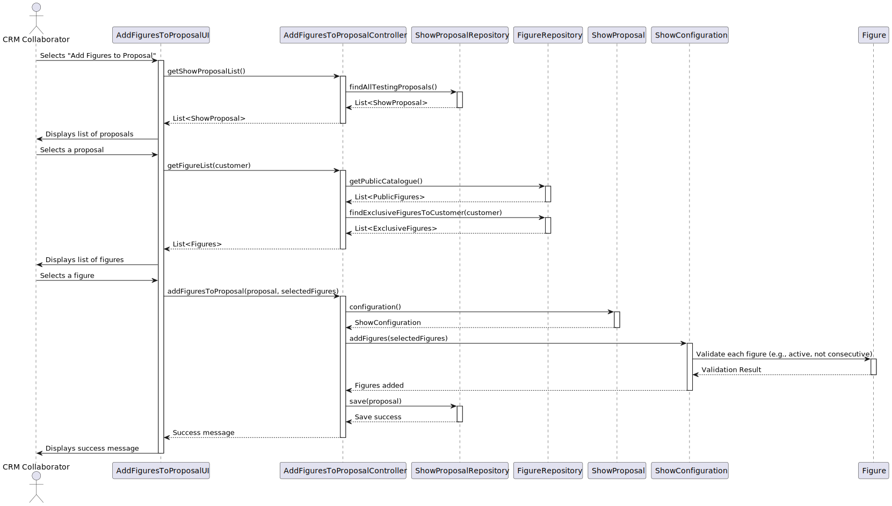

# US 312

## 1. Context

The point of this task is to be able to add a figure to a proposal, as a CRM Collaborator. This task is included in
Sprint 3 and it's the first time it's being implemented.

### 1.1 List of issues

Analysis: Done

Design: Done

Implement: Done

Test: Done

## 2. Requirements

**As a** CRM Collaborator,
<br>
**I want** to add one of the available figures to a show proposal,
<br>
**So that** we can add figures to the proposal.

**Acceptance Criteria:**

- US312.1 Any active figure can be added to the show proposal.

- US312.2 A figure may have more than one occurrence in a show, but never in two consecutive positions.

- US312.3 For each figure, it must be established the relation between each drone type in the figure and the drone
  models in the show.

**Dependencies/References:**

- **_US233 - Add figure to catalogue:_** This user story is a direct dependency. It is required to have a figure
  registered in the system so it can be added to the proposal.
- **_US211 - Register users:_** This user story is a direct dependency. It is required to have a CRM Collaborator
  registered in the system so he can add a figure to the proposal.
- **_US310 - Create a show proposal:_** This user story is a direct dependency. It is required to have a show proposal
  created in the system so it can be added a figure to it.

## 3. Analysis

The `ShowProposal` aggregate is central to this functionality. It includes the following value objects:

- `ShowConfiguration`: Configuration of the show, including the drones associated to the show and the figures that are
  part of the show.

The `Figure` aggregate is also central to this functionality. It includes the following value objects:

- `FigureStatus`: Represents the current status of a figure, active or inactive.

It is important that the CRM Collaborator can add a figure to the show proposal, as it is a key part of the show. The
figure is added to the `ShowConfiguration` of the `ShowProposal`.
The `FigureStatus` of the figures to be added to the show proposal must be `active`, as only active figures can be added
to the show proposal.
The drone type associated to a figure must be associated to a model present in the show proposal by the CRM Collaborator
when adding the figure to the show proposal.


### Show Proposal Domain Model


### Figure Domain Model


## 4. Design

### 4.1. Realization

1. **ShowConfiguration**:

* Represents the configuration of a show, including the drones and figures associated with it.
* Contains a list of `ShowConfigurationFigure` objects to manage the figures in the show.
* Ensures that figures are added according to the business rules: Figures must be active. Figures cannot be added
  consecutively.

2. **ShowConfigurationFigure**:

* A value object representing a figure in the show configuration.
* Ensures that the figure is not null when created.
* Implements equality and hash code methods to ensure proper handling in collections.

3. **Figure**:

* Represents a figure that can be added to a show proposal.
* Must have an active status (`FigureStatus.ACTIVE`) to be added to the show configuration.

4. **Relationships**:

* `ShowConfiguration` uses `@ElementCollection` to manage a list of `ShowConfigurationFigure` objects.
* `ShowConfigurationFigure` references a `Figure` entity using a `@ManyToOne` relationship.

### Sequence Diagram



### 4.2. Acceptance Tests

**Test 1:** *Verifies that it is not possible to add inactive figures to the proposal*

**Refers to Acceptance Criteria:** US312.1

```
@Test(expected = IllegalArgumentException.class)
public void ensureInactiveFigureCannotBeAddedToProposal() {
    // Setup: create a show proposal and an inactive figure

    // Action: attempt to add the inactive figure

    // Assert: exception is thrown due to inactive status
}
```

**Test 2:** *Verifies that a figure can be added more than once if not consecutively*
**Refers to Acceptance Criteria:** US312.2

```
@Test
public void ensureFigureCanBeAddedMultipleTimesIfNotConsecutive() {
    // Setup: create a show proposal and an active figure
    ShowProposal proposal = createTestProposal();
    Figure figure = new Figure(FigureStatus.ACTIVE);
    Figure anotherFigure = new Figure(FigureStatus.ACTIVE);

    // Action: add figure, then another figure, then same figure again
    proposal.addFigure(figure, validDroneTypeMapping());
    proposal.addFigure(anotherFigure, validDroneTypeMapping());
    proposal.addFigure(figure, validDroneTypeMapping());

    // Assert: figure is added in non-consecutive positions with no error
    assertEquals(3, proposal.figureSequence().size());
}

```

**Test 3:** *Verifies that a figure cannot be added in two consecutive positions*
**Refers to Acceptance Criteria:** US312.2

```
@Test(expected = IllegalArgumentException.class)
public void ensureFigureCannotBeAddedInConsecutivePositions() {
    // Setup: create a proposal and an active figure
    ShowProposal proposal = createTestProposal();
    Figure figure = new Figure(FigureStatus.ACTIVE);

    // Action: add the same figure twice in a row
    proposal.addFigure(figure, validDroneTypeMapping());
    proposal.addFigure(figure, validDroneTypeMapping()); // should throw

    // Assert: exception is thrown due to consecutive usage
}
```

## 5. Implementation

The implementation of this user story is done in the `ShowConfiguration` aggregate, which is responsible for managing
the figures in a show proposal. The `ShowConfigurationFigure` value object is used to represent a figure in the show
configuration, and it ensures that the figure is not null when created. The `Figure` entity is used to represent a
figure that can be added to the show proposal, and it must have an active status (`FigureStatus.ACTIVE`) to be added to
the show configuration.
The `ShowConfiguration` aggregate uses the `@ElementCollection` annotation to manage a list of
`ShowConfigurationFigure` objects, and the `ShowConfigurationFigure` value object references a `Figure` entity using a
`@ManyToOne` relationship.

## 6. Integration/Demonstration

To demonstrate the functionality, follow these steps:

1. Launch the application via the backoffice application.
2. Log in as a CRM Collaborator.
3. Navigate to the Show Proposal section.
4. Select the option to add figures to a proposal.
5. Follow the instructions in the UI to select a proposal, choose figures, and associate drone types with models.
6. Confirm the addition of figures to the proposal.
   This integration ensures seamless functionality across the layers of the system, adhering to the defined business
   rules and user requirements.

## 7. Observations

For the implementation of US 312, the following tools and frameworks were utilized:

* EAPLI Framework: A Java framework that provides a set of libraries and tools developed by ISEP, facilitating the
  implementation of domain-driven design and application logic.
* Jpa Hibernate: Used for object-relational mapping (ORM), simplifying database interactions and ensuring persistence of
  entities such as ShowProposal and Figure.
* H2 Database: A lightweight, in-memory database used for development and testing purposes, ensuring quick setup and
  execution.
* ECafetaria Project: Served as a reference project for implementing similar functionalities and adhering to best
  practices.
* IntelliJ IDEA: The IDE used for development, debugging, and testing the application.