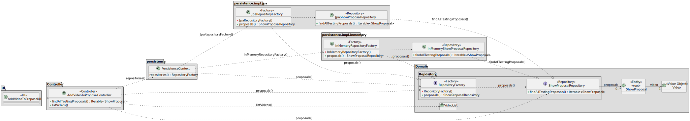

# US315 - Add Video of Simulation to the Proposal

## 1. Context

This task as the objective of concluding the requirements of the us315 of sprint3, where it is asked to develop a new functionality to the system. The team will now focus on completing the implementation and testing of this functionality as well as integrating it with the rest of the system.

### 1.1 List of Issues

- **Analysis**: Done
- **Design**: DOne
- **Implementation**: In Progress
- **Testing**: To do

---

## 2. Requirements

**As** a CRM Collaborator,
<br>
**I want** to add a video of the simulated show,
<br>
**So that** the customer can have a preview of the show.


### Acceptance Criteria

- **AC01**: There is no need to generate the video, but we can use any suitable file.
- **AC02**: The video must be available via a link.
- **AC03**: The video must be available in the Show Proposal.

### Dependencies

- This requirement depends on [US310](../../SPRINT_3/US310/readme.md), as a proposal must be created before we can add the video of that proposal simulation.
- This requirement depends on [US370](../../SPRINT_3/US370/readme.md), as the objective of adding the video is soo that the customer can visualise it.

---

### Client Clarifications:

> **[Topic: US315](https://moodle.isep.ipp.pt/mod/forum/discuss.php?d=36158)**  
> The video is just a link.

## 3. Analysis

It is important that the customer can visualise their own proposal simulation, as they request for that show and have all the motives to want to see how much progress was made into implementing his show.

This is possible because in terms of domain the proposal as a relation of many-to-one with the request and the request as a many-to-one relation with customer.

Other elements not relevant to this functionality are omitted for simplicity.


## 4. Design

In this section, we describe the design approach adopted for implementing **US315 - Add Video of Simulation to the Proposal**. The class diagram defines the main components involved in the addition of a video to the show proposal, showing a clear separation of concerns between the UI, application logic, domain model, and persistence layer.

### 4.1. Realization



## 5. Tests

The following tests validate the acceptance criteria defined for US315. They ensure that only valid videos are added.

**Refers to Acceptance Criteria: AC02 and AC03**
**Description**: Ensures that a video link can be added to a proposal.

```java
@Test
void ensureVideoLinkCanBeAddedToProposal() {
    ShowProposal proposal = controller.createShowProposal(showRequest, quant_drones, insurance, collaborator, date, time);
    String videoName = "The name of the video";
    String videoLink = "https://www.youtube.com/watch?v=dQw4w9WgXcQ&ab_channel=RickAstley";
    proposal.addVideo(videoLink);
    assertEquals(videoLink, proposal.getVideoLink());
}
```

## 6. Implementation

The implementation of US315 is based on the design and analysis presented in the previous sections. The code is organized into packages that reflect the domain model, application logic, and user interface.
We included the necessary classes and methods to support the addition of a video to the show proposal. And didn't diverge from the design.

The coding Commit messages related to this requirement are as follows:

- [Multiple changes to the show proposal and request class soo now the id is generated correctly also slightly changed the uis for us310 and 315](https://github.com/Departamento-de-Engenharia-Informatica/sem4pi-2024-2025-sem4pi_2024_2025_g44/commit/38b0902705b7983d1fdea497785e2859b6fea4b8)

- [Added all the necessary missing tests of us310 and us315](https://github.com/Departamento-de-Engenharia-Informatica/sem4pi-2024-2025-sem4pi_2024_2025_g44/commit/13b89c9f055017b05f840f70fa7a344a49856043)

- [ Finished the implementation of us310 and us315 missing some documentation and tests](https://github.com/Departamento-de-Engenharia-Informatica/sem4pi-2024-2025-sem4pi_2024_2025_g44/commit/4fb53c686ebf47e7c6766f895d7e8d01a2e32c27)

## 7. Integration/Demonstration

To integrate the new functionality with the existing system, we followed these steps:

1. **Persistence Layer**: To connect the new functionality with the database, we used the existing repository pattern. The `ShowProposalRepository` was updated to include the necessary methods for the new functionality.
2. **Controller Layer**: The controller was updated to include methods for handling requests related to visualising the simulation of the proposal. 
3. **UI Layer**: The user interface was updated to include forms and views for analysing the proposal via the video. This includes input validation and error handling.
4. **Testing**: We ran the unit tests to ensure that the new functionality works as expected. The tests cover all acceptance criteria and other important scenarios.

To run the project, follow the instructions in the [README.md](../../../readme.md) file located in the root directory of the project. This file contains detailed instructions on how to set up the development environment, run the application, and execute the tests.

### Demonstration Instructions

To demonstrate the functionality, follow these steps:

1. **Launch the application via the backoffice application**.
2. **Log in as a CRM Collaborator**.
3. Navigate to the **Show Proposal** section.
4. Select the corresponding option to what you want to do.
5. Follow the instructions in the UI.

## 8. Observations

For the implementation of this project, we used the following sources:

- **EAPLI Framework**: A Java framework that provides a set of libraries and tools of our department(ISEP).
- **ECafetaria project**: A project developed by our department that serves as a reference and source for implementing similar functionalities and as a guide for best practices.
- **Jpa Hibernate**: A Java framework for object-relational mapping (ORM) that simplifies database interactions.
- **H2 Database**: A lightweight Java database that is easy to set up and use for development and testing purposes.
