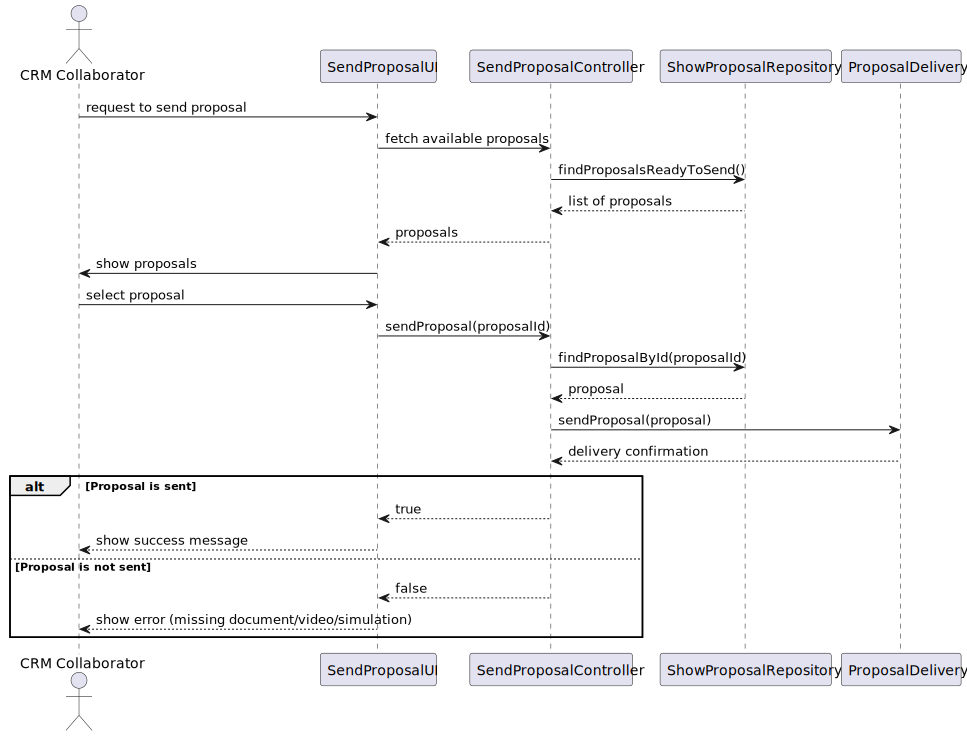

# US 316

## 1. Context

This user story is being developed as part of Sprint 3. It introduces the functionality that allows a **CRM Collaborator**  
to send a completed **show proposal** to a customer. A proposal includes the configured figures, assigned drones,  
the duration of the event, a simulation video (US315), and a document generated using a validated template (US318).

Sending the proposal is only possible when the proposal is complete and ready, meaning:

- It passed the simulation phase.
- It contains a valid video (see US315).
- It includes a configured and validated document (see US318).

Instead of sending an actual email, the system generates a unique delivery code that can later be used by the customer  
to access the proposal through the client-side application.

### 1.1 List of issues

Analysis: 🧪 Testing  

Design: 🧪 Testing  

Implementation: 📝 To Do  

Testing: 📝 To Do

## 2. Requirements

**As a** CRM Collaborator,  
<br>  
**I want** to send a show proposal to the customer,  
<br>  
**So that** the customer can review and approve the proposed drone show.

### Acceptance Criteria:

- **US316.1** A proposal must contain a valid document before it can be sent.
- **US316.2** The system must display the Show Proposal identification code so that the customer can subsequently 
access the proposal.
- **US316.3** If the proposal is incomplete, the system must prevent the sending operation and notify the user.

### Dependencies/References:

- **US318 – Templates for Show Proposals**: The document must have been generated and validated beforehand.
- **US315 – Generate Simulation Video**: A video must already be associated with the proposal.
- **US347 – Proposal Generation**: Builds upon this configuration to deliver the final file to the customer.

## 3. Analysis

This user story finalises the proposal workflow by making the completed proposal available to the customer.

The delivery logic is delegated to the `ProposalDelivery` domain service. This service creates a new `ProposalDeliveryInfo`  
entity containing:

- A reference to the `ShowProposal`.
- A reference to the `Customer`.
- A `ProposalDeliveryCode` (a unique code or token).
- A delivery status.

This entity is persisted in the system and will later be retrieved by the customer application (e.g., via sockets) using 
the delivery code.

No email is sent in this version. Instead, the generated code is shown to the CRM Collaborator, who must communicate it 
to the customer.

## 4. Design

This section outlines the design for implementing **US316 – Send Show Proposal to Customer**.

### 4.1 Realisation

The process begins when the CRM Collaborator opens the **Send Proposal** interface.

1. The `SendProposalUI` triggers the `SendProposalController`.
2. The controller opens a `PersistenceContext` and uses the `RepositoryFactory` to retrieve:
    - The `ShowProposalRepository`
    - The `ProposalDeliveryInfoRepository`
3. The controller calls `findProposalsReadyToSend()` to filter only completed proposals.
4. The UI shows the list to the user, who selects one.
5. The selected proposal is passed to the controller.
6. The controller calls the `ProposalDelivery` service.
7. This service creates a `ProposalDeliveryInfo` instance, including a unique `ProposalDeliveryCode`.
8. The entity is saved via `ProposalDeliveryInfoRepository`.
9. If successful, the UI shows the code to the user.
10. If not, an error is displayed.



### 4.2. Acceptance Tests

The following tests validate the acceptance criteria defined for **US316 – Send Show Proposal to Customer**.  
They ensure that a proposal is only sent when it contains the generated document.
They also ensure that appropriate errors are raised when attempting to send incomplete proposals.

---

#### **Test 1: Proposal is not ready to be sent if required elements are missing**
**Refers to Acceptance Criteria:** _US316.1_  
**Description:** Ensures that a proposal without a configured document is not eligible to be sent to the customer.

```java
@Test
void ensureProposalCannotBeSentIfIncomplete() {
    // Setup: create a valid ShowRequest and collaborators
    // Create a ShowProposal with insurance, time, date, and assigned collaborator
    // NOT configure the proposal document

    // Action: call isReadyToSend() on the ShowProposal

    // Assert: isReadyToSend() must return false because required fields are missing
}
```

## 5. Implementation

## 6. Integration/Demonstration

## 7. Observations
