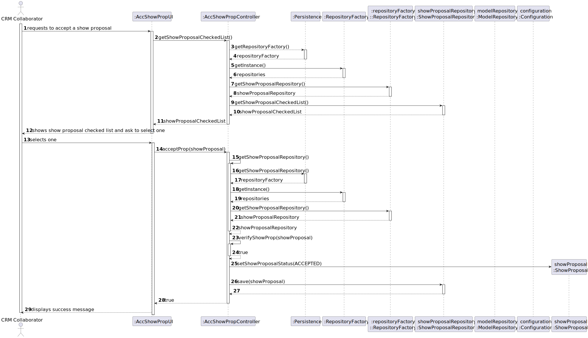

# US 317 

## 1. Context

This task as the objective of concluding the requirements of the us317 of sprint3, where it is asked to develop a new functionality to the system. The team will now focus on completing the implementation and testing of this functionality as well as integrating it with the rest of the system.

### 1.1 List of Issues

- **Analysis**: Done  
- **Design**: Done  
- **Implementation**: Done
- **Testing**: Done  

---

## 2. Requirements

**As** a CRM Collaborator,  
**I want** to mark the proposal as accepted by the customer after it has been accept by a Customer RepresentaƟve in the Customer App.
**So that** I can see if the show proposal will be a confirmed show or not.

### Acceptance Criteria

- **AC01**: The show proposal can only be accepted or rejected if the show proposal have already a customer feedback.

### Dependencies

- This requirement depends on [US371](../../SPRINT_3/US371/readme.md), as a show proposal must have a customer feedback about the show.

---

## 3. Analysis

### Show Proposal Aggregate

The ShowProposal aggregate is responsible for representing a complete show proposal within the system. It includes the show’s configuration, proposal status, feedback, and various linked entities required for a successful proposal.

It is important that we are able to configure the list of drone models (number of drones and model) of a show proposal. As we have a one-to-many relationship between the show proposal and the drone models, we can easily configure the list of drone models for a show proposal.

The `Show Proposal` aggregate  includes:

- **ShowProposalStatus** – The current status of the proposal (e.g., pending, approved, rejected).  
- **ShowProposalTemplate** – The template used as a base for configuring the proposal.
- **ShowProposalNumber** – Unique identifier number for the proposal.
- **Insurance** – Insurance details related to the show.
- **CustomerFeedback** – Feedback provided by the customer about the proposal.
- **ShowConfiguration** – Detailed configuration of the show, including assigned drones.
- **Video** –  Preview or demo video related to the show proposal.
- **ShowRequest** – The original request on which this proposal is based.
- **TemplateValidate** – A domain service that validates the proposal template.
- **GenerateShowDSL** – A domain service that generates a DSL (domain-specific language) description of the show.
- **ShowDSLDescription** – A DSL representation of the show’s technical configuration.

The principal element of show proposal for this US is the **CustomerFeedback**, that have the information to accept or reject a show proposal.


---


---

## 4. Design

This document provides an overview of the system design for configuring drone models in a show proposal. The architecture follows a layered approach with UI, controller, repository, persistence, and domain layers.


---

This layered architecture ensures clear separation of concerns and supports maintainability, extensibility, and adherence to Domain-Driven Design principles.

### 4.1 Realization



---

## 5. Tests

The following tests validate the acceptance criteria defined for **US317**. These tests ensure that the system behaves as expected when accepting a show proposal.

---

### Test 1: Customer is a user of the system

**Refers to Acceptance Criteria:** AC01  
**Description:** The customer feedback must not be null when accepting or rejecting a show proposal.

```java
    @Test
    void testFeedBackNotNull (){
            ShowProposal proposal = new ShowProposal(showRequest, date, time, duration,
            quantDrones, insurance, collaborator, generateProposalNumber);

            CustomerFeedback customerFeedback = new CustomerFeedback(CustomerFeedbackStatus.ACCEPTED, "Great proposal, looking forward to the show!");
            CustomerFeedback customerFeedback2 = new CustomerFeedback(CustomerFeedbackStatus.REJECTED, "Bad proposal, looking forward to the show!");
            assertNotEquals(customerFeedback, proposal.customerFeedback());
            assertNotEquals(customerFeedback2, proposal.customerFeedback());
            }
```

---
## 6. Implementation

---

### Architecture Layers

| Layer | Components | Responsibility |
|-------|------------|-----------------|
| **Presentation/UI Layer** | `:AccShowPropUI` | Handles user interaction |
| **Application/Controller Layer** | `:AccShowPropController` | Coordinates business logic |
| **Persistence Layer** | `:Persistence` `:RepositoryFactory` `:repositoryFactory::RepositoryFactory` | Provides access to repositories |
| **Repository Layer** | `showProposalRepository` `modelRepository` | CRUD operations for domain models |
| **Domain Model Layer** | `showProposal` | Represents business entities and rules |

---

### Detailed Step-by-Step Process

#### 1. User Initiates the Action

- Actor: `CRM Collaborator` (`DT`)
- Action: Requests to accept a show proposal
- Message: `DT -> UI: requests to accept a show proposal`

#### 2. UI Layer: Request for Data

- `UI -> CTRL: getShowProposalCheckedList()`
- The UI delegates to Controller to retrieve the list of proposals ready for acceptance.

#### 3. Controller Layer: Retrieve Repository Factory

- `CTRL --> PERS: getRepositoryFactory()`
- Persistence returns repositoryFactory instance.
- `CTRL -> REPOS: getInstance()`
- RepositoryFactory returns repository singleton.

#### 4. Repository Layer: Get Show Proposal Repository

- `CTRL -> REPOS_SINGLETON: getShowProposalRepository()`
- Gets repository instance for show proposals.
- `CTRL -> SP_REPO: getShowProposalCheckedList()`
- Retrieves list of proposals marked for checking.
- Result sent back up the stack: `CTRL --> UI: showProposalCheckedList` then `UI --> DT`.

#### 5. User Selects a Proposal

- `DT -> UI: selects one`
- The collaborator selects a specific show proposal from the presented list.

#### 6. UI Sends Selection to Controller

- `UI -> CTRL: acceptProp(showProposal)`
- The UI calls the business logic to accept the selected proposal.

#### 7. Controller Layer: Access Repository Again

- Controller again repeats:
  - Gets repository factory via persistence.
  - Gets repository singleton via repository factory.
  - Retrieves `showProposalRepository`.

#### 8. Business Logic Execution

- `CTRL -> CTRL: verifyShowProp(showProposal)`
  - Validates that the proposal can be accepted.
  - Returns `true` if validation passes.

#### 9. Domain Model Change

- `CTRL -> SP: setShowProposalStatus(ACCEPTED)`
  - The domain object updates its internal state to `ACCEPTED`.

#### 10. Persist the Updated Proposal

- `CTRL -> SP_REPO: save(showProposal)`
- Repository saves the updated show proposal to persistence storage.

#### 11. Final UI Feedback

- `CTRL --> UI: true`
- `UI --> DT: displays success message`
- User sees confirmation that the proposal was successfully accepted.

---

### Main Methods Involved

| Layer | Method | Responsibility |
|-------|--------|-----------------|
| UI | `getShowProposalCheckedList()`, `acceptProp(showProposal)` | UI triggers data fetch and submission |
| Controller | `verifyShowProp(showProposal)`, `acceptProp()` | Coordinates business logic |
| Persistence | `getRepositoryFactory()` | Provides RepositoryFactory |
| RepositoryFactory | `getInstance()`, `getShowProposalRepository()` | Repository creation |
| Repository | `getShowProposalCheckedList()`, `save(showProposal)` | CRUD operations |
| Domain Model | `setShowProposalStatus(ACCEPTED)` | Changes business state |

---

## 7. Integration/Demonstration

### 🔁 Process Flow Summary

1. User logs into CRM UI and requests to accept a show proposal.
2. UI asks Controller for the list of proposals ready to be accepted.
3. Controller navigates through the RepositoryFactory to reach the ShowProposalRepository.
4. The repository returns a list of proposals to UI.
5. UI shows the list to the user; user selects one proposal.
6. UI sends selection to Controller to accept.
7. Controller verifies if the proposal can be accepted.
8. If valid, domain object state is updated.
9. The updated proposal is saved into persistence via repository.
10. UI confirms to user that the operation succeeded.

---
## 8. Observations

For the implementation of this project, we used the following sources:

- **EAPLI Framework**: A Java framework that provides a set of libraries and tools of our department(ISEP).
- **ECafetaria project**: A project developed by our department that serves as a reference and source for implementing similar functionalities and as a guide for best practices.
- **Jpa Hibernate**: A Java framework for object-relational mapping (ORM) that simplifies database interactions.
- **H2 Database**: A lightweight Java database that is easy to set up and use for development and testing purposes.
