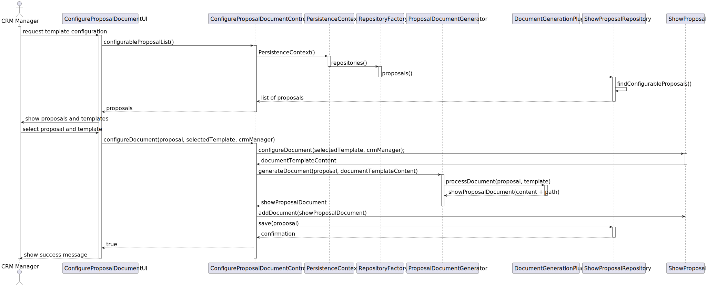

# US 318 – Templates for Show Proposals

## 1. Context

This user story is part of Sprint 3 and introduces the functionality that allows a CRM Manager to configure the 
**template** used to format the **proposal document** sent to the customer. The template defines the structure and 
content of the final document generated during the proposal process.

To ensure that the document follows the expected structure, the system must validate the selected template before it 
is accepted. This validation is performed using a plugin, which must already be registered in the system (as described 
in US317).

### 1.1 List of issues

Analysis: 🧪 Testing

Design: 🧪 Testing

Implementation: 🧪 Testing

Testing: 🧪 Testing

## 2. Requirements

**As a** CRM Manager,  
<br>
**I want** to be able to configure the template that formats the document to be sent to the customer,  
<br>
**So that** the proposal document follows a standard structure and can be generated and sent correctly.

### Acceptance Criteria:

- **US318.1** The proposal must contain a valid configuration, including assigned drones and figures, before a document 
template can be configured.
- **US318.2** The plugin used to validate the proposal document must be previously registered in the system.
- **US318.3** In case of invalid formatting, a descriptive error must be returned to the user.
- **US318.4** Only predefined and valid templates can be used for document configuration. Any attempt to use an 
unrecognised template must be rejected.

### Dependencies/References:

- **_US347 – Proposal Generation_**: The document configured in this user story will be used to generate the final 
proposal file. It must be valid for US347 to execute successfully.
- **_US317 – Plugin Registration_**: The plugin responsible for validation must be registered beforehand.

## 3. Analysis

This user story focuses on allowing the CRM Manager to configure and validate the template that defines the structure 
of the proposal document. The document is later generated based on this template and sent to the customer.

The domain model includes a `ShowProposalDocument` value object, which encapsulates the raw content of the template. 
The validation is performed by the `DocumentValidate` domain service, which delegates the task to a plugin 
(`DocumentValidationPlugin`) registered in the system.

Validation is required before a document template can be associated with a proposal. If the template is invalid, the 
system returns a validation error and prevents its use.

The following diagram shows the relevant portion of the domain model within the `ShowProposal` aggregate, including 
`ShowProposalDocument` and `DocumentValidate`.


## 4. Design

This section presents the design adopted for implementing **US318 – Configure Proposal Document**.  
The following sequence diagram and explanation detail the interaction between the user interface, controller, 
validation service, plugin, domain model, and repository.

### 4.1 Realisation

The process begins in the UI (`ConfigureProposalDocumentUI`), where the CRM Manager initiates the configuration of a 
proposal document. The UI requests from the controller the list of proposals that are still eligible for configuration.

The `ConfigureProposalDocumentController` accesses the `ShowProposalRepository` to retrieve proposals that are in a 
configurable state. The CRM Manager selects one of them and a predefined template type (e.g., "Portuguese", 
"English VIP", etc.).

The controller loads the corresponding `ShowProposal` and the template content. The selected content is then validated 
through the `DocumentValidate` domain service. The validation logic is delegated to the `DocumentValidationPlugin`, 
which ensures that the content is syntactically and structurally correct.

If validation is successful, the template content is stored as a `ShowProposalDocument` and assigned to the proposal. 
The proposal is saved in the repository. If validation fails, the CRM Manager is notified, and the operation is aborted.

This design separates responsibilities clearly:

- The **UI** manages user input and feedback.
- The **controller** orchestrates the interaction between domain logic and persistence.
- The **domain service** encapsulates the validation logic.
- The **plugin** allows pluggable validation strategies, supporting future extensibility.



### 4.2. Acceptance Tests

The following tests validate the acceptance criteria defined for **US318 – Configure Proposal Document**. They ensure 
that a document template can only be configured and accepted when all required conditions are met: a complete proposal, 
a valid plugin, and a properly formatted template.

---

#### **Test 1: Proposal is not ready for document configuration if required data is missing**
**Refers to Acceptance Criteria:** _US318.1_  
**Description:** Ensures that a proposal without necessary data (e.g., configuration, video, etc.) cannot proceed 
with document configuration.

```java
@Test
void ensureProposalCannotConfigureDocumentWithoutRequiredFields() {
    // Setup: create a ShowProposal with missing configuration or customer information
    // Action: call isReadyToConfigureDocument() on the proposal
    // Assert: verify the method returns false
}
```

---

#### **Test 2: Valid proposal configures document correctly**

**Refers to Acceptance Criteria:** *US318.1 + US318.2*
**Description:** Confirms that a complete and valid proposal successfully configures a document template, with all 
placeholders replaced and validation completed.

```java
@Test
    void ensureDocumentIsConfiguredCorrectly() {
    // Setup: create a ShowProposal with configuration, video and template content
    // Action: call proposal.configureDocument(template, manager)
    // Assert: resulting document contains replaced values (e.g., customer name, model info)
}
```

---

#### **Test 3: Only predefined templates can be used**
**Refers to Acceptance Criteria:** _US318.4_  
**Description:** Ensures that if an unrecognised template identifier is used (i.e., not one of the predefined valid options), the system throws an error and blocks document configuration.

```java
@Test
    void ensureInvalidTemplateThrowsException() {
        // Setup: create a valid ShowProposal with configuration and video
        // Use an invalid template name (e.g., "french", which is not configured)
        // Action: call proposal.configureDocument("french", manager)
        // Assert: IllegalArgumentException is thrown due to unrecognised template
    }

```

## 5. Implementation

The implementation of **US318** followed the design outlined in the previous section. The logic is spread across the 
domain, application, and presentation layers, respecting the layered and modular architecture defined for the project.

At the domain level, the method `configureDocument(...)` was implemented within the `ShowProposal` aggregate. It handles 
the process of loading a predefined template, dynamically replacing placeholders with proposal-specific data (customer, 
date, insurance, video link, drone models, figure names, etc.), and invoking the registered `DocumentValidationPlugin` 
through the domain service `DocumentValidate`.

Only proposals that are in a valid state — with a configuration, assigned drones and figures, and an associated video — 
are eligible to configure a document. If the template is invalid or the name provided does not match any predefined 
option, appropriate exceptions are thrown.

The `TemplateLoaderService` is responsible for resolving the correct template path based on the selected language and 
customer type (e.g., "Portuguese", "English VIP", etc.), using the paths defined in the `application.properties` file.

The controller `ConfigureProposalDocumentController` coordinates the configuration process, and the UI prompts the user 
to select an eligible proposal and a template. If validation succeeds, the document is associated with the proposal and 
persisted.

Relevant commit messages:

- [Implementation of US318](https://github.com/Departamento-de-Engenharia-Informatica/sem4pi-2024-2025-sem4pi_2024_2025_g44/commit/26691413a48476381972731b4b1e5ceba7ee3796)

## 6. Integration/Demonstration

The functionality developed in **US318** was successfully integrated into the Shodrone system. It allows 
**CRM Managers** to configure the proposal document by selecting a predefined template and applying it to an eligible 
proposal.

The `ConfigureProposalDocumentUI` presents two selection menus:
- The first lets the user select a show proposal that is still configurable.
- The second lets the user select one of the available document templates (e.g., Portuguese, English (VIP), English 
(Regular)).

The selected template is loaded, processed, and validated. The result is stored as a `ShowProposalDocument`, ready to 
be included in the final proposal sent to the customer (see US316 and US347).

### Demonstration Instructions

To demonstrate this feature:

1. **Launch the application** via the appropriate script.
2. **Log in as a CRM Manager**.
3. Navigate to **Show Proposals → Configure Proposal Document**.
4. Choose an eligible proposal from the list.
5. Choose one of the available templates:
    * "Portuguese"
    * "English (Regular Customer)"
    * "English (VIP Customer)"
6. If successful:
    * A confirmation message is displayed.
    * The proposal document is saved and associated with the selected proposal.
7. If unsuccessful:
    * An error message is shown (e.g., due to invalid template or missing data).

## 7. Observations

For the implementation of this project, I used the following sources:

- **EAPLI Framework**: A Java framework that provides a set of libraries and tools developed by our department (ISEP).
- **eCafeteria Project**: A reference project developed by our department, used as a source of inspiration for similar
  functionalities and a guide for best practices.
- **JPA (Hibernate)**: A Java framework for object-relational mapping (ORM) that simplifies database interactions.
- **H2 Database**: A lightweight Java database that is easy to set up and use for development and testing purposes.
