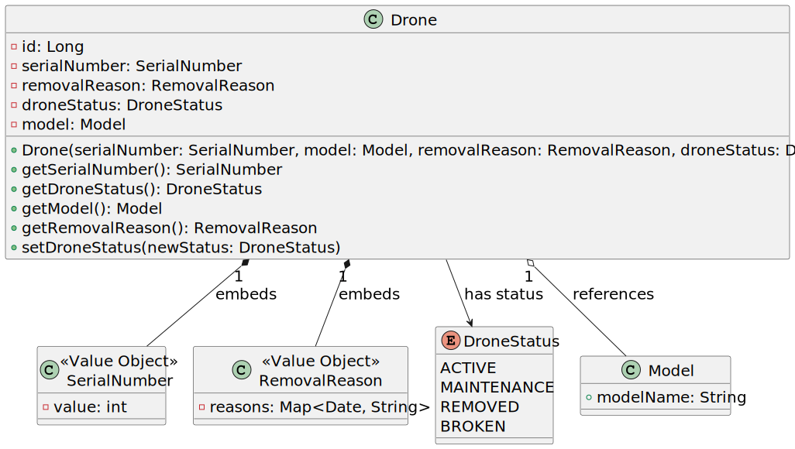

# US 325

## 1. Context

This task has the objective of concluding the requirements of US325 of sprint 3, where it is asked to develop a new functionality in the system. The team will focus on completing the analysis and design of the functionality to list the maintenance history of a drone, including filtering by date range, before proceeding with implementation and testing.

### 1.1 List of issues

- **Analysis**: Done
- **Design**: Done
- **Implementation**: To Do
- **Testing**: To Do


## 2. Requirements

*In this section you should present the functionality that is being developed, how do you understand it, as well as possible correlations to other requirements (i.e., dependencies). You should also add acceptance criteria.*

*Example*

**As** a Drone Tech,  
**I want** first to see a list of all active drones to select one, and then input an inclusive date range,   
**So that** I can review all maintenance events of the selected drone in the specified period.

### Acceptance Criteria

- **AC01**: Display a list of all active drones for the user to select from.
- **AC02**: List all maintenance records for a given drone.
- **AC03**: The list must be ordered by maintenance date descending.
- **AC04**: Each record must include maintenance type, date, description, technician (optional), and usage hours.
- **AC05**: No access restrictions; Drone Tech can consult any drone.
- **AC06**: Date filtering must be inclusive of start and end dates.
- **AC07**: If no maintenance records exist in the filtered range, display a clear “No maintenance records found” message.
- **AC08**: Usage hours at the date of maintenance must be shown.
### Dependencies

- This requirement depends on [US240](../../SPRINT_2/US240/readme.md), as drone models must be registered.
- This requirement depends on [US241](../../SPRINT_2/US241/readme.md), as drones must be registered in the inventory.
- This requirement depends on [US321](../../SPRINT_3/US321/readme.md), for maintenance type management.
- This requirement depends on [US326](../../SPRINT_3/US326/readme.md), to add maintenance records to drones.

### Client Clarifications:
> 1. The maintenance history means a list of all performed maintenances with details such as date, type, observations, and usage hours (cost is not relevant).
> 2. Drone Tech can consult any drone (no permission restrictions).
> 3. If no records exist for a date range, the system should indicate so clearly.
> 4. Date filtering is inclusive of start and end dates.
> 5. The user must first select a drone from the list of active drones before inputting the date range.

## 3. Analysis

### Drone Aggregate

The Drone aggregate represents a physical drone in the system. It includes:

- **SerialNumber** – Unique drone identifier.
- **DroneStatus** – Current operational status.
- **RemovalReason** – Reason for removal if applicable.
- **DroneLanguage** – Configured operational language.
- **Model** – Reference to the drone’s model.
- **Maintenance** – List of maintenance records associated with the drone.

### Maintenance Aggregate

The Maintenance aggregate represents a maintenance event with:

- **Date** – Date when the maintenance was performed.
- **MaintenanceType** – Type/category of maintenance.
- **Description** – Optional notes and observations.
- **Technician** – Optional responsible technician.
- **UsageHours** – The drone’s usage hours at the maintenance date.

The user story requires filtering maintenances by an inclusive date range and showing a message when no records exist.


## 4. Design

The architecture follows a layered approach with UI, controller, repository, persistence, and domain layers.
---

### 👤 Actor

#### Drone Tech
- **Role:** The operator who consults maintenance history.
- **Interaction:** First requests the list of drones to select one, then inputs optional date filters to retrieve maintenance history.

---

### 💻 UI Layer

#### :ListMaintenanceHistoryUI
- **Role:** Collects user input and displays maintenance history.
- **Main Methods:**
  - `getDroneList()`
  - `selectDrone(droneId)`
  - `enterDateRange(startDate, endDate)` (optional)
  - `showMaintenanceHistory(List<Maintenance>)`
  - `showNoRecordsMessage()`

---

### 🎮 Application Layer

#### :ListMaintenanceHistoryController
- **Role:** Coordinates fetching drone and maintenance data.
- **Main Methods:**
  - `getDroneList() : List<Drone>`
  - `getMaintenanceHistory(droneId, startDate, endDate) : List<Maintenance>`
  - Uses `DroneRepository` and `MaintenanceRepository`
---

### 🗃 Persistence Layer

#### :Persistence
- **Role:** Provides access to repositories and persistence infrastructure.
- **Main Method:**
    - `getRepositoryFactory() : RepositoryFactory`

---

### 🏗 Repository Layer

#### :RepositoryFactory
- **Role:** Abstract factory for repositories.
- **Main Methods:**
    - `getDroneRepository() : DroneRepository`
    - `getMaintenanceRepository() : MaintenanceRepository`

#### droneRepository: DroneRepository
- **Main Method:**
  - `findAllActiveDrones() : List<Drone>`
  - `findBySerialNumber(serialNumber) : Optional<Drone>`

#### maintenanceRepository: MaintenanceRepository
- **Main Method:**
    - `findByDroneOrderedByDate(drone, startDate, endDate) : List<Maintenance>`

---

### 🧠 Domain Layer

The domain layer includes entities and value objects with their business rules.

---

### 🔁 Process Flow Summary

1. **Drone Tech** requests the list of active drones.
2. UI displays drone list for selection.
3. **Drone Tech** selects a drone and inputs an inclusive date range.
4. UI calls the controller method `getMaintenanceHistory`.
5. Controller fetches drone using `DroneRepository`.
6. Controller fetches maintenance history with date filtering from `MaintenanceRepository`.
7. Controller returns list to UI.
8. UI shows the maintenance list or a no records message.

---
### 4.1. Realization


### 4.3. Applied Patterns

### 4.4. Acceptance Tests

Include here the main tests used to validate the functionality. Focus on how they relate to the acceptance criteria. May be automated or manual tests.

**Test 1:** *Verifies that it is not possible to ...*

**Refers to Acceptance Criteria:** US101.1


```
@Test(expected = IllegalArgumentException.class)
public void ensureXxxxYyyy() {
	...
}
````

## 5. Implementation

*In this section the team should present, if necessary, some evidencies that the implementation is according to the design. It should also describe and explain other important artifacts necessary to fully understand the implementation like, for instance, configuration files.*

*It is also a best practice to include a listing (with a brief summary) of the major commits regarding this requirement.*

## 6. Integration/Demonstration

*In this section the team should describe the efforts realized in order to integrate this functionality with the other parts/components of the system*

*It is also important to explain any scripts or instructions required to execute an demonstrate this functionality*

## 7. Observations

*This section should be used to include any content that does not fit any of the previous sections.*

*The team should present here, for instance, a critical prespective on the developed work including the analysis of alternative solutioons or related works*

*The team should include in this section statements/references regarding third party works that were used in the development this work.*