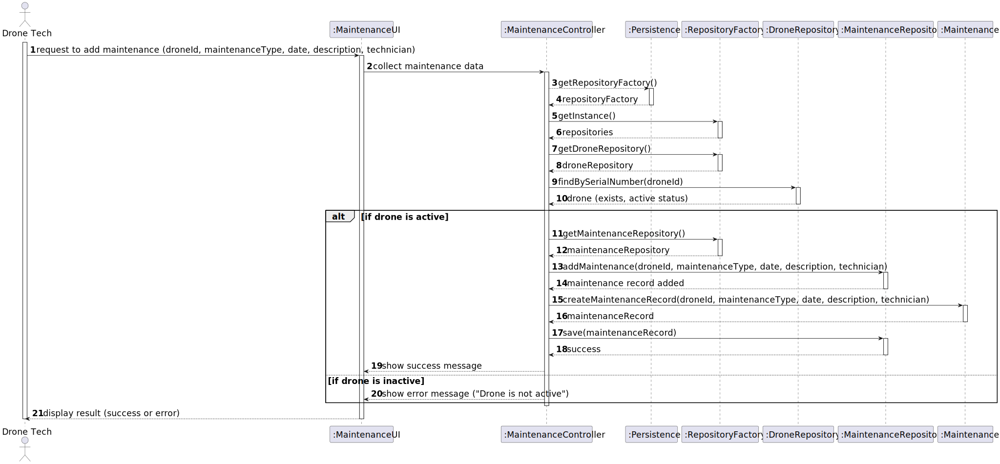

# US 326

## 1. Context

This task aims to complete the requirements of US326 of sprint 3, where the system must allow Drone Techs to register maintenance record for a drone. The focus is on finalizing the analysis and design, and implementing and testing this functionality.
### 1.1 List of issues

- **Analysis**: Done
- **Design**: Done
- **Implementation**: Done
- **Testing**: Done

## 2. Requirements

**As** a Drone Tech,  
**I want** to register a maintenance record for a drone,  
**So that** I can track the history of performed maintenances.

**Acceptance Criteria:**

- **AC01**: Only drones that are active can have maintenance registered.
- **AC02**: The maintenance record must include type, date, description (optional), and technician (optional).
- **AC03**: The system must persist the maintenance record after validation.
- **AC04**: The maintenance type must be selected from existing types.
- 
**Dependencies/References:**

- Depends on [US241](../../SPRINT_2/US241/readme.md) for drone registration.
- Depends on [US321](../../SPRINT_3/US321/readme.md) for management of maintenance types.

### Client Clarifications:

> - Any Drone Tech can add maintenance records.
> - Maintenance types are configured by Drone Techs.
> - The system should prevent registering maintenance for removed drones.


## 3. Analysis

### Drone Aggregate

The Drone aggregate includes:
- **SerialNumber**
- **DroneStatus**
- **MaintenanceList**

Only drones with **active** status are allowed to be updated.


### Maintenance Aggregate

Represents the performed maintenance:
- **Date**
- **MaintenanceType**
- **Description** 


## 4. Design

Architecture follows a layered structure: UI, Controller, Repositories, Domain.

### 👤 Actor

#### Drone Tech
- **Role**: The user who performs and records maintenance.
- **Interaction**: Selects a drone and fills the maintenance data.


### 💻 UI Layer


#### `AddMaintenanceRecordDroneUI`
- **Methods**:
  - `selectDrone()` – shows all inventory drones.
  - `selectMaintenanceType()` – shows list of existing maintenance types.
  - `maintenanceDescription()` – collects optional description.
  - `controller.addMaintenance(drone, type, date, description)` – submits the data.
  - `UtilsUI.goBackAndWait()` – waits for return.

---


### 🎮 Application Layer

#### `AddMaintenanceRecordDroneController`
- **Methods**:
- `addMaintenance(Drone drone, MaintenanceType type, LocalDate date, String description);`
- `findAllDronesInventory();`
- `findAllMaintenanceType();`

### 🗃 Persistence Layer

#### :Persistence
- `getRepositoryFactory()`


### 🏗 Repository Layer

#### :RepositoryFactory
- `getDroneRepository()`
- `getMaintenanceRepository()`

#### :DroneRepository
- `findAllDronesInventory();`

#### :MaintenanceRepository
- `save(Maintenance maintenance);`


### 🧠 Domain Layer

#### :Maintenance
- `create()`
- Encapsulates the maintenance data and rules.


### 🔁 Process Flow Summary

1. Drone Tech initiates the maintenance registration.
2. UI collects drone ID and maintenance data.
3. Controller verifies if drone exists and is active.
4. Controller constructs maintenance record and persists it.
5. UI displays confirmation.


### 4.1. Realization



### 4.3. Applied Patterns

### 4.4. Acceptance Tests

### Test 1: Register maintenance for active drone

**Refers to AC01, AC02, AC03**
```java
@Test
void ensureMaintenanceIsRegistered() {
    // setup: active drone, valid maintenance type
    // action: controller.addMaintenance(...)
    // assert: maintenance is persisted successfully
}

```
@Test(expected = IllegalArgumentException.class)
void ensureCannotAddToRemovedDrone() {
// setup: removed drone
// action: controller.addMaintenance(...)
// expect: exception thrown
}
````

## 5. Implementation

*In this section the team should present, if necessary, some evidencies that the implementation is according to the design. It should also describe and explain other important artifacts necessary to fully understand the implementation like, for instance, configuration files.*

*It is also a best practice to include a listing (with a brief summary) of the major commits regarding this requirement.*

## 6. Integration/Demonstration

*In this section the team should describe the efforts realized in order to integrate this functionality with the other parts/components of the system*

*It is also important to explain any scripts or instructions required to execute an demonstrate this functionality*

## 7. Observations

*This section should be used to include any content that does not fit any of the previous sections.*

*The team should present here, for instance, a critical prespective on the developed work including the analysis of alternative solutioons or related works*

*The team should include in this section statements/references regarding third party works that were used in the development this work.*