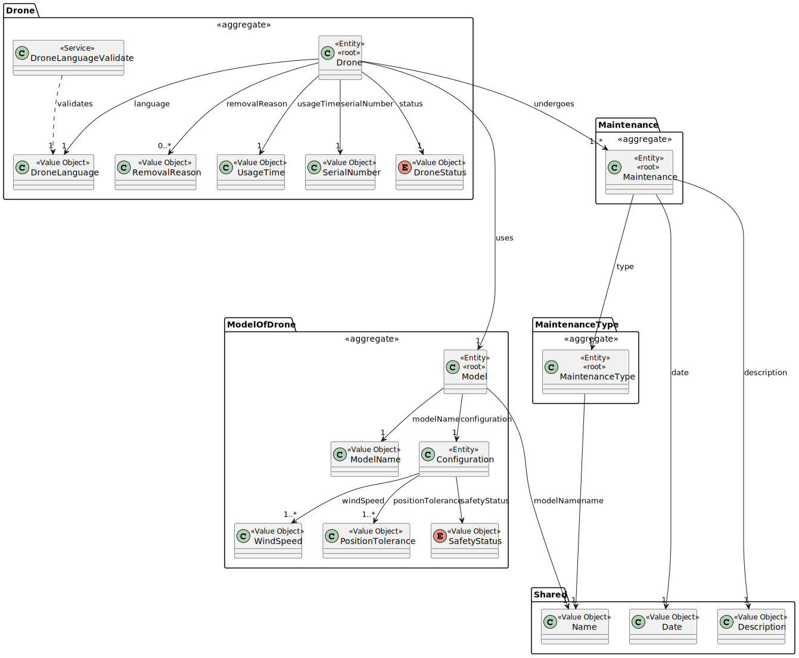
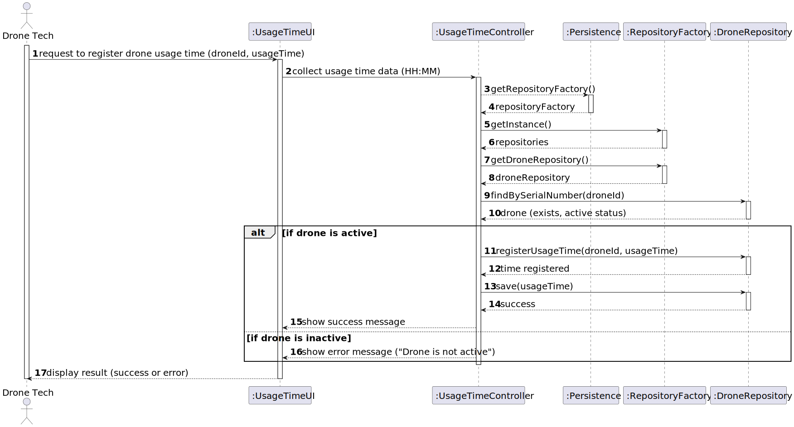

# US 327


## 1. Context

This task aims to fulfill the requirements of US327 from Sprint 3, which consist of allowing a Drone Tech to register usage time for a given drone. The goal is to finalize the analysis, design, implementation, and testing of this functionality.

### 1.1 List of issues

- **Analysis**: Done
- **Design**: Done
- **Implementation**: Done
- **Testing**: Done

---

## 2. Requirements

**As** a Drone Tech,  
**I want** to record the flying/usage time of a given drone,  
**So that** I can track its total operational time for maintenance and performance analysis.

### Acceptance Criteria:

- **AC01**: The usage time must be recorded in HH:mm format.
- **AC02**: Only drones in the inventory (active or usable) can be selected.
- **AC03**: Usage time must be persisted and added to the drone’s total.
- **AC04**: The UI must validate time format and prevent invalid input.
- **AC05**: Drone Tech must be able to cancel the operation at any point.
- 
### Dependencies

- Depends on US241 for drone registration.
- Depends on drone aggregate having usage time tracking.
- Supports future maintenance logic (e.g., preventive thresholds – US328).

---

### Client Clarifications:

> - Usage time must be recorded in `HH:mm` format.
> - The usage time is expected to be realistic, and should not exceed physical or operational constraints (e.g., drone battery limits).
> - Although the client did not confirm if manual corrections are allowed, the tone implies that unrealistic entries (like excessive daily usage) are discouraged or invalid.
> - Avoid redundant or obvious questions; clarify only what is not specified in the documentation.


## 3. Analysis

### Drone Aggregate

The drone aggregate supports:
- `SerialNumber`
- `DroneStatus`
- `UsageTime` field (likely `Duration`)
- Method: `addUsageTime(LocalTime time)`
- Method: `resetUsageTime()` (used in US326)

---



## 4. Design

The system uses a layered MVC-style architecture: UI → Controller → Repository → Domain.

---

### 👤 Actor

#### Drone Tech
- Selects a drone from inventory.
- Enters usage time in HH:mm format.
- Confirms registration and receives feedback.

---

### 💻 UI Layer

#### `RegisterUsageTimeUI`
- **Methods**:
    - `selectDrone()` – list and select drones from inventory.
    - `inputUsageTime()` – read and validate time (HH:mm).
    - `controller.registerUsageTime(drone, time)` – sends data to controller.
    - Feedback messages (success, errors, cancellation).

---

### 🎮 Application Layer

#### `RegisterUsageTimeController`
- **Methods**:

- `registerUsageTime(Drone drone, LocalTime usageTime);`
- `findAllDronesInventory();`

### 🗃 Persistence Layer

#### :Persistence
- **Role:** Provides access to repositories and persistence infrastructure.
- **Main Method:**
    - `getRepositoryFactory() : RepositoryFactory`

---

### 🏗 Repository Layer

#### :RepositoryFactory
- **Role:** Abstract factory for repositories.
- **Main Methods:**
    - `findAllDronesInventory();`
    - `void save(Drone drone);`

#### droneRepository: DroneRepository
- **Main Method:**
    - `findAllDronesInventory();`


### 🧠 Domain Layer

The domain layer includes entities and value objects with their business rules.

---

### 🔁 Process Flow Summary

1. **Drone Tech** accesses “Register Usage Time”..
2. UI shows a list of available drones..
3. **Drone Tech** selects a drone.
4. UI prompts the user to input usage time in `HH:mm` format via `inputUsageTime()`.
5. UI calls the controller method `registerUsageTime(drone, usageTime)`.
6. Controller validates the input and updates the drone’s usage time using `addUsageTime(...)`.
7. Controller persists the updated drone through `droneRepository.save(...)`.
8. UI displays a success confirmation or error message to the user.

---
## 4. Design


### 4.1. Realization



### 4.3. Applied Patterns

Domain-driven design with aggregates and value objects

### 4.4. Acceptance Tests

**Test 1:** *Add valid usage time to a drone*

**Refers to Acceptance Criteria:** AC01, AC03


```
@Test
void ensureUsageTimeAddedSuccessfully() {
    // setup: valid drone, LocalTime 01:30
    // action: controller.registerUsageTime(drone, time)
    // assert: usage time updated and persisted
}
````

## 5. Implementation

Implemented in `RegisterUsageTimeUI` and `RegisterUsageTimeController`.

Validates and parses input as `LocalTime` in `HH:mm`.

Time is added via `drone.addUsageTime(...)`.

Persistence through `droneRepository.save(...)`.

## 6. Integration/Demonstration

*In this section the team should describe the efforts realized in order to integrate this functionality with the other parts/components of the system*

*It is also important to explain any scripts or instructions required to execute an demonstrate this functionality*

## 7. Observations

*This section should be used to include any content that does not fit any of the previous sections.*

*The team should present here, for instance, a critical prespective on the developed work including the analysis of alternative solutioons or related works*

*The team should include in this section statements/references regarding third party works that were used in the development this work.*