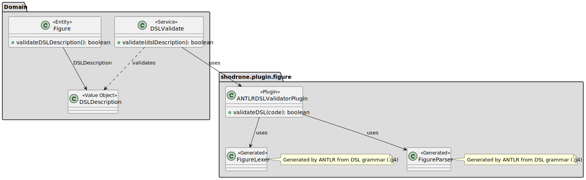

# US 341

## 1. Context

The purpose of this task is to validate the syntax of a figure's high-level description (DSL), ensuring it complies
with the defined grammar and can therefore be safely registered in the system. This task is included in Sprint 3 and
is being implemented for the first time. The grammar used for validation was previously designed in Sprint 2, as part
of US251 – Specification of the language for figure and show description.

The validation logic will be implemented using the ANTLR parser generator. The actual integration of the parser into
the system as a reusable plugin is defined in US340. In this user story, the focus is on implementing the syntax validation
logic and exposing it through the DSL validation service in the domain layer (`DSLValidate`), which is invoked when a
Figure is being registered.

### 1.1 List of issues

Analysis: 🧪 Testing  

Design: 🧪 Testing  

Implementation: 📝 To Do  

Testing: 📝 To Do

## 2. Requirements

**As a** Show Designer,  
<br>
**I want** to validate the syntax of the figure description written in DSL,  
<br>
**So that** I can register the figure in the system.

### Acceptance Criteria

- **_US341.1_** The system must verify that the figure description follows the DSL grammar rules.
- **_US341.2_** The validation process must use the ANTLR parser configured with the current version of the DSL grammar.
- **_US341.3_** The result of the validation must indicate whether the DSL is valid and, if not, provide error details 
(line, message, etc.).

### Dependencies/References

- **_US251 – Specification of the language for figure and show description_**: The grammar for the DSL was defined in
  this user story, and it is essential for the validation process.
- **_US340 – DSL Plugin_**: The validation logic implemented in this US will be executed inside the plugin registered in 
this user story.
- **_US233 – Add Figure to the Catalogue_**: The validation must occur before a figure can be added to the catalogue.

## 3. Analysis

The grammar used for this user story was designed in [US251](../../LPROG_LOG_2DI_1230462_1230917_1230948_1220780_1230875/US251/US251.md#3-analysis) to describe drone shows and figures in a modular and 
extensible way.

In the scope of US341, this grammar is now applied to validate DSL input files before figures are registered in the 
system. The validation process ensures that each DSL file is syntactically correct and matches the expected structure.

The `Figure` aggregate encapsulates all the relevant information required to define a figure in the system. For this 
user story, the focus is on the `DSLDescription` value object, which contains the high-level description of a figure 
using the DSL. This description must be validated syntactically before the figure can be stored in the catalogue.

The validation is performed through the domain service `DSLValidate`, which receives the `DSLDescription` and delegates 
the actual validation logic to the plugin structure defined in **US340**. If the validation fails, the system prevents 
the figure from being added or updated.

The following domain model represents all the relevant entities and value objects involved in figure definition and DSL 
validation:


## 4. Design

This section outlines the design adopted for implementing **US341**. The class diagram presents the essential components
involved in validating a figure's DSL description, with a clear separation between the domain service, validation logic,
and integration with the DSL plugin.

### 4.1 Realisation

The class diagram below represents the realisation of **US341 — Validate Figure Description**. The domain service
`DSLValidate` is responsible for validating the DSL description of a figure before it is added to the system. This
service receives the DSL code and delegates its validation to the plugin configured under **US340**.

The plugin exposes a method such as `validateDSL(String code)`, which internally uses an ANTLR-generated parser
(`FigureLexer` and `FigureParser`) to perform a syntactic analysis of the input. If any syntax errors are detected,
they are reported back in a structured result; otherwise, the DSL is considered valid.

The `Figure` entity includes a `DSLDescription` as one of its attributes. Validation is performed before the figure is
registered, ensuring the integrity and correctness of the figure's description according to the DSL grammar.

Only the relevant domain elements are included in the diagram, such as `Figure`, the `DSLValidate` service, and the
plugin interface. The diagram omits unrelated components to maintain clarity and focus on the functionality.

[Full Grammar](../../LPROG_LOG_2DI_1230462_1230917_1230948_1220780_1230875/US251/US251.md#full-grammar)



### 4.2. Acceptance Tests

The following tests validate the acceptance criteria defined for **US341 - Validate Figure Description**. They ensure
that figures are correctly validated against the DSL grammar, and that any errors in the DSL description are appropriately
reported.

---

#### **Test 1: Invalid figure DSL – missing mandatory elements**
**Refers to Acceptance Criteria:** _US341.1_, _US341.3_  
**Description:** This test ensures that a figure's DSL description is rejected when it does not comply with the 
grammar — specifically, when required elements are missing.

```java
@Test
void shouldFailValidationWhenDSLIsMissingMandatoryElements() {
  // Arrange: define an invalid DSL input that lacks required elements
  // In this case, there are no statements or actions defined
  
  // Act: call the validateDSL method from the plugin
  
  // Assert: check that validation fails
  // The DSL should be considered invalid due to missing structural elements
  
  // Assert: check that at least one error is reported
  
  // Assert: check that the error message is meaningful
  // This depends on how your ANTLR parser reports errors

}
```

#### **Test 2: Valid figure DSL – correct structure**
**Refers to Acceptance Criteria:** _US341.1_, _US341.3_
**Description:** This test ensures that a figure’s DSL description is accepted when it complies with the grammar and contains all required elements.

```java
@Test
void shouldPassValidationWhenDSLIsValid() {
  // Arrange: define a valid DSL input that includes all required elements
  
  // Act: call the validateDSL method from the plugin
  
  // Assert: check that validation passes
  // The DSL should be considered valid
  
  // Assert: check that no errors are reported
}
```

## 5. Implementation


## 6. Integration/Demonstration


### Demonstration Instructions


## 7. Observations
