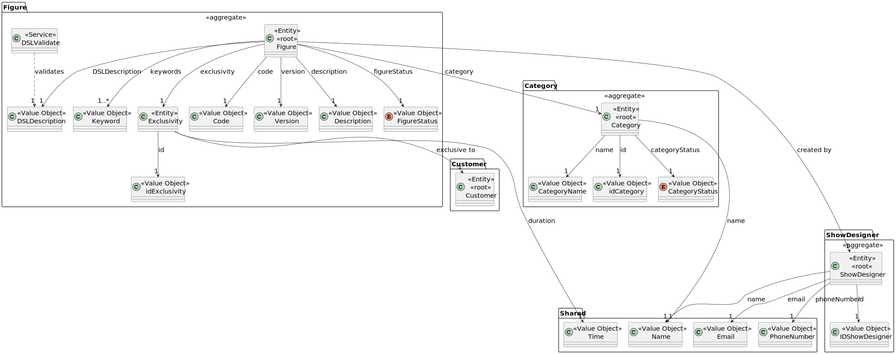
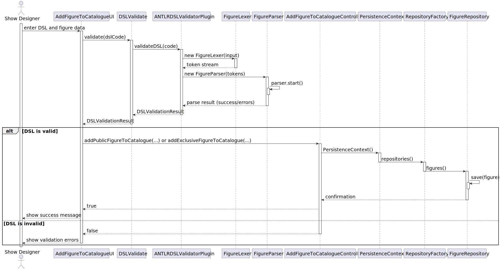

# US 341

## 1. Context

The purpose of this task is to validate the syntax of a figure's high-level description (DSL), ensuring it complies
with the defined grammar and can therefore be safely registered in the system. This task is included in Sprint 3 and
is being implemented for the first time. The grammar used for validation was previously designed in Sprint 2, as part
of US251 – Specification of the language for figure and show description.

The validation logic will be implemented using the ANTLR parser generator. The actual integration of the parser into
the system as a reusable plugin is defined in US340. In this user story, the focus is on implementing the syntax validation
logic and exposing it through the DSL validation service in the domain layer (`DSLValidate`), which is invoked when a
Figure is being registered.

### 1.1 List of issues

Analysis: 🧪 Testing  

Design: 🧪 Testing  

Implementation: 🧪 Testing  

Testing: ⚪ Not Applicable (UI-driven)

## 2. Requirements

**As a** Show Designer,  
 
**I want** to validate the syntax of the figure description written in DSL,  
 
**So that** I can register the figure in the system.

### Acceptance Criteria

- **_US341.1_** The system must verify that the figure description follows the DSL grammar rules.
- **_US341.2_** The validation process must use the ANTLR parser configured with the current version of the DSL grammar.
- **_US341.3_** The result of the validation must indicate whether the DSL is valid and, if not, provide error details 
(line, message, etc.).

### Dependencies/References

- **_US251 – Specification of the language for figure and show description_**: The grammar for the DSL was defined in
  this user story, and it is essential for the validation process.
- **_US340 – DSL Plugin_**: The validation logic implemented in this US will be executed inside the plugin registered in 
this user story.
- **_US233 – Add Figure to the Catalogue_**: The validation must occur before a figure can be added to the catalogue.

## 3. Analysis

The grammar used for this user story was designed in [US251](../../LPROG_LOG_2DI_1230462_1230917_1230948_1220780_1230875/US251/US251.md#3-analysis) to describe drone shows and figures in a modular and 
extensible way.

In the scope of US341, this grammar is now applied to validate DSL input files before figures are registered in the 
system. The validation process ensures that each DSL file is syntactically correct and matches the expected structure.

The `Figure` aggregate encapsulates all the relevant information required to define a figure in the system. For this 
user story, the focus is on the `DSLDescription` value object, which contains the high-level description of a figure 
using the DSL. This description must be validated syntactically before the figure can be stored in the catalogue.

The validation is performed through the domain service `DSLValidate`, which receives the `DSLDescription` and delegates 
the actual validation logic to the plugin structure defined in **US340**. If the validation fails, the system prevents 
the figure from being added or updated.

The following domain model represents all the relevant entities and value objects involved in figure definition and DSL 
validation:

## 4. Design

This section outlines the design adopted for implementing **US341 – Validate Figure Description**. The system allows a  
Show Designer to enter a figure's DSL description, which must be validated before the figure can be added to the catalogue.

### 4.1 Realisation

The sequence diagram below presents the full validation flow, highlighting the separation of responsibilities between the  
user interface, domain service, plugin infrastructure, and ANTLR-generated components.

The validation process is initiated by the Show Designer through the `AddFigureToCatalogueUI`, where the DSL code and other  
figure-related metadata are entered. The UI component delegates validation to the domain service `DSLValidate`, which  
interacts with the plugin registered via **US340**.

The plugin exposes a `validateDSL(code)` method and internally leverages ANTLR-generated components, specifically  
`FigureLexer` and `FigureParser`, to perform lexical and syntactic analysis. The process includes:

- Lexical analysis performed by `FigureLexer`
- Syntax parsing through `FigureParser`, starting from the root rule
- Collection of validation results and reporting of syntax errors (if any)

Upon successful validation, the UI proceeds to call the controller to persist the figure. Otherwise, it displays the  
validation errors to the user and halts the process.

This design ensures that **only syntactically valid DSL descriptions are accepted**, promoting data integrity and consistency  
across the system.

[Full Grammar](../../LPROG_LOG_2DI_1230462_1230917_1230948_1220780_1230875/US251/US251.md#full-grammar)

### 4.2. Acceptance Tests

Given that the validation logic is invoked directly from the user interface layer — and not from within the domain 
model or a dedicated application service — no unit tests are provided for this user story.

The `DSLValidate` service is designed to be used externally by the UI to check whether the input DSL code is 
syntactically valid. Since the responsibility of triggering validation and handling the result lies entirely within the 
user interface flow, this validation will be verified manually or as part of the figure registration process during 
full-system testing.

Unit testing the `DSLValidate` service in isolation is not required in this context, as it acts as a pass-through to the 
plugin implemented in **US340**, which is where the core parsing and validation logic resides and may be tested directly 
if needed.

## 5. Implementation

The implementation of **US341** focused on enabling the syntactic validation of a figure’s DSL description before it is 
registered in the system.

A new application service, `DSLValidate`, was created to encapsulate the validation logic. This service delegates the 
validation to the plugin `ANTLRDSLValidatorPlugin`, which uses the ANTLR-generated components `FigureLexer` and 
`FigureParser` to perform syntax checks over the input DSL code. The result is returned as a structured object 
containing success or failure status and error details (if applicable).

Validation is triggered directly from the user interface (`AddFigureToCatalogueUI`) before a figure is created. If the 
DSL is valid, the process continues; otherwise, the figure is not registered and the error messages are shown to the 
user.

No changes were required to the `Figure` entity itself. All logic was isolated in the application layer and plugin, 
maintaining separation of concerns.

Relevant commit messages:

* [Grammar implementation in ANTLR to test DSL Description.](https://github.com/Departamento-de-Engenharia-Informatica/sem4pi-2024-2025-sem4pi_2024_2025_g44/commit/ac8e50203bb9db2b8860084a3363740454781268)
* [Minor grammar corrections and creation of the DSLValidate service for validating the DSL file in the US233 UI.](https://github.com/Departamento-de-Engenharia-Informatica/sem4pi-2024-2025-sem4pi_2024_2025_g44/commit/de39ab3e638252e89fc3e8b7cca8337d2ef03694)

## 6. Integration/Demonstration

The functionality developed in **US341** was successfully integrated into the process of figure registration through 
the `AddFigureToCatalogueUI`.

When the Show Designer inputs the DSL code during figure creation, the system performs a validation step by calling the 
`DSLValidate` service. This ensures that only syntactically correct DSL descriptions are accepted, preserving system 
integrity and preventing runtime errors in future show execution.

The validation result (success or detailed errors) is presented to the user in the UI. If valid, the figure can be 
created as usual.

### Demonstration Instructions

To demonstrate the functionality, follow these steps:

1. **Launch the application** (via the main class or script, as defined in the [readme.md](readme.md)).
2. **Log in as a Show Designer**.
3. Navigate to the **Figures** section.
4. Choose **Add Figure to the Catalogue**.
5. Enter all the necessary data to create the figure.
6. Select a **DSL File** from the list or the **Other** option to enter your own path to a file.
7. If the DSL is valid, you can continue creating the figure; otherwise, error messages (with line and message) are 
displayed, and you are asked to make a new selection.

## 7. Observations

* The validation process was implemented using **ANTLR 4**, a powerful parser generator for building DSLs.
* The grammar used is defined and documented in [US251](../../LPROG_LOG_2DI_1230462_1230917_1230948_1220780_1230875/US251/US251.md).
* No unit tests were implemented for this user story, as validation is triggered exclusively from the user interface 
and is indirectly verified through the figure registration flow.
* The `DSLValidate` service and the plugin were designed for reuse, ensuring that future use cases can rely on 
centralized validation logic.
* The `eCafeteria` project and **EAPLI Framework** served as references for structural and architectural alignment.
