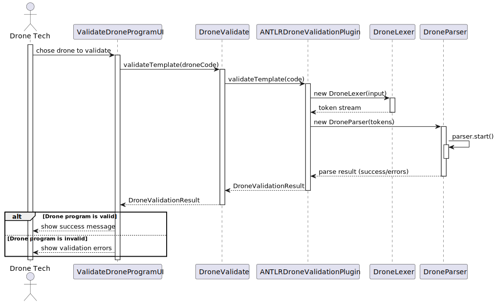

# US 345

## 1. Context

The objective of this task is to implement and deploy a plugin responsible for analyzing and validating drone programs
written in the Drone Language (DSL). This functionality is part of **Sprint 3**, aligned with the domain of drone
programming and simulation.

### 1.1 List of Issues

Analysis :        Done

Design:           Done

Implement:        Done

Test:             ⚪ Not Applicable (UI-driven)

---

## 2. Requirements

**As a** Drone Tech,  
**I want** to deploy and configure a plugin to be used by the system to analyze/validate a drone program,  
**So that** we can ensure the programs are syntactically correct and ready to be used in drone simulations.

### Acceptance Criteria:

- **US345.1:** There must be a plugin for each different drone language.

### Dependencies/References:

- **US253 - Drone Programming Language Configuration:** This user story is a direct dependency. It is required to have
  the drone programming language defined in the system so it can be used by the plugin.

---

## 3. Analysis

The Drone Language is a Domain-Specific Language (DSL) used to program individual drone behaviors in a show. The
language includes instructions such as `takeOff`, `land`, `move`, `blink`, etc., and allows mathematical expressions and
structured types such as `Position`, `Vector`, and arrays.

Two versions of the language currently exist:

- **DroneOne DSL** (v0.86)
- **DroneTwo DSL** (v0.666), which adds new types and instructions

Both versions share much of the core syntax but diverge in instruction sets and type names.

---

## 4. Design

The plugin is implemented using **ANTLR4**. A shared Antlr (`DroneLexer.g4 and DroneParser.g4`) was created to support both versions by
generalizing keywords and types.

### 4.1 Architecture Overview

- `DroneParser.g4`: ANTLR grammar defining syntactic structure of the language
- `DroneLexer.g4`: ANTLR lexer defining tokens for the language
- `ANTLRDroneValidationPlugin`: Main Java class that uses the parser to check program validity

The plugin exposes a method:

```java
public DroneValidationResult validateTemplate(String code){}
```

Which returns a success status or a list of syntax errors with line/column info.

### 4.2 Sequence Diagram


### 4.3 Acceptance Tests

Given that the validation logic is invoked directly from the user interface layer — and not from within the domain
model or a dedicated application service — no unit tests are provided for this user story.

The `DroneValidationPlugin` is designed to be used externally by the UI to check whether the input DSL code is
syntactically valid. Since the responsibility of triggering validation and handling the result lies entirely within the
user interface flow, this validation will be verified manually or as part of the drone program registration process during
full-system testing.

## 5. Implementation

The implementation of **US345** focused on enabling the syntactic validation of a drone program's code.
A new plugin, `ANTLRDroneValidationPlugin`, was created to encapsulate the validation logic. This plugin uses the
ANTLR-generated components `DroneLexer` and `DroneParser` to perform syntax checks over the input code. The result
is returned as a structured object containing success or failure status and error details (if applicable).

Validation is triggered directly from the user interface (`ValidateDroneProgramUI`) before a drone program is created.

## 6. Integration/Demonstration

To demonstrate the functionality, follow these steps:
1. **Launch the application** (via the main class or script, as defined in the [readme.md](../../../readme.md)).
2. **Log in as a Drone Tech**.
3. Navigate to the **Drone Programs** section.
4. Choose **Validate Drone Program**.
5. Choose a drone.
6. The program will validate the drone program code and display the result.

*It is also important to explain any scripts or instructions required to execute an demonstrate this functionality*

## 7. Observations

*This section should be used to include any content that does not fit any of the previous sections.*

*The team should present here, for instance, a critical prespective on the developed work including the analysis of
alternative solutioons or related works*

*The team should include in this section statements/references regarding third party works that were used in the
development this work.*