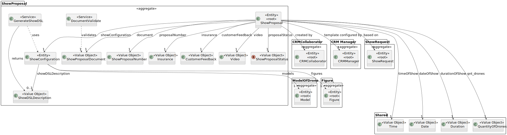
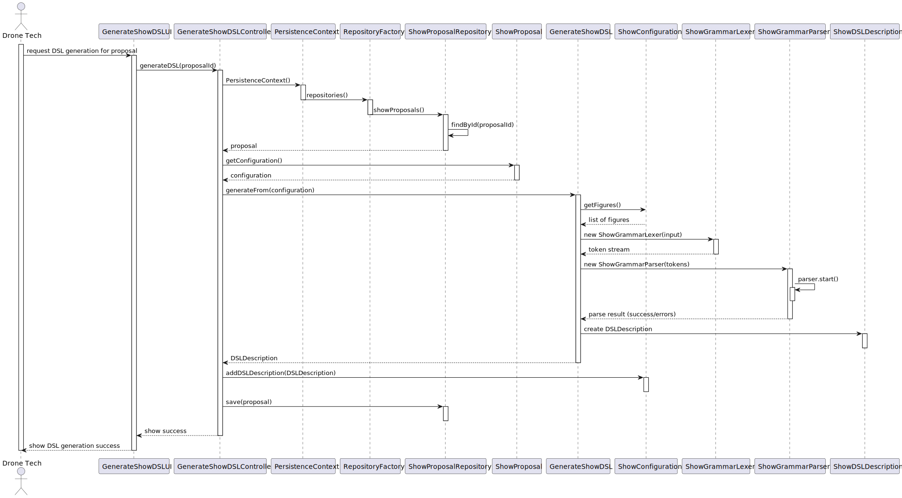

# US 348

## 1. Context

This user story is part of Sprint 3 and introduces the ability to generate a high-level description of a drone show 
based on its configuration. The generated description serves as a DSL (Domain-Specific Language) representation of the 
show, from which the low-level code for drones can later be derived.

This generation is intended for Drone Techs, who are responsible for converting the high-level DSL into actual 
instructions per drone. The generation process transforms the set of figures and drones selected in the show proposal 
into a structured textual representation using a predefined grammar.

### 1.1 List of issues

Analysis: ✅ Done

Design: ✅ Done

Implementation: ✅ Done

Testing: ✅ Done

## 2. Requirements

**As a** Drone Tech, 
 
**I want** the system to generate the show high-level description from its set of figures, 
 
**So that** I can later generate the actual code for each drone.

### Acceptance Criteria:

* **US348.1** The show description must be generated based on the figures in the configuration.
* **US348.2** The generation must follow the predefined DSL grammar.
* **US348.3** The generated description must be associated with the `ShowConfiguration`.
* **US348.4** The description must be stored in the system for future access.

### Dependencies/References:

* **US310 – Create Show Proposal**: The proposal must already exist and contain a valid configuration.
* **US312 –  Add figures to a proposal**: The figures must be defined and selected in the proposal.

## 3. Analysis

This user story focuses on producing a DSL-based textual description of a drone show. The data source is the 
`ShowConfiguration` entity, which contains the ordered set of `Figure` elements selected for the show, along with the 
assigned `Drone` instances.

The generation process applies a predefined grammar to this configuration to produce a syntactically valid 
`ShowDSLDescription` (a value object). This object is then associated with the `ShowConfiguration` for future retrieval, 
export, or compilation into drone-specific code.

The generation is performed by the domain service `GenerateShowDSL`, which consumes a `ShowConfiguration` and returns a 
`ShowDSLDescription`. The grammar is defined externally and should be maintained consistently to ensure that all figures 
are valid and properly formatted.

The following diagram shows the domain model for the `ShowProposal` aggregate, highlighting the entities and value 
objects involved in this user story:

## 4. Design

This section presents the design adopted for implementing **US348 – Generate Show DSL Description**.

### 4.1 Realisation

The process begins when the Drone Tech initiates a request to generate the DSL description for a specific show proposal 
via the user interface. The UI delegates the request to the `GenerateShowDSLController`, which coordinates the operation.

The controller creates a new `PersistenceContext` and obtains access to the `ShowProposalRepository` through the 
`RepositoryFactory`. It then retrieves the selected `ShowProposal` using its identifier and accesses the associated 
`ShowConfiguration`.

The generation of the DSL description is delegated to the `GenerateShowDSL` domain service. This service applies the 
predefined DSL grammar to the set of `Figure` elements included in the configuration. Internally, the service uses 
ANTLR-generated components, namely `ShowLexer` and `ShowParser`, to perform lexical and syntactic analysis 
over the configuration.

The final result is encapsulated in a `ShowDSLDescription` value object, which represents the textual description of 
the show. This value object is then set on the `ShowConfiguration`. The updated `ShowProposal` is persisted via the 
repository.

This design ensures that:

- The **user interface** is responsible only for interaction and presentation.
- The **controller** orchestrates the process and handles persistence.
- The **domain service** encapsulates the grammar-based logic using ANTLR components.
- The **value object** guarantees immutability and correctness of the generated DSL.
- The **proposal configuration** stores the result for future compilation or inspection.

## 5. Implementation

The implementation of **US348** focused on enabling the generation of a DSL-based high-level description for a drone 
show based on its configured figures.

A new application service, `GenerateShowDSL`, was created to encapsulate the generation logic. This service obtains the
list of figures from the `ShowConfiguration` and generates a DSL representation using predefined grammar rules. The DSL 
content is then validated using the plugin `ANTLRShowDSLValidatorPlugin`, which uses ANTLR-generated components 
(`ShowLexer`, `ShowParser`) to ensure syntactic correctness.

If validation succeeds, a new `ShowDSLDescription` value object is created and associated with the show proposal. The 
proposal is then persisted through the repository.

The entire logic is isolated in the application layer and service, preserving the domain model integrity and ensuring
modular design.

Relevant commit messages:

* [Possible Implementation of US348](https://github.com/Departamento-de-Engenharia-Informatica/sem4pi-2024-2025-sem4pi_2024_2025_g44/commit/dbc26f2dc870e325a25a2180bd620333b330df34)

## 6. Integration/Demonstration

The functionality developed in **US348** was successfully integrated into the Drone Tech’s workflow via the 
`GenerateShowDSLUI`.

When the Drone Tech selects a proposal marked as ready, the system fetches its configuration and invokes the 
`GenerateShowDSL` service. The generated DSL is validated and, if successful, saved in the proposal. Otherwise, the 
validation errors are shown to the user for correction.

This ensures that only valid DSL descriptions are persisted, protecting the consistency of the domain and preparing 
the show for downstream processing such as simulation and code generation.

### Demonstration Instructions

To demonstrate the functionality, follow these steps:

1. **Launch the application** (via the main class or script, as defined in the [readme.md](../../../readme.md).
2. **Log in as a Drone Tech**.
3. Navigate to the **Show Proposals** section.
4. Select the **Generate Show DSL** option.
5. Choose a proposal marked as ready for generation.
6. If the generation and validation succeed, a success message is shown; otherwise, validation errors are displayed 
7. and the DSL is not saved.

## 7. Observations

* The validation process was implemented using **ANTLR 4**, a powerful parser generator for building DSLs.
* The grammar used is defined and documented in [US251](../../LPROG_LOG_2DI_1230462_1230917_1230948_1220780_1230875/US251/US251.md).
* No unit tests were implemented for this user story, as validation is triggered exclusively from the user interface
  and is indirectly verified through the figure registration flow.
* The `DSLValidate` service and the plugin were designed for reuse, ensuring that future use cases can rely on
  centralized validation logic.
* The `eCafeteria` project and **EAPLI Framework** served as references for structural and architectural alignment.
