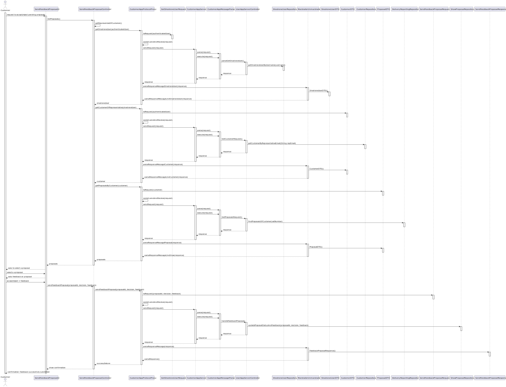

# US 371

## 1. Context

This user story is part of Sprint 3 and introduces the functionality that allows a **Customer** to accept or reject a 
show proposal and optionally provide feedback on it.

### 1.1 List of issues

Analysis: 🧪 Testing

Design: 🧪 Testing

Implementation: 🧪 Testing

Testing: 📝 To Do
 

## 2. Requirements

**As a Customer,**  
 
**I want** to accept or reject a proposal,  
 
**So that** I can express whether I agree with the show plan and optionally share my opinion.

### Acceptance Criteria:

* **US371.1** The customer must be able to accept or reject a proposal.
* **US371.2** The customer should be able to optionally provide textual feedback.
* **US371.3** The system must update the proposal status and store any given feedback.
* **US371.4** This action must be available only for proposals currently pending decision.

### Dependencies/References

* **US370 – Analyse a proposal**: to view the proposal before taking action.

## 3. Analysis

This user story focuses on enabling the customer to accept or reject a previously delivered proposal, and optionally 
provide feedback.

All required domain elements are already in place:

- `ShowProposal` entity includes:
    - `proposalStatus` (of type `ShowProposalStatus`)
    - `customerFeedback` (of type `CustomerFeedback`)
- The proposal is linked to the customer via the `ProposalDeliveryInfo` aggregate.

The system must ensure that:
- Only proposals with status `WAITING FOR RESPONSE` can be accepted or rejected.
- The customer's response is persisted in the `ShowProposal` instance.
- Optional feedback is stored in the associated `CustomerFeedback` value object.

There is **no need to modify the domain model**, only to apply its existing operations correctly.

### Responsibilities per component

- **Customer App**: UI element to choose between accept/reject and optionally submit feedback.
- **Customer App Protocol Proxy**: constructs and sends an `AcceptRejectProposalRequest` over the socket.
- **Customer App Server**:
    - Parses and validates the request.
    - Verifies the current proposal status.
    - Applies the decision (updates status and feedback).
    - Returns success/failure response.

## 4. Design

This section presents the design adopted for implementing **US371 – Accept/Reject Proposal**.

### 4.1 Realisation

The following sequence diagram illustrates the interaction flow between the user interface, controller, network proxy, 
socket layer, server components, and repositories:

The process begins in the `SendFeedbackProposalUI`, where the **Customer** requests to view all show proposals that are 
pending a decision. The UI triggers the `SendFeedbackProposalController`, which initiates a multistep lookup process 
to determine the authenticated user and fetch the proposals addressed to their customer account.

First, the controller retrieves the authenticated `ShodroneUser` by delegating to the `CustomerAppProtocolProxy`. The 
proxy constructs a `GetShodroneUserRequest` and sends it via TCP using the `ClientSocket`. The `CustomerAppServer` 
receives and parses the request through the `CustomerAppMessageParser`, which delegates the operation to the 
`UserAppServerController`. The user repository (`ShodroneUserRepository`) is queried, and the result is returned to the 
client, where the `MarshallerUnmarshaller` deserializes the response into a `ShodroneUserDTO`.

With the user data retrieved, the controller continues by requesting the `Customer` information and then the list of 
show proposals pending feedback. The proxy builds and sends respective requests (`GetCustomerOfRepresentativeRequest`, 
`GetProposalsOfCustomerRequest`) through the socket. On the server side, the `CustomerRepository` and the 
`DeliveryReportingRepository` are queried to retrieve the relevant data. The resulting proposals are returned and 
presented to the customer.

After reviewing the available proposals, the customer selects one and is prompted to accept or reject it, optionally 
providing textual feedback.

When the feedback is submitted, the controller calls `sendFeedbackProposal(...)` on the proxy. A 
`SendFeedbackProposalRequest` is constructed and sent via the `ClientSocket`. On the server side, the 
`handleProposalFeedback(...)` method in the `UserAppServerController` processes the request. This method accesses the 
`ShowProposalRepository`, where the matching proposal is located and its state updated according to the customer's 
decision and feedback. The proposal is then persisted.

A `SendFeedbackProposalResponse` is created and returned to the client, where it is parsed and interpreted. The 
controller then informs the UI of the outcome, and a confirmation message is shown to the customer.

This design ensures a clear separation of concerns:

- The **UI** manages user interaction and decision capture.
- The **controller** coordinates between user actions and the domain logic.
- The **network proxy** handles message preparation and socket communication.
- The **socket layer** abstracts low-level network transport.
- The **message parser** interprets incoming requests and responses.
- The **server controller** executes the domain logic and updates aggregate state.
- The **repositories** provide persistent access to both customer-related information (`DeliveryReportingRepository`, 
`CustomerRepository`) and proposal lifecycle (`ShowProposalRepository`).

### 4.2. Acceptance Tests

## 5. Implementation

## 6. Integration/Demonstration

## 7. Observations