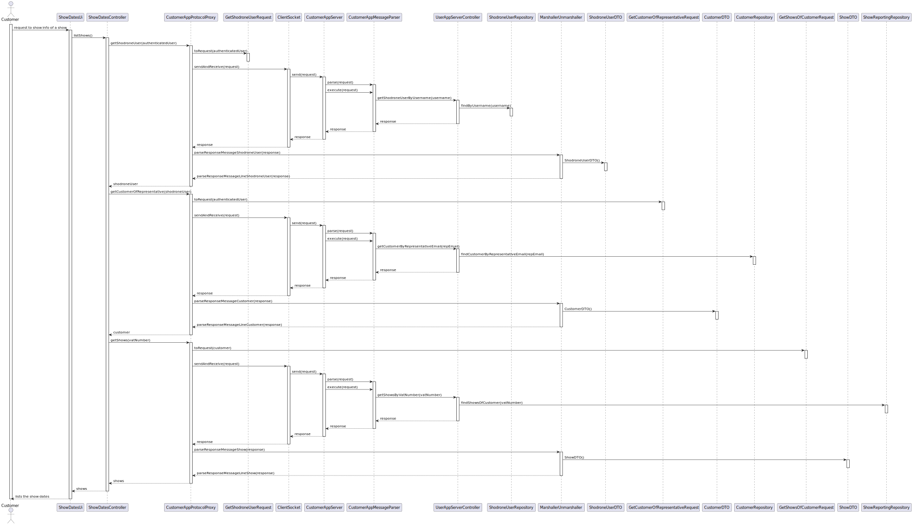

# US 372

## 1. Context

This user story is part of Sprint 3 and introduces the functionality that allows a **Customer** list all of his
scheduled shows.

### 1.1 List of issues

Analysis: Doing

Design: Doing

Implement: To do

Test: ⚪ Not Applicable

## 2. Requirements

**As** a Customer,
 
**I want** to get the list of scheduled shows,
 
**So that** I can keep track of my current shows.

**Acceptance Criteria:**

- US372.1: The Customer must be able to see the list of scheduled shows.
- US372.2: Sockets should be used to retrieve the show dates.

**Dependencies/References:**

This requirement depends on [US371](../../SPRINT_3/US371/readme.md), as a proposal must be accepted before we can get
the show date, until accepted the show won't be scheduled.

## 3. Analysis

It is important that the customer can visualise the dates of scheduled shows.

This is possible because in terms of domain as the proposal as a relation of many-to-one with the request and the
request as a many-to-one relation with customer.

Other elements not relevant to this functionality are omitted for simplicity.

## 4. Design

In this section, we describe the design approach adopted for implementing **US372 - List Scheduled Shows**. The
sequence diagram defines the main components involved in showing the list of scheduled shows to a user, showing a clear
separation of concerns between the UI, application logic, domain model, and persistence layer. And a clear separation
of user app and server app.

### 4.1. Realization

## 5. Implementation

The implementation of US372 is based on the design and analysis presented in the previous sections. The code is
organized into packages that reflect the domain model, application logic, and user interface.
We included the necessary classes and methods to support the demonstration of the information of a show. And didn't
diverge from the design.

To integrate the new functionality with the existing system, we followed these steps:

1. **Persistence Layer**: To connect the new functionality with the database, we used the existing repository pattern.
   The `ShowReportingRepository` was created to include both show proposal and request information.
2. **Controller Layer**: The controller was updated to include methods for handling requests related to the showing of a
   show. This includes methods for retrieving show information, validating the input, and sending it to the client.
3. **UI Layer**: The user interface was updated to include forms and views for viewing the shows. This includes input
   validation and error handling.
4. **Socket Communication**: We implemented socket communication to allow the user application to request show
   information from the server application. The server listens for incoming requests and responds with the relevant show
   details.
5. **Reporting Repository**: A custom repository was created to handle the retrieval of show proposal and request
   information, allowing for efficient querying and data retrieval.

## 6. Integration/Demonstration

To demonstrate the functionality, follow these steps:

1. **Launch the application via the user application**.
2. **Log in as a Representative of a Customer**.
3. Navigate to the **Show dates** section.
4. The app will show all the shows with the dates.

## 7. Observations

*This section should be used to include any content that does not fit any of the previous sections.*

*The team should present here, for instance, a critical prespective on the developed work including the analysis of
alternative solutioons or related works*

*The team should include in this section statements/references regarding third party works that were used in the
development this work.*