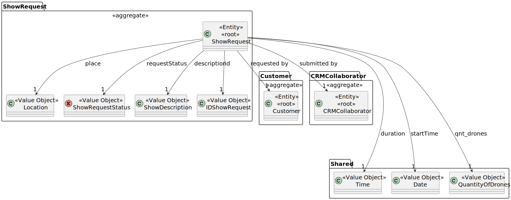
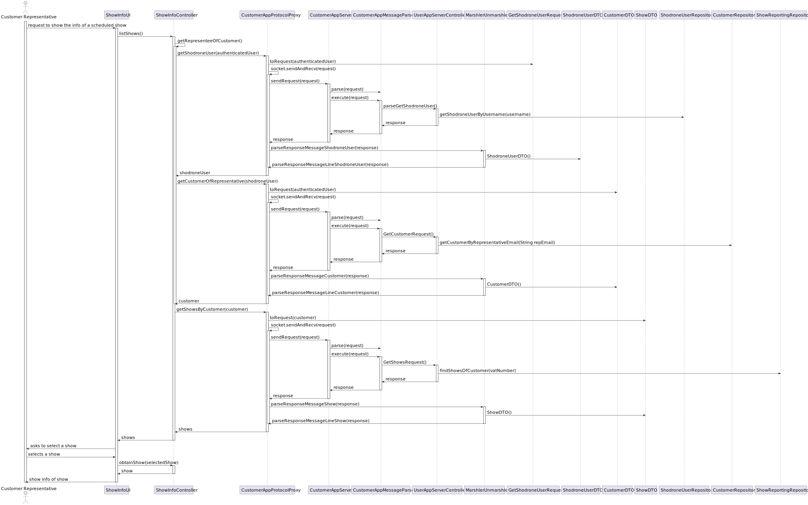

# US373 - Get Show Info

This task as the objective of concluding the requirements of the us373 of sprint3, where it is asked to develop a new functionality to the system. The team will now focus on completing the implementation and testing of this functionality as well as integrating it with the rest of the system.

## 1. Context

### 1.1 List of issues

Analysis: Done

Design: Done

Implement: To Do

Test: To Do

---

## 2. Requirements

**As** a Customer,
 
**I want** to get the details of a show (scheduled or in the past), including the drone models, figures, duration, etc.,
 
**So that** I know what I am going to watch.

### Acceptance Criteria

- **AC01**: There should be a server that will connect to the database and retrieve the show information.
- **AC02**: The returned information should have the most relevant details of the show.
- **AC03**: Sockets should be used to retrieve the show information.

### Dependencies

- This requirement depends on [US371](../../SPRINT_3/US371/readme.md), as a proposal must be accepted before we can get the show information. (The show becomes scheduled after wards).

---

## 3. Analysis

It is important that the customer can visualise the information of scheduled shows, as they request for that show and have all the motives to know when it will happen and how it will look like. (or also check for past shows).

This is possible because in terms of domain as the proposal as a relation of many-to-one with the request and the request as a many-to-one relation with customer.

Other elements not relevant to this functionality are omitted for simplicity.

## 4. Design

*In these sections, the team should present the solution design that was adopted to solve the requirement. This should include, at least, a diagram of the realization of the functionality (e.g., sequence diagram), a class diagram (presenting the classes that support the functionality), the identification and rational behind the applied design patterns and the specification of the main tests used to validade the functionality.*

### 4.1. Realization

## 5. Tests

The implementation of US373 is based on the design and analysis presented in the previous sections. The code is organized into packages that reflect the domain model, application logic, and user interface.
We included the necessary classes and methods to support the demonstration of the information of a show. And didn't diverge from the design.

The coding Commit messages related to this requirement are as follows:
- [Started doing us373 of sprint 3](https://github.com/Departamento-de-Engenharia-Informatica/sem4pi-2024-2025-sem4pi_2024_2025_g44/commit/df4c781930d7195a96206ede2c89474d13237829)
- [Was able to make the sockets work correctly](https://github.com/Departamento-de-Engenharia-Informatica/sem4pi-2024-2025-sem4pi_2024_2025_g44/commit/7daf4df7052ffa4017a930a94c9bef83a6746bb7)
- [Added the socket for Customers](https://github.com/Departamento-de-Engenharia-Informatica/sem4pi-2024-2025-sem4pi_2024_2025_g44/commit/b9b848c38d5198c7393804bcaa43325ff36d72b6)
- [Made the socket for shows and made a reporting repository to get the information of show proposal and request](https://github.com/Departamento-de-Engenharia-Informatica/sem4pi-2024-2025-sem4pi_2024_2025_g44/commit/fcfa75e6d8e0df900720fbbd0cbac81e84db2b98)

## 6. Implementation

To integrate the new functionality with the existing system, we followed these steps:

1. **Persistence Layer**: To connect the new functionality with the database, we used the existing repository pattern. The `ShowReportingRepository` was created to include both show proposal and request information.
2. **Controller Layer**: The controller was updated to include methods for handling requests related to the showing of a show. This includes methods for retrieving show information, validating the input, and sending it to the client.
3. **UI Layer**: The user interface was updated to include forms and views for viewing the shows. This includes input validation and error handling.

To run the project, follow the instructions in the [README.md](../../../readme.md) file located in the root directory of the project. This file contains detailed instructions on how to set up the development environment, run the application, and execute the tests.

## 7. Integration/Demonstration

To demonstrate the functionality, follow these steps:

1. **Launch the application via the user application**.
2. **Log in as a Representative of a Customer**.
3. Navigate to the **Show information** section.
4. Select the show you want to visualise.

## 8. Observations

For the implementation of this project, we used the following sources:

- **EAPLI Framework**: A Java framework that provides a set of libraries and tools of our department(ISEP).
- **ECafetaria project**: A project developed by our department that serves as a reference and source for implementing similar functionalities and as a guide for best practices.
- **Jpa Hibernate**: A Java framework for object-relational mapping (ORM) that simplifies database interactions.
- **H2 Database**: A lightweight Java database that is easy to set up and use for development and testing purposes.
- **Socket Programming**: We used Java's built-in socket programming capabilities to implement the communication between the client and server for retrieving show information.
- **Reporting Repository**: A custom repository was created to handle the retrieval of show proposal and request information, allowing for efficient querying and data retrieval.
