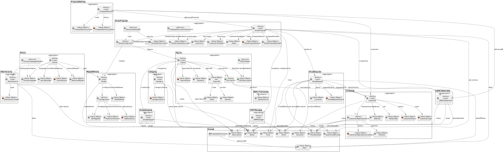
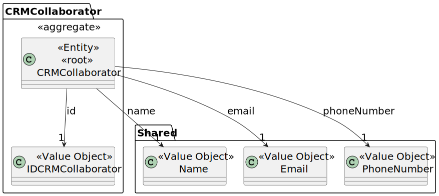
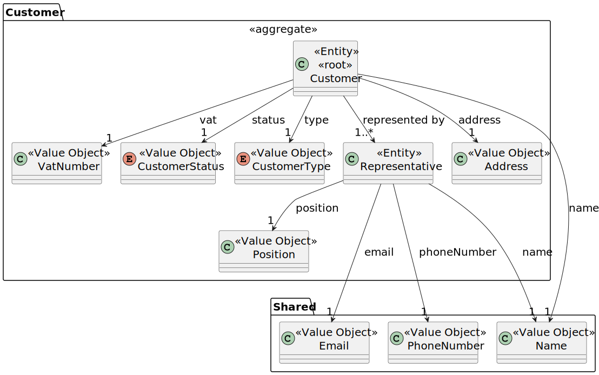
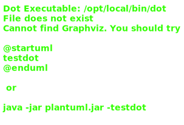

# Analyses

## Domain Model

### Overview

### CRM Collaborator

### Customer

### Drone

### Figure

### Show Request

### Show Proposal

## Story Board

**Management story**

1 - The admin creates a user.

2 - The Drone Tech creates a drone model.

3 - The Drone Tech configs the drone language.

4 - The Drone Tech adds drones to inventory.

5 - The Drone Tech lists the drones in inventory.

6 - The Drone Tech can remove the drone from inventory.

7 - The Drone Tech sends the drone to maintenance if necessary.

8 - The Drone Tech receives the drone from maintenance.

9 - The Drone Tech can list the drones maintenance history.

10 - Client contacts CRM Collaborator to submit a request for a show.

11 - If the client doesn't exist, CRM Manager creates a client in the app.

12 - CRM Collaborator creates a show request into the system.

13.1 - If it's a new figure, the CRM Manager assigns the request to a Show Designer.

13.2 - If it's an existing figure. Jump to step 9.

14 - The Show Designer designs the new figure and adds it to the system.

15 - The Drone Tech generates the figure code.

16 - The figure is tested.

17 - The Drone Tech generates the show code.

18 - The show is tested.

19 - The CRM Collaborator generates the show proposal.

20 - The proposal document is validated by the system. If it's not valid, the CRM Collaborator updates the proposal and
it gets reevaluated by the system.

21 - The proposal is sent to the client.

22 - The client logins in the system and accepts/rejects the proposal.

23 - The CRM Collaborator updates the show status to "Accepted"/"Denied".

24.1 - If the show proposal is denied, the client discusses the proposal with CRM Manager.

24.2 - If the show proposal is accepted, the CRM Team schedules the show. There may be some negotiation with the client.

25 - The show is scheduled in the system with date and time.

26 - The client can consult the show schedule in the system.

### Questions to Clarify Requirements

> 1. How do you want the simulation to be demonstrated, via a third party program?
> 2. In previous questions the client mentioned the need of a maintenance for drones, we wanted to know what are the attributes required. We thought about some like the date of the maintenance, the maintenance id, the description, and the type and status of the maintenance. If there are any missing or extra attributes please mention them. 