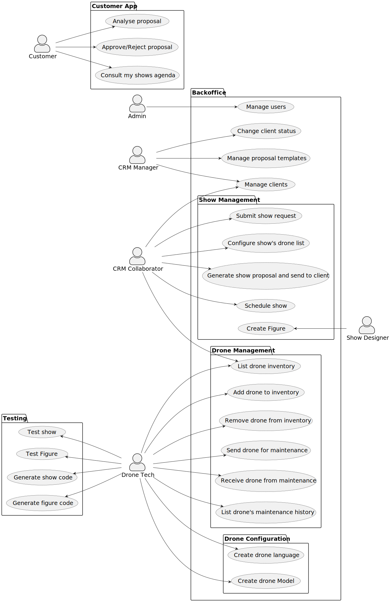

# Requirements, technical constraints and concerns of the project.

## Use Case Diagram (UCD)

The following diagram represents the use cases of the system, in accordance with the user stories.
User stories can have multiple use cases.

| Main Use Cases   | Description                    |
|:-----------------|:-------------------------------|
| Admin            | Manages users                  |
| CRM Manager      | Manages clients and proposals  |
| CRM Collaborator | Schedules and configures shows |
| Show Designer    | Creates figures for shows      |
| Drone Tech       | Manages drones                 |
| Customer         | Requests and views shows       |

### Use Cases / User Stories

| US    | Description |                   
|:------|:------------|
| USxx1 |             |
| USxx1 |             |             
| USxx1 |             |             
| USxx2 |             |             
| USxx2 |             |             
